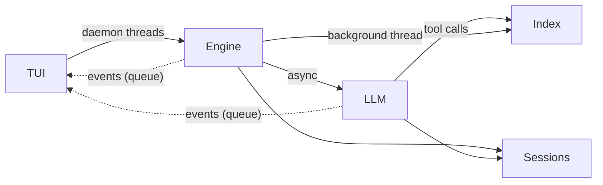
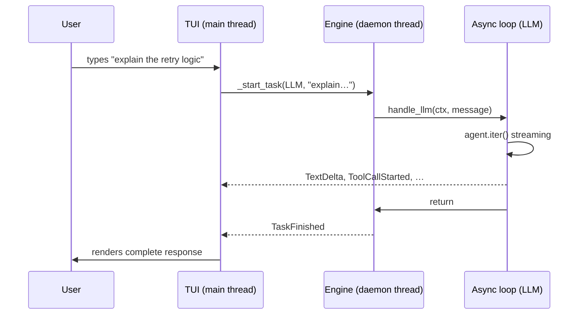
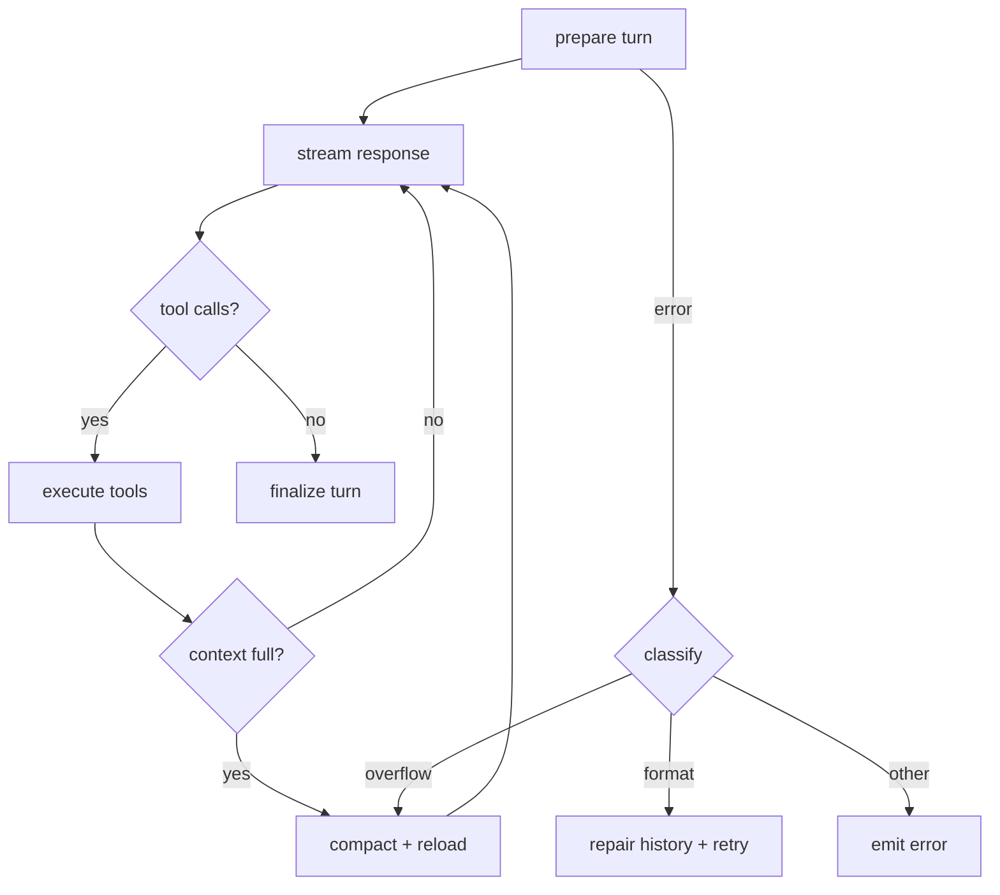

# Architecture

Technical reference for contributors and maintainers.
For usage, see [README.md](README.md).

---

## Overview

rbtr is built around six capabilities:

1. **Conversation storage.** Every message — user prompts,
   model responses, tool calls, tool results — is persisted
   to SQLite as it streams. Conversations survive crashes,
   work across provider switches, and support compaction
   when the context window fills.
2. **Code indexing and search.** Tree-sitter extracts
   functions, classes, and imports from every file. A
   dependency graph connects them. Three search channels
   (name matching, BM25, semantic embeddings) are fused
   into a single ranked result. The model searches by
   name, keyword, or concept.
3. **Read-only git interface.** All file reads go through
   the git object store at exact commit SHAs. The working
   tree is never read for repository files and never
   modified. Untracked workspace files (`.rbtr/notes/`,
   drafts) use a separate filesystem fallback.
4. **Cross-session memory.** An extraction agent identifies
   durable facts from conversations — project conventions,
   architecture decisions, recurring patterns. Facts are
   scoped (global or per-repo), deduplicated by the LLM,
   and injected into the system prompt of future sessions.
5. **Context compaction.** When the context window fills,
   older messages are summarised by a dedicated agent.
   The originals stay in the database. Compaction triggers
   automatically (mid-turn, post-turn, on overflow) or
   manually, and can be undone.
6. **Review drafts and GitHub integration.** The model
   builds a structured review incrementally — inline
   comments, a summary, suggestions. The draft syncs
   with GitHub's pending review API and posts atomically.

### Layers



Four layers: a terminal UI that owns the display, an engine
that dispatches commands, an LLM pipeline that streams model
responses, and two storage backends — SQLite for sessions,
DuckDB for the code index.

The TUI never runs commands or does I/O beyond rendering. The
engine never imports Rich or touches the display. The portal
is long-lived across tasks to keep httpx connection pools
alive.

### How a review flows

Three review modes, selected by argument count:

- `/review 42` — PR review (GitHub metadata + diff).
- `/review main feature` — branch diff (local refs, no GitHub).
- `/review v2.1.0` — snapshot (single ref, no diff).

#### PR and branch reviews

A `/review 42` command follows this path:

1. **TUI** receives input, spawns a daemon thread.
2. **Engine** (`engine/review_cmd.py`) fetches PR metadata
   from the GitHub API — title, body, base/head SHAs,
   author. Stores exact commit SHAs in `EngineState`. Opens
   the repo via pygit2.
3. **Index** (`index/orchestrator.py`) starts in a background
   daemon thread. Extracts chunks from the base commit, then
   incrementally indexes the head commit. Emits
   `IndexProgress` events; emits `IndexReady` when done.
4. **User sends a message.** Engine calls `handle_llm()`.
5. **LLM pipeline** (`llm/stream.py`) loads history from
   SQLite, assembles the system prompt (system + review +
   index status templates), and enters the `agent.iter()`
   streaming loop.
6. **Tool calls.** The model calls `read_file`, `search`,
   `diff`, etc. File tools read from the git object store
   at the stored SHAs. Index tools query DuckDB. Draft
   tools write to `.rbtr/drafts/42.yaml`.
7. **Streaming response.** Text deltas and tool-call events
   flow back to the TUI via the event queue. Each part is
   persisted to SQLite as it arrives.
8. **Draft and post.** `/draft sync` syncs with GitHub's
   pending review API. `/draft post` submits the review.

Branch reviews (`/review main feature`) follow the same path
but skip step 2 (no GitHub fetch) and use local branch names
as refs.

The review starts immediately — the user can talk to the
model while the index builds. Index tools appear when
`IndexReady` is emitted.

#### Snapshot reviews

A `/review v2.1.0` command follows a simpler path:

1. **Engine** resolves the ref via `repo.revparse_single()`,
   peels to a commit, and stores the SHA in a
   `SnapshotTarget`.
2. **Index** indexes only that single commit — no base, no
   incremental update.
3. **Tools.** File tools (`read_file`, `list_files`, `grep`)
   and index tools (`search`, `read_symbol`, `list_symbols`,
   `find_references`) are available. Diff tools
   (`diff`, `changed_files`, `commit_log`, `changed_symbols`)
   and draft tools are hidden.
4. **Prompt.** The review template uses exploration-oriented
   instructions (orient → explore → annotate) instead of the
   diff-oriented flow (brief → deepen → evaluate → draft).

---

## Conversation storage

LLM conversations are complex structures: user prompts,
model responses with thinking and text parts, tool calls
with arguments and results, all interleaved across multiple
request/response cycles. rbtr needs to persist these as they
stream (for crash recovery), replay them to any provider
(for cross-model switching), compact them when the context
fills, and track costs across the session.

The design: decompose each PydanticAI message into
**fragments** — one row per message header, one row per
part — in a single SQLite table. This flat structure
supports streaming writes (insert each part as it arrives),
selective replay (filter by status and compaction state),
and provider-agnostic storage (parts are serialised as
JSON, not in any provider's wire format). Persisted history
is immutable — repairs, compaction, and provider adaptations
are applied transiently in memory at load time.

All reads and writes go through `SessionStore`
(`sessions/store.py`).

### How messages map to fragments

`sessions/serialise.py` handles the conversion in both
directions. A PydanticAI `ModelRequest` or `ModelResponse`
becomes 1 + N rows:

- **1 message header** (`fragment_index = 0`) — metadata:
  timestamps, model name, token counts, cost. Links parts
  via `message_id`.
- **N part rows** (`fragment_index >= 1`) — one per part:
  `UserPromptPart`, `TextPart`, `ToolCallPart`,
  `ToolReturnPart`, `ThinkingPart`, etc. Each serialised
  as JSON in `data_json`.

The `FragmentKind` enum and `FragmentStatus` enum
(`sessions/kinds.py`) are the type system for this table —
every other sessions module depends on them.

Sessions are a `session_id` column, not a separate table.

### Streaming writes and crash recovery

Requests and responses use the same two-phase pattern:
insert as `IN_PROGRESS`, set to `COMPLETE` when finished.
`load_messages()` filters `WHERE status = 'COMPLETE'`,
so a crash mid-turn leaves no corrupt state — incomplete
fragments are invisible on next load.

For each model request node, the persistence order is:

1. Save the request as `IN_PROGRESS` via `save_messages`.
2. Create the response row via `begin_response`.
3. Stream response parts (`add_part` / `finish_part`).
4. Finalize the request (`finalize_request` — updates
   the header with post-mutation data, sets `COMPLETE`).
5. Finish the response (`ResponseWriter.finish`).

The request row is created before the response row so its
`created_at` is earlier. `load_messages` orders by
`created_at`, so the request always precedes its response
on reload — preserving the logical conversation order
across session resume and provider switches.

### Cost and usage tracking

`llm/usage.py` reads token counts, cost, and context-window
metadata from PydanticAI `ModelResponse` objects. Token
counts and cost are written to the fragment header when a
response finishes. Usage accumulates on `SessionUsage` and
is visible in the footer and `/stats`.

Background agents (compaction, fact extraction) incur costs
outside the main conversation. These are persisted as
overhead fragments via `store.save_overhead()` with typed
payloads (`CompactionOverhead`, `FactExtractionOverhead`
from `sessions/overhead.py`). Session statistics
(`sessions/stats.py`) aggregate both conversation and
overhead costs for `/stats` reporting.

### Rebuilding history for replay

`load_messages()` reconstructs the conversation:

1. Query all `COMPLETE` fragments where
   `compacted_by IS NULL` for the session.
2. Group by `message_id`.
3. Merge each header with its parts into a PydanticAI
   message object.

The result is a provider-agnostic message list ready to
send to any model. When the provider rejects the history
(incompatible tool-call encoding, thinking metadata from
a different provider), the history repair pipeline
transforms it in memory — see [History repair][hist-rep]
below.

When compaction has run, the `compacted_by` filter
hides the original messages and the summary message
takes their place — see
[Context compaction](#context-compaction).

[hist-rep]: #cross-provider-history-repair

### Session lifecycle

- **Creation.** A new `session_id` (UUID7) is generated on
  `/review` or at startup.
- **Continuation.** `/session resume` loads a previous
  session and restores `EngineState` from it.
- **Retention.** `/session purge <duration>` enforces
  age-based cleanup. Deletion cascades from message
  headers to parts via the `message_id` FK.

### Fragment reference

One table, `fragments`. Key columns:

| Column           | Purpose                                     |
| ---------------- | ------------------------------------------- |
| `id`             | UUID7 primary key                           |
| `session_id`     | Groups fragments into sessions              |
| `message_id`     | Self-referential FK — parts point to header |
| `fragment_index` | Ordering within a message (0 = header)      |
| `fragment_kind`  | Discriminator (`FragmentKind` enum)         |
| `status`         | `IN_PROGRESS`, `COMPLETE`, or `FAILED`      |
| `data_json`      | Serialised PydanticAI message or part       |
| `compacted_by`   | FK to summary that replaced this fragment   |

`FragmentKind` groups: message-level (`REQUEST_MESSAGE`,
`RESPONSE_MESSAGE`), PydanticAI parts (`USER_PROMPT`,
`TEXT`, `TOOL_CALL`, `TOOL_RETURN`, `THINKING`, etc.),
user input (`COMMAND`, `SHELL`), and incidents
(`LLM_ATTEMPT_FAILED`, `LLM_HISTORY_REPAIR`).

### Cross-provider history repair

Switching from Claude to GPT to Gemini mid-conversation
produces history that each provider's API may reject —
different tool-call ID schemes, thinking metadata formats,
required message fields. Ctrl+C during tool execution
leaves dangling tool calls with no results.

rbtr's principle: **persisted history is immutable.** The
database always retains the original conversation exactly
as it happened. All repairs are applied transiently in
memory at load time by `sessions/scrub.py` and
`llm/history.py`. Each repair is recorded as an incident
row (`sessions/incidents.py` defines the data models:
`FailedAttempt`, `HistoryRepair`, `FailureKind`,
`RecoveryStrategy`, `IncidentOutcome`).

#### Repair stages

Repairs run in `_prepare_turn()` at three escalating levels:

**Level 0 — structural repair (every turn):**

- `strip_orphaned_tool_returns` — removes `ToolReturnPart`s
  whose `tool_call_id` has no matching `ToolCallPart` in the
  history. Handles legacy sessions compacted before the
  `split_history` fix that strips orphaned parts during
  compaction. New sessions are protected by `split_history`
  itself; this repair exists for data written by older code.
- `validate_tool_call_args` — repairs unparseable
  `ToolCallPart.args` (e.g. truncated JSON from streaming)
  to `{}`.
- `sanitize_tool_call_ids` — replaces characters in
  `tool_call_id` values that violate provider patterns
  (e.g. Anthropic requires `^[a-zA-Z0-9_-]+$`). IDs from
  other providers may contain dots, colons, or other
  characters. Both `ToolCallPart` and `ToolReturnPart` /
  `RetryPromptPart` are updated consistently to preserve
  pairing.
- `repair_dangling_tool_calls` — injects synthetic
  `(cancelled)` tool returns for unmatched `ToolCallPart`s
  left by a cancelled turn. Merges synthetic returns into
  existing `ModelRequest`s to maintain provider-expected
  pairing.

**Level 1 — consolidate (after first rejection):**

- `consolidate_tool_returns` — restructures tool returns so
  each response's returns are in one request. Fixes
  cross-provider pairing mismatches without destroying content.

**Level 2 — simplify (after second rejection):**

- `demote_thinking` — converts `ThinkingPart` to `TextPart`
  wrapped in `<thinking>` tags (some providers reject
  thinking parts from other providers).
- `flatten_tool_exchanges` — converts `ToolCallPart` /
  `ToolReturnPart` pairs to plain text, removing structural
  pairing entirely. Last resort.

#### Error classification and recovery

`handle_llm()` in `stream.py` classifies exceptions and selects
a recovery strategy:

| Failure kind         | Trigger               | Recovery                   |
| -------------------- | --------------------- | -------------------------- |
| `HISTORY_FORMAT`     | 400 + format error    | `CONSOLIDATE` / `SIMPLIFY` |
| `OVERFLOW`           | Context exceeded      | `COMPACT_THEN_RETRY`       |
| `EFFORT_UNSUPPORTED` | 400 + effort rejected | `EFFORT_OFF`               |
| `TOOL_ARGS`          | Malformed tool args   | `SIMPLIFY_HISTORY`         |
| `TYPE_ERROR`         | Adapter null values   | `SIMPLIFY_HISTORY`         |
| `CANCELLED`          | Ctrl+C                | `NONE`                     |
| `UNKNOWN`            | Unclassified          | `NONE`                     |

#### Incident recording

Level-0 preventive repairs run every turn against immutable
history. Each persists a single **`LLM_HISTORY_REPAIR`**
row per unique fingerprint, deduplicated via
`has_repair_incident` to avoid duplicates on subsequent turns.

Every retry cycle (levels 1–2) persists two incident rows:

1. **`LLM_ATTEMPT_FAILED`** — records `FailureKind`, strategy,
   diagnostic traceback, error text, model name, and HTTP
   status code.
2. **`LLM_HISTORY_REPAIR`** — records `RecoveryStrategy`, the
   specific transformation applied, and counts (parts demoted,
   tool calls flattened, etc.).

After the retry, the outcome is written back:

| `IncidentOutcome` | Meaning                               |
| ----------------- | ------------------------------------- |
| `RECOVERED`       | Retry succeeded                       |
| `FAILED`          | Retry also failed                     |
| `ABORTED`         | No recovery attempted (unrecoverable) |

Incidents are queryable via `/stats` and visible in session
history exports but never injected into the conversation sent
to the LLM.

---

## Context compaction

Long conversations fill the model's context window. A review
that explores several files, runs searches, and builds a draft
can easily reach the limit within a single session. Truncating
history loses context the model needs; failing on overflow
breaks the session.

Compaction summarises older messages to free space while
preserving recent turns. The originals stay in the database
(immutable history) — the summary replaces them only in the
message list sent to the model. Compaction triggers
automatically when context pressure rises, or manually via
`/compact`. It can be undone.

The algorithm lives in `llm/compact.py` and `llm/history.py`.
Database operations use `SessionStore.compact_session()` (see
[Conversation storage](#conversation-storage)).

### Split algorithm

`split_history()` divides the conversation into _old_
(to summarise) and _kept_ (to preserve). A turn starts at a
`ModelRequest` containing a `UserPromptPart` and includes all
subsequent messages until the next such request — tool calls,
tool returns, and assistant responses within a turn stay
together.

The split removes the last `keep_turns` turns (default 2) from
the end of the conversation. Everything before that boundary
is _old_. When the conversation has fewer turns than
`keep_turns`, the split is retried with `keep_turns=1` — at
least the most recent turn is always preserved.

After splitting, `split_history()` scans the _kept_ partition
for orphaned tool returns — `ToolReturnPart`s whose matching
`ToolCallPart` (by `tool_call_id`) ended up in _old_. These
are moved to _old_ to prevent API errors from mismatched
tool-call IDs. When a `ModelRequest` at a turn boundary
contains both a `UserPromptPart` and orphaned `ToolReturnPart`s
(the "straddling" case), the orphaned parts are stripped from
the request — the `UserPromptPart` stays in _kept_, the
orphaned returns are discarded.

### Safe boundary snapping

When the serialised old messages exceed the available context,
`find_fit_count()` uses binary search to find the largest
message prefix that fits. The resulting split point can land
between a `ModelResponse` (containing tool calls) and its
immediately following `ModelRequest` (containing tool
results). `snap_to_safe_boundary()` decrements the count
until the boundary no longer separates a call/result pair.

### Serialisation

`serialise_for_summary()` converts old messages to a
human-readable text format. Each message becomes a markdown
section: `## User`, `## Assistant`, `## Tool call: name(args)`,
`## Tool result: name`. Tool results are truncated to
`summary_max_chars` (default 2000). Thinking parts are omitted.

### Summary agent

`compact_agent` is a separate, tool-less `Agent[None, str]`
that shares the system prompt with the main agent but receives
`compact.md` as its task instructions. It runs with
`UsageLimits(request_limit=1)` — a single request/response
cycle. Extra instructions (e.g. from `/compact Focus on auth`)
are passed via the `instructions=` parameter.

`_stream_summary()` iterates the agent's `ModelRequestNode`
stream, collecting text deltas into the summary. The result
includes token counts and cost for overhead tracking.

### Concurrent fact extraction

During compaction, fact extraction runs concurrently with the
summary via `asyncio.gather()`. The two are independent — the
summary uses serialised text, fact extraction uses raw messages.
If fact extraction fails, the summary still proceeds. Fact
extraction identifies durable knowledge from conversations —
see [Extraction pipeline](#extraction-pipeline) under
Cross-session memory.

### Trigger paths

Four trigger paths, all calling the same
`compact_history_async()`:

| Trigger   | Enum             | Condition                           |
| --------- | ---------------- | ----------------------------------- |
| Post-turn | `AUTO_POST_TURN` | After response, context ≥ threshold |
| Mid-turn  | `MID_TURN`       | During tool-call cycle, ≥ threshold |
| Overflow  | `AUTO_OVERFLOW`  | API context-length error            |
| Manual    | `MANUAL`         | `/compact` command                  |

Mid-turn compaction fires at most once per turn. After
compacting, history is reloaded from the database and the
agent loop resumes with the fresh (shorter) history. The
in-progress turn counts as one of the `keep_turns`.

Post-turn compaction runs only when mid-turn compaction did
not fire during the same turn.

Overflow compaction calls `compact_history()` synchronously,
then retries the original `handle_llm()` call.

### Reset

`reset_compaction()` undoes the latest compaction.
`SessionStore.reset_latest_compaction()` clears `compacted_by`
on all fragments marked by the most recent summary, then
deletes the summary message (its timestamp would interleave
with restored messages). Reset is blocked if messages were
added after the compaction — the summary is already part of
the later context.

### Persistence

After the summary is generated, `compact_session()` inserts
the summary message and sets `compacted_by` on each old
fragment, linking it to the summary. `load_messages()` filters
`WHERE compacted_by IS NULL`, so compacted messages are
invisible. The originals remain in the database for auditing.

Compaction overhead (trigger, message counts, summary tokens,
model, cost) is persisted as an `OVERHEAD_COMPACTION` fragment
via `save_overhead()` and tracked on `SessionUsage`.

### Settings

```toml
[compaction]
auto_compact_pct = 85
keep_turns = 2
reserve_tokens = 16000
summary_max_chars = 2000
```

- `auto_compact_pct` — context usage percentage that triggers
  automatic compaction (post-turn and mid-turn).
- `keep_turns` — number of recent turns to preserve.
- `reserve_tokens` — tokens reserved for the summary response
  (subtracted from available context when fitting old messages).
- `summary_max_chars` — maximum characters per tool result in
  the serialised summary input.

Token estimation uses `len(text) // 4` — no external tokeniser.

---

## Cross-session memory

Static project instructions live in `AGENTS.md`, but the
model also learns things during reviews — project
conventions, architecture decisions, recurring patterns,
user preferences. Cross-session memory captures this
knowledge as **facts** that persist across conversations
and are injected into the system prompt of future sessions.

Facts are scoped: `"global"` (applies everywhere) or
`"owner/repo"` (applies only to that repository). They
are created automatically (during compaction, after posting
a review) or explicitly (via the `remember` tool or
`/memory extract`). The LLM handles deduplication — it
sees all existing facts and tags each new extraction as
`new`, `confirm`, or `supersede`.

### Storage

Facts live in a `facts` table in `sessions.db` (same
SQLite database as conversations). A `facts_fts` FTS5
virtual table (content-external, synced via triggers)
enables keyword search for deduplication. Store methods
live on `SessionStore`.

### Extraction pipeline

A dedicated `fact_extract_agent` (`llm/memory.py`) identifies
durable facts from conversation messages. It follows the
background agent pattern (see
[Background agents](#background-agents)): module-level
`Agent[FactExtractionDeps, FactExtractionResult]`,
`@instructions` decorators for the static task prompt
(`prompts/memory_extract.md`) and existing facts (via
`RunContext`), model passed at each call site. The conversation
is passed as the user prompt; existing facts are injected as
instructions through `FactExtractionDeps`.

Three triggers:

- **Compaction** — runs concurrently with the summary
  agent via `asyncio.gather`. The compaction summary and
  fact extraction are independent (different serialisations,
  different agents).
- **`/draft post`** — after posting a review, the richest
  source of project knowledge.
- **`/memory extract`** — explicit user command.

Orchestration is split into composable steps:

1. `run_fact_extraction()` — async, runs the agent, returns
   `FactExtractionRun` (raw results + cost + model refs)
   or `None`.
2. `apply_fact_extraction()` — async, processes facts,
   persists overhead, runs clarification if needed.
   Single orchestrator used by both `extract_facts_from_ctx`
   (daemon thread entry point) and `compact_history_async`.
3. `extract_facts_from_ctx()` — sync daemon-thread wrapper
   that emits `FactExtractionStarted`/`Finished` events
   around steps 1 and 2 via `portal.call`.

### Deduplication

LLM-driven. The extraction prompt includes all existing
active facts for the same scopes. The LLM tags each
extraction as `new`, `confirm` (re-observed, with
`existing_content`), or `supersede` (outdated, with
`existing_content` of the old fact). No client-side dedup
logic — the LLM sees the full context and makes the
decision. If it occasionally misses a near-duplicate,
`/memory purge` provides explicit cleanup.

Content-based matching throughout — no IDs exposed to LLMs.
The `remember` tool, fact injection, extraction prompt, and
clarification retry all reference facts by their text
content.

### Fact clarification

When the LLM's `existing_content` doesn't exactly match any
active fact (typo, paraphrase), the failed facts are
collected and a follow-up prompt is sent to the same agent
with `message_history` from the first call. One retry only;
still-unresolved facts are logged and skipped. Overhead from
clarification is persisted as a separate fragment.

### Fact lifecycle

Facts are created via fact extraction (at compaction, after
`/draft post`, or on demand) or the `remember` tool. They
accumulate `confirm_count` as they are re-observed. A fact
can be superseded (replaced by a newer one). Long-term
cleanup is explicit via `/memory purge <duration>`, which
deletes facts by `last_confirmed_at` — same pattern as
`/session purge`.

### Cost overhead

Fact extraction costs are persisted as
`OVERHEAD_FACT_EXTRACTION` fragments with a
`FactExtractionOverhead` payload (source trigger, model,
token counts, cost, fact IDs). Clarification retries
produce a separate overhead fragment. See
[Cost and usage tracking](#cost-and-usage-tracking) for
the general overhead mechanism.

---

## Code index

An LLM reviewing code needs more than the diff. It needs to
find related functions, trace callers, check whether a change
breaks anything downstream, and understand conventions used
elsewhere in the codebase. rbtr builds a structural index of
the repository to give the model these abilities.

The index decomposes source files into **chunks** (functions,
classes, methods, imports, doc sections), connects them with
a **dependency graph** (import, test, and doc edges), and
makes them searchable through three channels (name matching,
BM25 keywords, semantic embeddings) fused into a single
ranked result.

The index lives in `index/` and runs in a background daemon
thread — the review starts immediately while indexing catches
up.

### Language decomposition

Each file is decomposed into chunks using one of three
strategies, selected by the language plugin:

- **Tree-sitter** — if the plugin provides a grammar and
  query. Extracts functions, classes, methods, and imports
  as structured `Chunk` objects with names, kinds, line
  ranges, and scope. This is the primary path for supported
  languages (Python, Go, TypeScript, Rust, etc.).
- **Custom chunker** — if the plugin provides a `chunker`
  function (e.g. markdown heading-hierarchy splitting).
- **Plaintext fallback** — splits the file into fixed-size
  overlapping line chunks. Any file in any language gets
  indexed.

### Indexing across time and changes

The index stores chunks keyed by `(commit_sha, file_path,
start_line)`. Both base and head commits are indexed:

- `build_index()` indexes a single commit.
- `update_index()` indexes head given an existing base
  index — copies unchanged file snapshots and only
  re-extracts changed files.

Deduplication is at the blob level: if two files share the
same git blob SHA, chunks are extracted once. The index is
persistent — subsequent `/review` runs skip unchanged files.

`index/languages.py` detects each file's language from its
extension (using the plugin registry). `index/arrow.py`
provides PyArrow helpers for bulk inserts into DuckDB.

### Dependency graph

`edges.py` infers cross-file relationships from chunk
metadata and content:

- **Import edges** — from tree-sitter import extractors
  (structural) or text-search fallback for languages
  without an extractor.
- **Test edges** — `test_foo.py` → `foo.py` by naming
  convention and import analysis.
- **Doc edges** — markdown/RST sections that mention
  function or class names.

The graph powers `find_references` (find all callers of a
function), `changed_symbols` (flag missing tests and stale
docs for changed code), and the **importance** signal in
search ranking (symbols with more inbound edges rank
higher).

### Search fusion

`search()` fuses three retrieval channels:

- **Name matching** — case-insensitive substring and
  token-level matching against chunk names. Finds exact
  identifiers (`IndexStore`, `_prepare_turn`).
- **BM25 keyword search** — full-text search over
  tokenised content. Code-aware tokenisation
  (`tokenise.py`) splits `camelCase` and `snake_case`,
  emitting both compound and parts. Finds keyword queries
  (`retry timeout`, `error handling`).
- **Semantic similarity** — cosine distance between query
  and chunk embeddings (bge-m3, quantized GGUF, runs on
  Metal/CPU — no API calls). Finds conceptual queries
  (`how does auth work`).

`classify_query()` routes each query as `IDENTIFIER`,
`CONCEPT`, or `PATTERN` and adjusts fusion weights.
After fusion, post-fusion multipliers adjust scores:

- **Kind boost** — classes and functions rank above imports.
- **File category** — source files rank above tests.
- **Importance** — more inbound graph edges → higher rank.
- **Proximity** — files touched by the current diff rank
  higher.

### Graceful degradation

- No grammar installed → line-based plaintext chunking.
- No embedding model → structural index works, semantic
  signal skipped (weight redistributed).
- Slow indexing → review starts immediately, index tools
  appear when `IndexReady` is emitted.

### Benchmarking and search quality

Three scripts measure and tune search:

**`scripts/eval_search.py`** — Runs 24+ curated queries against
the rbtr repo, measuring recall@1, recall@5, and MRR across
three backends (name, BM25, unified). Queries are grouped by
technique (tokenisation, IDF, kind scoring, file category, name
matching, query understanding, structural signals).

**`scripts/tune_search.py`** — Grid-searches fusion weight
combinations for each query kind (identifier / concept).
Precomputes all channel scores once, then sweeps in-memory.
Reports the top 10 weight combos and the current settings.

**`scripts/bench_search.py`** — Mines real search queries from
session history (`~/.config/rbtr/sessions.db`). Filters by repo
remote URL, extracts search→read pairs, detects retry chains,
and replays paired queries through the current pipeline. Reports
R@1, R@5, MRR, and per-query signal breakdowns.

```bash
just eval-search                      # evaluate against curated queries
just tune-search                      # grid-search fusion weights
just tune-search -- --step 0.05       # finer resolution
just bench-search                     # replay real queries (current dir)
just bench-search -- /path/to/repo    # replay for a specific repo
```

General index benchmarking:

```bash
just bench                            # quick benchmark (current repo)
just bench -- /path/to/repo main      # custom repo
just bench -- . main feature          # with incremental update
just bench-scalene -- /path/to/repo   # line-level CPU + memory profiling
just scalene-view                     # view last scalene profile
```

### Language plugins

Language plugins use [pluggy](https://pluggy.readthedocs.io/).
Each plugin implements the `rbtr_register_languages` hook and
returns a list of `LanguageRegistration` instances
(`plugins/hookspec.py`).

#### Registration order

The plugin manager (`plugins/manager.py`) registers plugins in
precedence order:

1. `DefaultsPlugin` (`plugins/defaults.py`) — grammar-only and
   detection-only registrations for languages without full
   plugins (C#, CSS, HCL, markdown, etc.).
2. Language-specific plugins (`plugins/python.py`,
   `plugins/go.py`, etc.) — override defaults for the same
   language ID.
3. External plugins via the `rbtr.languages` setuptools entry
   point — highest priority.

#### Progressive capability

Each field on `LanguageRegistration` unlocks more analysis:

| Field               | Unlocks                              |
| ------------------- | ------------------------------------ |
| `id` + `extensions` | File detection, line-based chunks    |
| `chunker`           | Custom chunking (no grammar needed)  |
| `grammar_module`    | Tree-sitter parsing                  |
| `query`             | Structural symbol extraction         |
| `import_extractor`  | Structural import metadata for edges |
| `scope_types`       | Method-in-class scoping              |

#### How to add a language

**Minimal (detection only).** Add an entry in
`plugins/defaults.py`:

```python
LanguageRegistration(id="kotlin", extensions=frozenset({".kt", ".kts"}))
```

This gives file detection and line-based plaintext chunking.

**With tree-sitter grammar:**

1. Create `plugins/<language>.py` with a plugin class.
2. Decorate the registration method with `@hookimpl`.
3. Return a `LanguageRegistration` with `grammar_module`,
   `query`, and optionally `import_extractor` and
   `scope_types`.
4. Register the plugin in `plugins/manager.py`
   (`_register_builtins`).
5. Add the grammar package to `pyproject.toml` optional deps.

Use `plugins/bash.py` as a minimal grammar example (functions
only, no imports, no classes). Use `plugins/python.py` for a
full example with import extractor and scope types.

**External plugins** register via the `rbtr.languages` entry
point:

```toml
# hypothetical third-party plugin's pyproject.toml
[project.entry-points."rbtr.languages"]
kotlin = "rbtr_kotlin:KotlinPlugin"
```

`hookspec.py` exports two utilities for plugin authors:
`parse_path_relative()` for languages with filesystem-relative
imports (JS, TS) and `collect_scoped_path()` for languages with
`::` or `.`-separated scoped identifiers (Rust, Java).

---

## Read-only git interface

A code review tool that modifies the working tree is
dangerous — uncommitted changes, dirty state, merge
conflicts. rbtr never reads or writes the working tree for
repository files. All file access goes through the git
object store at exact commit SHAs, giving the model a
frozen, reproducible view of the code at both sides of
the diff.

The implementation lives in `git/` (pygit2 wrappers) and
`engine/review_cmd.py` (ref resolution).

When `/review` selects a target, `review_cmd.py` builds one
of three target types (`models.py`):

- **`PRTarget`** — GitHub PR. `base_commit` and `head_commit`
  are exact SHAs from the API. `head_sha` is the raw SHA
  used by the draft system for stale comment translation.
- **`BranchTarget`** — local branch diff
  (`/review main feature`). `base_commit` and `head_commit`
  are branch names that resolve via pygit2.
- **`SnapshotTarget`** — single ref (`/review v2.1.0`).
  Only `head_commit` (SHA). No `base_commit`, no diff.

The `Target` union (`PRTarget | BranchTarget | SnapshotTarget`)
is used throughout — every `match target:` block handles all
three arms.

`git/repo.py` wraps pygit2 for all object-store reads.
File access follows the path
`pygit2.Repository.revparse_single(ref)` → tree → blob.
The working tree is never read for repository files and
never modified.

`git/filters.py` handles path filtering — gitignore
matching, glob patterns, and binary file detection. Both
the indexer (deciding which files to index) and the file
tools (deciding which untracked files are readable) use
these filters.

Untracked files (`.rbtr/notes/`, drafts) use a filesystem
fallback that respects `.gitignore` and the
`include`/`extend_exclude` config.

The `ref` parameter on tools maps directly to the stored
SHAs: `"head"` → `head_commit`, `"base"` → `base_commit`,
or a raw SHA is passed through to pygit2.

---

## Review draft and GitHub integration

The model builds a review incrementally — adding comments
as it reads code, revising them as it learns more. The
review needs to sync with GitHub's pending review API
(which has significant limitations), handle concurrent
edits from the GitHub UI, survive across sessions, and
post atomically.

Three modules collaborate:

- **`github/draft.py`** — local persistence, matching, and
  comment validation. Loads, saves, and diffs YAML draft
  files. Pure domain operations on comments — `find_comment`,
  `snap_to_commentable_line`, `partition_comments`.
- **`github/client.py`** — GitHub API wrapper. Reads and
  writes pending reviews, converts between line formats.
- **`engine/publish.py`** — orchestration. Coordinates pull,
  merge, push, post, and draft cleanup.

### Draft persistence

Each PR's draft lives at `.rbtr/drafts/<pr>.yaml`. The file
is updated atomically (temp file + rename) on every mutation.
A `threading.Lock` serialises concurrent tool calls that
modify the same draft.

`ReviewDraft` contains a summary, a list of `InlineComment`
objects, and sync metadata (`github_review_id`,
`summary_hash`). Each `InlineComment` carries `path`, `line`,
`side`, `body`, optional `suggestion`, and sync fields
(`github_id`, `commit_id`, `comment_hash`).

### GitHub API constraints

Two hard API limitations shape the sync design:

**No individual pending-comment updates.** PATCH on a pending
review comment returns 404. DELETE works, but there is no way
to _modify_ a single pending comment — the only option is to
delete the entire review and recreate it. Every push therefore
goes through a delete → create cycle. To track comments across
this cycle, each comment's `github_id` is recorded locally and
re-established after each push by re-fetching the new review.

**No modern line data on the per-review endpoint.** The write
path sends `line` + `side` (modern API) and GitHub accepts
them. However, the read endpoint
(`GET /repos/{o}/{r}/pulls/{n}/reviews/{id}/comments`) returns
`line: null`, `side: null`, and `subject_type: null` for all
review comments — pending and submitted. Only the deprecated
`position` field and the `diff_hunk` string are available. The
per-PR endpoint (`GET /pulls/{n}/comments`) returns modern
fields but excludes pending comments. The individual comment
endpoint (`GET /pulls/comments/{id}`) returns 404 for pending
comments.

> Verified 2026-02-27 with direct httpx calls using
> `Accept: application/vnd.github+json` and
> `X-GitHub-Api-Version: 2022-11-28`. If GitHub fixes this,
> `get_pending_review` already checks `data.get("line")`
> first — the hunk-walking fallback only fires when `line`
> is null.

### Position ↔ line conversion

Three functions in `client.py` handle the conversion:

**`_walk_hunk(diff_hunk)`** — the single source of truth.
Yields `(position, line, side)` for each diff line by
parsing the `@@ -old,n +new,m @@` header and classifying
each subsequent line by its prefix: `+` → RIGHT (new), `-`
→ LEFT (old), context → RIGHT (both counters advance).

**`_position_to_line(diff_hunk)`** — returns the last
`(line, side)` from the walk. The commented line is always
the last line in the hunk GitHub returns.

**`_line_to_position(diff_hunk, line, side)`** — the
inverse. Finds the first matching `(line, side)` and returns
its position. Used when pushing comments back.

### Content hashing

`_comment_hash(c)` computes a 16-char SHA-256 hex digest
over `path`, `line`, `body`, and `suggestion`. `side` and
`commit_id` are excluded — they are resolution metadata not
visible in the GitHub UI. `line` is included because the
position → line conversion is deterministic.

`_summary_hash(summary)` hashes the review body the same
way.

Hashes are only written during sync (via `stamp_synced()`),
never when the LLM or user edits a comment. Any edit makes
the live hash diverge from the stored one — this is how
dirty detection works without diffing content.

### Matching algorithm

`match_comments()` pairs remote comments against local in
two tiers:

**Tier 1 — `github_id`.** If a local comment has a
`github_id` from a previous sync and a remote comment has
the same ID, they match. Primary mechanism.

**Tier 2 — `(path, line, formatted_body)`.** For local
comments without a `github_id` (newly created, never
synced), match by exact content against unmatched remotes.
Pairs greedily, 1:1. If multiple remotes have identical
content, none are matched — ambiguity is not guessed at.

After both tiers: unmatched remotes are imported as new
local comments. Locals with a stale `github_id` (absent
from remote) were deleted on GitHub and are removed locally.

### Three-way merge

`_reconcile()` uses the stored `comment_hash` as a common
ancestor. Each side's current content is hashed and compared
to the stored hash to determine who changed what.

Conflicts resolve in favour of the local draft. The warning
includes a preview of the remote body. The same logic applies
to the review summary via `summary_hash`.

### Tombstones

When `remove_draft_comment` is called on a synced comment
(has `github_id`), the body and suggestion are cleared but
`github_id` and `comment_hash` are preserved. This creates a
tombstone — `is_tombstone()` checks for `github_id` set and
`body` empty.

During sync:

- Tombstones match their remote by `github_id` (tier 1).
  Three-way merge sees local as dirty → keeps the tombstone.
- Tombstones are excluded from the pushed comments. The new
  pending review is created without them.
- After a successful push, tombstones are dropped from the
  saved draft.

This prevents a deleted comment from being re-imported on
the next pull. Comments without a `github_id` (never synced)
are removed immediately — no tombstone needed.

### Stale comment translation

When a comment's `commit_id` differs from the current PR
head, `_translate_stale_comments()` uses
`translate_line(repo, path, old_sha, new_sha, line)` from
`git/objects.py` to compute the comment's new line number.
The function walks the diff hunks between the two commits to
map old lines to new ones. Comments targeting deleted lines
are separated out and skipped with a warning.

### Sync protocol

**Pull** (automatic on `/review <n>`):

1. Fetch the user's PENDING review via
   `client.get_pending_review()`. Remote comments arrive
   with `line: null` — recover `(line, side)` from
   `diff_hunk` via `_position_to_line()`.
2. Match remote comments to local via `match_comments()`
   (tier 1 by ID, tier 2 by content).
3. Reconcile each matched pair via `_reconcile()` — accept
   remote edits, detect conflicts.
4. Import unmatched remotes, remove remote deletions.
5. Stamp hashes via `stamp_synced()` and save.

**Push** (part of `/draft sync`):

1. Translate stale comments — if a comment's `commit_id`
   differs from the current PR head, translate its line
   number via `translate_line()`. Comments targeting deleted
   lines are skipped with a warning.
2. Validate against current diff via
   `partition_comments()` — comments whose `(path, line)`
   is no longer in a diff hunk are kept locally but excluded
   from the push.
3. Delete existing PENDING review (404 = already gone,
   crash recovery).
4. Create new PENDING review with `line` + `side` +
   `commit_id` via `client.push_pending_review()`.
5. Re-fetch to learn new `github_id`s (they change on every
   recreate). Recover `(line, side)` from `diff_hunk` again.
6. Tier-2 match returned comments to local (content is
   exact since we just wrote them).
7. Store new `github_id`s on local comments.
8. Merge pushed and skipped-stale comments back into the
   draft. Set `github_review_id` on the draft.
9. Stamp `comment_hash` and `summary_hash` via
   `stamp_synced()`, save to disk.

### Post flow

`post_review_draft()` in `publish.py`:

1. Pull remote to detect unsynced comments. Refuse if the
   remote has comments not in the local draft.
2. Delete existing PENDING review.
3. Drop tombstones, translate stale comments, validate
   against diff.
4. Post via `client.post_review()` as a single API call.
5. Delete local draft file.

---

## Runtime architecture

rbtr has four layers: a terminal UI that owns the display,
an engine that dispatches commands, an LLM pipeline that
streams model responses, and storage backends (SQLite for
sessions, DuckDB for the code index). The TUI never runs
commands. The engine never touches the display. The LLM
pipeline never imports the engine. Communication flows
through an event queue and typed context objects.

Three thread types coexist at runtime.

**Main thread.** The TUI. Owns the Rich `Live` context and the
prompt_toolkit input session. Polls `queue.Queue[Event]` in a
loop and renders each event. Never runs commands or performs
blocking I/O beyond display.

**Daemon threads.** The engine spawns one per task via
`threading.Thread(daemon=True)`. Commands (`/review`, `/model`),
shell execution (`!git log`), and LLM queries each run in their
own daemon thread. Background indexing is a separate daemon
thread launched by `/review`. Daemon threads communicate results
exclusively through the event queue — they never call TUI
methods.

**Async portal.** An anyio `BlockingPortal` created at engine
init via `start_blocking_portal(backend="asyncio")`. LLM
streaming runs as coroutines on the portal via
`portal.call()`. The portal persists across tasks so httpx
connection pools stay alive between turns.



### Storage backends

The two storage backends serve opposite workloads. SQLite
(WAL mode) handles session history: many small streaming
inserts from multiple threads, point queries by
`session_id`, crash recovery. DuckDB handles the code
index: bulk PyArrow inserts, BM25 full-text search,
cosine-similarity vector search, analytical score fusion.
Index data is derived and rebuildable; session data is not.

### Engine dispatch

The `Engine` class (`engine/core.py`) is a stateless dispatcher.
It holds references to:

- `EngineState` (`state.py`) — the mutable shared state bag.
  Contains the pygit2 repo handle, `ReviewTarget`, connected
  providers, `IndexStore`, model name, `SessionUsage`,
  discussion cache, and active session ID. Every layer
  reads from it; only the engine writes to it.
- `SessionStore` (`sessions/store.py`) — session persistence.
- `queue.Queue[Event]` — the event channel to the TUI.
- An anyio `BlockingPortal` on a dedicated daemon thread.

Input is classified and dispatched:

- Starts with `/` → `_handle_command()` routes to the matching
  `engine/*_cmd.py` handler via the `Command` enum.
- Starts with `!` → `handle_shell()` runs the command in a pty
  with output truncation.
- Anything else → `handle_llm()` in the LLM pipeline.

Each `*_cmd.py` module is a standalone handler that receives the
`Engine` instance and an argument string. Handlers emit events
through the engine. They never import or reference the TUI.

Before each task, the engine calls `_sync_store_context()` to
push current metadata (session ID, label, repo, model) to the
session store, so all subsequent writes inherit it.

**`LLMContext`** (`llm/context.py`) is the decoupling boundary
between engine and LLM pipeline. It is a dataclass holding the
state, store, event queue, cancellation flag, and portal.
The engine creates one via `_llm_context()` before each LLM or
compaction call. The LLM pipeline receives it as its only
dependency — it never imports the `Engine` class.

### Cancellation

`Ctrl+C` sets a `threading.Event` on the engine and signals
an `anyio.Event` via `anyio.from_thread.run_sync()`. The LLM
pipeline checks cancellation at two levels:

- **Synchronous.** `LLMContext.out()` and `LLMContext.warn()`
  check the `threading.Event` before emitting and raise
  `TaskCancelled`.
- **Asynchronous.** `_run_with_cancel()` wraps the entire
  agent turn in an anyio task group with a cancel scope. A
  watcher task awaits an `anyio.Event` that the engine sets
  from the UI thread (zero-latency bridge via a shared
  `CancelSlot`). When fired, the watcher cancels the scope,
  tearing down streaming, compaction, and all async work.
  `TaskCancelled` is raised to the caller.

Shell commands are killed via `SIGTERM` to the process group.

The engine's `run_task()` catches `TaskCancelled` and emits
`TaskFinished(success=False, cancelled=True)`. The TUI
re-enables the input prompt.

### Events

All communication from engine and LLM threads to the TUI flows
through typed Pydantic models defined in `events.py`. The TUI
matches on the `Event` union type.

#### Lifecycle

| Event          | Description                                |
| -------------- | ------------------------------------------ |
| `TaskStarted`  | A new task has begun (carries `task_type`) |
| `TaskFinished` | A task has completed                       |

#### Output

| Event            | Description                                      |
| ---------------- | ------------------------------------------------ |
| `Output`         | A line of text with a semantic `OutputLevel`     |
| `TableOutput`    | A table (columns and rows as plain strings)      |
| `MarkdownOutput` | Markdown content to render                       |
| `LinkOutput`     | A link with URL and optional label               |
| `FlushPanel`     | Flush active lines to scrollback or discard them |

`Output.level` is an `OutputLevel` enum (`INFO`, `WARNING`,
`ERROR`, `SHELL_STDERR`). The TUI maps each level to a theme
key for rendering. `Output.detail` optionally carries
expandable diagnostic text (shown via Ctrl+O on errors).

#### LLM streaming

| Event              | Description                                          |
| ------------------ | ---------------------------------------------------- |
| `TextDelta`        | A streaming text chunk                               |
| `ToolCallStarted`  | The LLM is calling a tool                            |
| `ToolCallFinished` | A tool call has completed (carries optional `error`) |

#### Index

| Event           | Description                                   |
| --------------- | --------------------------------------------- |
| `IndexStarted`  | Background indexing has begun                 |
| `IndexProgress` | Progress update (phase, indexed count, total) |
| `IndexReady`    | Indexing complete, store is queryable         |
| `IndexCleared`  | Index has been cleared                        |

#### Compaction

| Event                | Description                               |
| -------------------- | ----------------------------------------- |
| `CompactionStarted`  | Compaction has begun (message counts)     |
| `CompactionFinished` | Compaction complete (summary token count) |

#### Fact extraction

| Event                    | Description                                           |
| ------------------------ | ----------------------------------------------------- |
| `FactExtractionStarted`  | Fact extraction has begun                             |
| `FactExtractionFinished` | Fact extraction complete (added/confirmed/superseded) |

#### Context

| Event                | Description                                       |
| -------------------- | ------------------------------------------------- |
| `ContextMarkerReady` | A command produced context for the LLM            |
| `AutoSubmit`         | A command wants to chain an LLM submission        |

#### Review

| Event          | Description                   |
| -------------- | ----------------------------- |
| `ReviewPosted` | A review was posted to GitHub |

---

## LLM pipeline

The LLM pipeline (`llm/`) manages three concerns: streaming
model responses while persisting each part for crash
recovery, managing the context window so long conversations
don't fail, and recovering from provider errors so model
switches don't break sessions.



### Streaming and persistence

`handle_llm()` (`llm/stream.py`) is the entry point.
`_prepare_turn` builds the PydanticAI model, loads history
from the session database, and applies load-time repairs
(corrupt args, dangling tool calls).

The streaming loop iterates `agent.iter()` graph nodes.
`ModelRequestNode` yields text and tool-call deltas —
each part is persisted via `ResponseWriter` as it arrives
(see [Conversation storage](#conversation-storage)).
`CallToolsNode` executes tools and checks whether context
usage exceeds the compaction threshold.

### Error recovery

When a provider rejects the request, the pipeline classifies
the failure and retries:

- **Context overflow** — compact history, retry.
- **History format error** — escalating repair (see
  [Cross-provider history repair](#cross-provider-history-repair)).
  Level 1: restructure
  tool-call grouping. Level 2: demote thinking parts,
  flatten tool exchanges to plain text.
- **Effort unsupported** — disable the parameter, retry.
- **Other** — emit the error to the user.

**Tool-call limit.** After `max_requests_per_turn` model
requests (default 25), the loop breaks. A tool-free summary
request asks the model to report what it accomplished and what
remains.

**Key modules:**

- **`agent.py`** — PydanticAI `Agent` definition.
  `@agent.instructions` decorators wire the system prompt,
  review instructions, and index status. The agent is defined
  once at module level; the model is provided at call time.
- **`compact.py`** — a separate tool-less `Agent` for
  compaction. `compact_history()` splits the conversation via
  `split_history()`, serialises old turns, and sends them for
  summarisation. The compaction agent shares the system prompt
  but receives `compact.md` as its task instructions.
- **`history.py`** — repair functions for cross-provider
  compatibility: `sanitize_tool_call_ids`,
  `consolidate_tool_returns`, `demote_thinking`,
  `flatten_tool_exchanges`, `repair_dangling_tool_calls`.
  All operate on in-memory
  message lists and return new lists — the database is never
  modified.
- **`errors.py`** — pure functions that inspect
  `ModelHTTPError` to classify failures as overflow, history
  format rejection, effort unsupported, or unrecoverable.

### Background agents

Compaction and fact extraction are independent background
agents that share structural conventions but no code. Future
background agents should follow the same pattern.

Each is a module-level PydanticAI `Agent()` with
`@instructions` decorators: `render_system()` for shared
identity, plus a task-specific `.md` template. The model is
passed at call time, not baked in — background agents may
use a different model than the main conversation.

### Overhead tracking

Background agents (compaction, fact extraction) incur LLM
costs outside the main conversation. Each agent persists
its own overhead fragment with a typed payload — compaction
overhead in `compact.py`, extraction overhead in `memory.py`.
See [Cost and usage tracking](#cost-and-usage-tracking) for
the storage mechanism.

---

## Provider system

Every provider satisfies the `Provider` protocol:

```python
class Provider(Protocol):
    GENAI_ID: str
    LABEL: str
    def is_connected(self) -> bool: ...
    def list_models(self) -> list[str]: ...
    def build_model(self, model_name: str) -> Model: ...
    def model_settings(self, model_id: str, model: Model,
                       effort: ThinkingEffort) -> ModelSettings | None: ...
    def context_window(self, model_id: str) -> int | None: ...
```

The `PROVIDERS` dict in `providers/__init__.py` is the single
registration point — a mapping from `BuiltinProvider` enum
values to provider instances. All dispatch functions
(`build_model`, `model_settings`, `model_context_window`) call
`_resolve()`, which splits `<prefix>/<model-id>`, looks up the
prefix in `PROVIDERS`, and falls back to `endpoint.resolve()`
for custom endpoints. Nothing else in the codebase imports
provider modules directly.

**Builtin providers:**

| Prefix       | Module            | Auth       |
| ------------ | ----------------- | ---------- |
| `claude`     | `claude.py`       | OAuth/PKCE |
| `chatgpt`    | `openai_codex.py` | OAuth/PKCE |
| `google`     | `google.py`       | OAuth/PKCE |
| `openai`     | `openai.py`       | API key    |
| `fireworks`  | `fireworks.py`    | API key    |
| `openrouter` | `openrouter.py`   | API key    |

**Custom endpoints** (`/connect endpoint <name> <url> [key]`)
are stored in `config.toml` under `[endpoints.<name>]` with
optional keys in `creds.toml` under `[endpoint_keys]`.
`endpoint.py` wraps each as an `EndpointProvider` that satisfies
the same protocol. Endpoint providers appear in model listings,
tab completion, and dispatch identically to builtin providers.

**API-key providers** share a generic connect handler in
`connect_cmd.py`. Each exposes a `CRED_FIELD` attribute naming
the credential field (e.g. `"fireworks_api_key"`). The connect
command stores the key via `creds.update()`, and `setup.py`
auto-detects stored keys on startup by calling
`prov.is_connected()` for each registered provider.

**OAuth providers** (Claude, ChatGPT, Google) each have their
own connect handler. The shared OAuth infrastructure lives in
`oauth.py` — PKCE challenge generation, a localhost callback
server (binds an ephemeral port, serves one request), token
exchange, and automatic refresh when tokens expire. Each
provider's connect handler calls `oauth.authorize()` with
provider-specific URLs and scopes. Tokens are stored in
`creds.toml` under a provider-specific section.

**`shared.py`** contains helpers used by multiple providers:
`openai_chat_model_settings()` maps `ThinkingEffort` to
OpenAI-compatible settings, and `genai_prices_context_window()`
looks up context windows from the `genai-prices` library.

### How to add a provider

1. **Create `providers/<name>.py`** with a class satisfying
   `Provider`. Use `fireworks.py` as a template for API-key
   providers, `google.py` for OAuth providers. Instantiate the
   class as a module-level `provider` variable.

2. **Add a credential field** to `Creds` in `creds.py` (e.g.
   `newprov_api_key: str = ""`).

3. **Add an enum variant** to `BuiltinProvider` in
   `providers/__init__.py`.

4. **Add an entry** to the `PROVIDERS` dict mapping the new
   enum variant to the provider instance.

5. **Add a connect handler** in `engine/connect_cmd.py`. For
   API-key providers, add `CRED_FIELD` and optionally
   `KEY_PREFIX` to the provider class — the generic
   `_connect_api_key` handler will work automatically. OAuth
   providers need a dedicated handler in the `match` block.

6. **Add auto-detect** in `engine/setup.py`. The existing loop
   over `PROVIDERS` already calls `prov.is_connected()` for
   each registered provider, so API-key providers work with no
   changes. OAuth providers may need additional setup logic.

Model listing, tab completion, dispatch, and pricing via
`genai-prices` all derive from the registry automatically.

---

## Prompt architecture

The LLM receives instructions assembled from four templates in
`prompts/`, rendered via minijinja:

| Template          | Agent      | Content                             |
| ----------------- | ---------- | ----------------------------------- |
| `system.md`       | Both       | Identity, authority, language style |
| `review.md`       | Main       | Review context, principles, format  |
| `compact.md`      | Compaction | What to preserve/drop in summaries  |
| `index_status.md` | Main       | Index availability, tool readiness  |
| `skills.md`       | Main       | Available skills catalog (XML)      |

**Main agent** receives `@agent.instructions` decorators:
`_provider_identity(ctx)` prepends provider-specific text
(e.g. the identity line required by Anthropic's OAuth),
`_system()` renders `system.md`, `_review_task(ctx)` renders
`review.md` with live state, `_index_status(ctx)` renders
the index state, `_memory(ctx)` injects cross-session facts,
and `_skills(ctx)` renders the skill catalog. All run on
every turn.

**Compaction agent** is a separate tool-less `Agent` instance
in `llm/compact.py`. It receives two
`@compact_agent.instructions` decorators: `_system()` (same
`render_system()` as the main agent) and `_compact_task()`
(renders `compact.md`). The shared system prompt ensures
consistent identity and language across both agents.

**`review.md`** is a Jinja template with variables populated
from `EngineState`: `date`, `owner`, `repo`, `target_kind`,
`base_branch`, `branch`, `pr_number`, `pr_title`, `pr_author`,
`pr_body`, `editable_globs`, `ref_label`, `commit`. The
`target_kind` variable (`"pr"`, `"branch"`, `"snapshot"`, or
`"none"`) selects the appropriate context block and flow
instructions — snapshot mode uses orient/explore/annotate
instead of brief/deepen/evaluate/draft.

**`system.md`** has two template variables:
`project_instructions` and `append_system`.

### Customisation

Three layers, applied in order:

1. **System prompt override.** If `~/.config/rbtr/SYSTEM.md`
   exists, it replaces the built-in `system.md`. The same
   template variables (`project_instructions`, `append_system`)
   are available. Only the system prompt is replaced — review
   and compaction instructions are unaffected.

2. **Append system.** If `~/.config/rbtr/APPEND_SYSTEM.md`
   exists, its content is injected into the `append_system`
   template variable. Plain markdown, not a template. Applies
   to both agents.

3. **Project instructions.** Files listed in
   `config.project_instructions` (default `["AGENTS.md"]`) are
   read from the repo root, concatenated, and injected into the
   `project_instructions` template variable. Missing files are
   silently skipped.

Tool docstrings are the single source of truth for tool
behaviour. The prompt templates describe capabilities
conceptually without naming tools or parameters.

### Skills

Skills are self-contained instruction packages (markdown +
optional scripts) that extend the model's capabilities. They
are compatible with the [Agent Skills standard][agent-skills],
pi, and Claude Code.

[agent-skills]: https://agentskills.io/specification

**Discovery.** `load_skills()` (`skills/discovery.py`) scans
project directories (CWD up to the project root), user
directories, and any extra configured paths. It parses YAML
frontmatter via `python-frontmatter` and validates against the
spec (name format, description presence). The caller provides
the project root — the skills package has no git dependency.

**Registry.** `SkillRegistry` (`skills/registry.py`) is a
frozen-dataclass dict wrapper. First-registered wins on name
collision. `visible()` excludes skills with
`disable-model-invocation`. Zero rbtr imports — pure data.

**Prompt injection.** An `@agent.instructions` block calls
`registry.visible()` and renders `prompts/skills.md` — an XML
catalog matching the Agent Skills standard format. The model
reads skill files on demand via `read_file`, which allows
absolute paths within registered skill base directories.

**`/skill` command.** Lists skills grouped by source, or loads
a skill by name. Loading reads the `SKILL.md`, strips
frontmatter, wraps the body in an XML `<skill>` block
(matching pi's format), and auto-submits it as a user message
via `AutoSubmit`. Arguments are appended after the closing
tag. Tab-completes skill names.

**Lifecycle.** Discovery runs at engine startup and on
`/reload`. The registry is stored on `EngineState`.

---

## Tools

20 tools registered across six toolsets in submodules under
`llm/tools/`. Each tool receives `RunContext[AgentDeps]` and
returns a string result.

Tools are conditionally visible to the LLM based on session
state. Each toolset is wrapped in a `FilteredToolset` with a
filter function that controls group visibility. Individual
tools can further restrict visibility with a `prepare`
function.

### Toolset visibility

| Toolset             | Filter            | Visible when                       |
| ------------------- | ----------------- | ---------------------------------- |
| `index_toolset`     | `has_index`       | Index ready + any target           |
| `file_toolset`      | `has_repo`        | Repo + any target (incl. snapshot) |
| `diff_toolset`      | `has_diff_target` | Repo + PR or branch target         |
| `review_toolset`    | `has_pr_target`   | PR target selected                 |
| `workspace_toolset` | _(none)_          | Always visible                     |
| `shell_toolset`     | `has_shell`       | `config.tools.shell.enabled`       |

### Per-tool visibility

| Prepare function      | Condition                              |
| --------------------- | -------------------------------------- |
| `require_diff_target` | Hides `changed_symbols` for snapshots  |
| `require_pr`          | Hides `get_pr_discussion` without auth |
| _(none)_              | Inherits toolset filter only           |

### File tools (`file_toolset`)

| Tool         | Purpose                                            |
| ------------ | -------------------------------------------------- |
| `read_file`  | Read file content by path, with pagination         |
| `grep`       | Substring search, scoped by pathspec glob/prefix   |
| `list_files` | List files, scoped by pathspec glob/prefix         |

### Diff tools (`diff_toolset`)

| Tool            | Purpose                                            |
| --------------- | -------------------------------------------------- |
| `changed_files` | List file paths changed between base and head      |
| `diff`          | Unified text diff, scoped by pathspec glob or file |
| `commit_log`    | Commit log between base and head                   |

### Index tools (`index_toolset`)

| Tool              | Purpose                                                          |
| ----------------- | ---------------------------------------------------------------- |
| `search`          | Find symbols by name, keywords, or concepts                      |
| `read_symbol`     | Read the full source code of a symbol                            |
| `list_symbols`    | List functions, classes, methods in a file                       |
| `find_references` | Find symbols referencing a given symbol via the dependency graph |
| `changed_symbols` | Symbols changed between base and head (hidden for snapshots)     |

### Draft tools (`review_toolset`)

| Tool                   | Purpose                                   |
| ---------------------- | ----------------------------------------- |
| `add_draft_comment`    | Add an inline comment to the review draft |
| `edit_draft_comment`   | Edit an existing draft comment            |
| `remove_draft_comment` | Remove a draft comment                    |
| `set_draft_summary`    | Set the top-level review summary          |
| `read_draft`           | Read the current draft                    |

### Discussion tools (`review_toolset`)

| Tool                | Purpose                                    |
| ------------------- | ------------------------------------------ |
| `get_pr_discussion` | Read existing discussion on the current PR |

### Workspace tools (`workspace_toolset`)

| Tool   | Purpose                                                  |
| ------ | -------------------------------------------------------- |
| `edit` | Create or modify files matching `editable_include` globs |

### Shell tools (`shell_toolset`)

| Tool          | Purpose                                           |
| ------------- | ------------------------------------------------- |
| `run_command` | Run a shell command, stream output, return result |

Primary use: executing scripts bundled with skills. The
docstring steers the model away from codebase access — the
working tree may not match the review target (different
branch/commit), and should be treated as read-only. Bespoke
tools read from the git object store at the correct ref.

Delegates to `shell_exec.run_shell()` — the same subprocess
core used by `!` shell commands. The tool adds streaming
display via `ToolCallOutput` events: a `HeadTailBuffer`
captures the first 3 and last 5 lines, emitting events to
the TUI at ~30 fps. When the command path falls inside a
skill's `base_dir`, `_format_tool_header` (TUI) renders
`[skill · source]` instead of the raw JSON args — matching
is done by `SkillRegistry.match_command()` (longest prefix
wins). Output returned to the model is truncated to
`config.tools.shell.max_output_lines`.

File tools read from the git object store first and fall back
to the local filesystem for untracked files (`.rbtr/notes/`,
draft files). The filesystem fallback respects `.gitignore` and
the `include`/`extend_exclude` config. Tools that accept a
`ref` parameter return the state of the codebase at that
snapshot (`"head"`, `"base"`, or a raw commit SHA), not the
changes introduced by it.

**Pathspec support.** `list_files`, `grep`, and `diff` accept
a `pattern` parameter that works like a git pathspec. A plain
string is a directory prefix or exact file path; glob
metacharacters (`*`, `?`, `[`) activate pattern matching via
`PurePosixPath.full_match`. Bare filename patterns (no `/`)
are implicitly prefixed with `**/` so `*.py` matches at any
depth. The shared `matches_pathspec()` helper in `common.py`
implements the detection and matching.
For `diff`, the glob is forwarded to the plumbing
(`diff_refs`, `diff_single`) via a `match_fn` callback,
keeping glob awareness out of `git/objects.py`.

`llm/tools/common.py` provides shared helpers: toolset
definitions, filter and prepare functions, pathspec matching,
pagination (offset/limit with a trailer telling the LLM how
many results remain), output truncation, and `ref` parameter
resolution.
Individual tool modules (`file.py`, `git.py`, `index.py`,
`draft.py`, `discussion.py`, `notes.py`, `memory.py`,
`shell.py`) each register their tools on the appropriate
toolset via `@<toolset>.tool`.

---

## Configuration and credentials

Two singleton instances, importable directly:

```python
from rbtr.config import config
from rbtr.creds import creds
```

Both use pydantic-settings with TOML files under
`~/.config/rbtr/`. Both support `update(**kwargs)` which
persists to disk and reloads the instance in place.

**`config.py`** reads `config.toml`. Contains preferences,
endpoint URLs, model selection, index settings, and TUI
settings. Environment variables with `RBTR_` prefix override
any TOML value.

**`creds.py`** reads `creds.toml` with 0600 permissions.
Contains OAuth tokens (Claude, ChatGPT, Google), API keys
(OpenAI, Fireworks, OpenRouter), endpoint keys, and the GitHub
token.

**`workspace.py`** discovers the project workspace (`.rbtr/`)
by walking from CWD to the git root — nearest wins, supporting
monorepos. `resolve_path()` expands `${WORKSPACE}` placeholders
in config values.

---

## TUI

The TUI lives in `tui/` and runs entirely on the main thread.

**`tui/ui.py`** owns the main event loop. It polls
`queue.Queue[Event]`, matches on the event type, and renders
via Rich `Live`. The terminal's native scroll buffer holds all
conversation history. The Live region is kept small — only the
current active panel and input chrome. Completed panels are
flushed to scrollback so they become part of the terminal's
own scroll history rather than an in-process buffer.

Each panel gets a background colour by variant: `response`
(transparent — LLM markdown text), `succeeded` (green —
command/shell output), `failed` (red — errors and failed tool
calls), `toolcall` (purple — successful tool results),
`input` (grey — user input echo), `queued` (slate — pending
commands). LLM text and tool results are always separate
panels — a multi-tool-call turn produces alternating
`response` and `toolcall` panels. Failed tool calls show a
`✗` icon and the `failed` background.

**`tui/footer.py`** renders the status bar. Pure functions, no
UI state. The footer shows the model name, token usage
(input/output/cache), context window percentage, message count,
cumulative cost, thinking effort level, and index progress.
Colour thresholds signal context pressure (green/yellow/red)
and message count (grey/yellow/red).

**`tui/input.py`** wraps prompt_toolkit for input handling.
Manages bracketed paste detection, paste markers (collapsed
display of large pastes with atomic cursor behaviour),
context markers (command summaries injected for the LLM),
tab completion (slash commands, command arguments, bash
programmable completion, file paths, executables), multiline
editing via Shift+Enter / Alt+Enter, and input history backed by the
session database (up/down arrow browses previous inputs,
deduplicated across sessions).

**Context markers.** Slash commands and shell commands emit
`ContextMarkerReady` events. The TUI stores each as a
`ContextRegion` on `InputState.context_regions` — outside
the editing buffer. They are rendered as a styled line above
the prompt. Backspace at cursor position 0 dismisses the
last marker. On submit, `expand_markers()` prepends a
`[Recent actions]` block from `context_regions`; commands
(`/`, `!`) skip expansion and preserve context for the next
input. Per-command opt-in — handlers call
`engine._context(marker, content)` when the outcome is
useful to the model. Shell markers include the full output,
truncated to `tui.shell_context_max_chars`.

**Thinking effort.** Shift+Tab cycles the `ThinkingEffort`
enum (`off` → `low` → `medium` → `high`). The footer
displays the current level. The provider's `model_settings()`
maps the enum to provider-specific parameters (e.g.
`budget_tokens` for Claude, `reasoning_effort` for OpenAI).

---

## Styling

All visual styling is centralised in `styles.py`.
`build_theme()` selects the palette for the configured mode and
passes it to Rich's `Theme`.

### Palette hierarchy

`PaletteConfig` is the base Pydantic model. It defines ANSI
text-style defaults (shared across modes) and declares
background fields as required (no defaults). `DarkPalette`
and `LightPalette` subclass it to provide mode-specific
background hex defaults. Because Pydantic uses the field's
type to deserialise, partial TOML overrides like
`[theme.light] bg_succeeded = "on #E0FFE0"` get the
correct light defaults for unset fields — no validators needed.

### Theme configuration

`[theme]` in config controls the colour mode:

- `mode` — `"dark"` (default) or `"light"`.
- `[theme.dark]` / `[theme.light]` — per-mode field overrides.
  Any Rich style string is valid.

### Theme structure

Code references semantic style keys — never inline hex colours
or ad-hoc style strings. Only the TUI imports `styles.py`.

Events carry semantic data, not style strings. `Output` events
use an `OutputLevel` enum (`INFO`, `WARNING`, `ERROR`,
`SHELL_STDERR`). The TUI maps each level to a theme key when
rendering. No engine or LLM module imports from `styles.py`.

### Style groups

| Group      | Keys                           | Purpose                   |
| ---------- | ------------------------------ | ------------------------- |
| Prompt     | `rbtr.prompt`, `.input`        | Input area                |
| Panels     | `rbtr.bg.*` (6 keys)           | Panel background by state |
| Text       | `rbtr.dim/muted/warning/error` | Semantic colours          |
| Chrome     | `rbtr.rule`, `.footer`         | Separators, status bar    |
| Completion | `rbtr.completion.*`            | Tab-completion menu       |
| Usage      | `rbtr.usage.*`                 | Context-window indicator  |
| Output     | `rbtr.out.*` (5 keys)          | TUI-internal level styles |
| Inline     | `rbtr.link`                    | Links                     |
