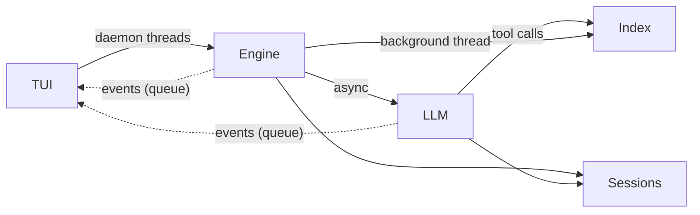
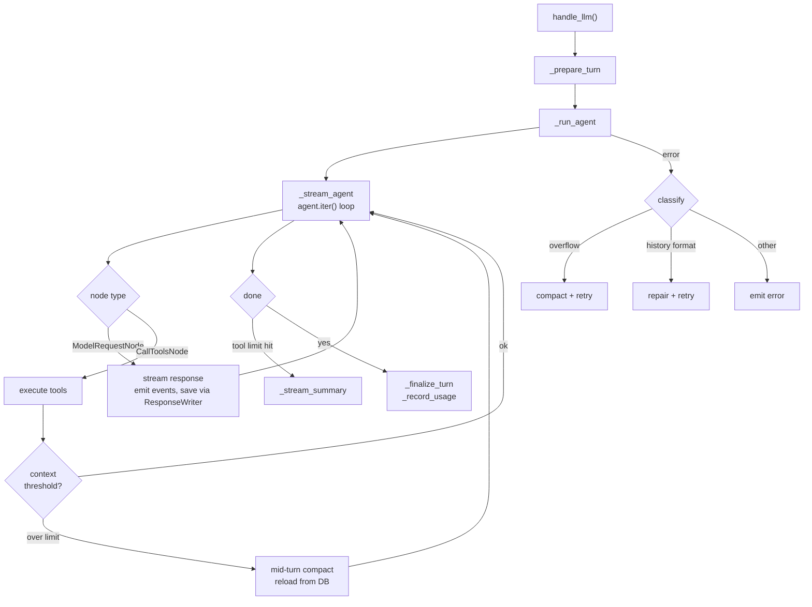
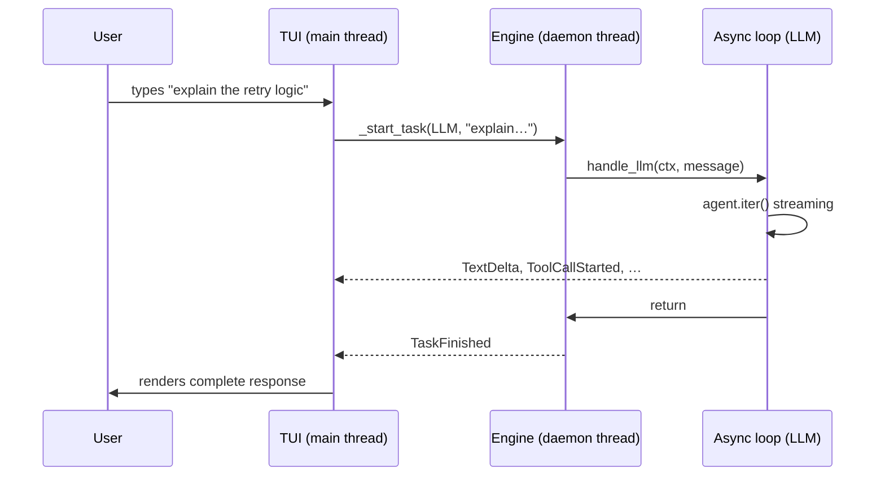
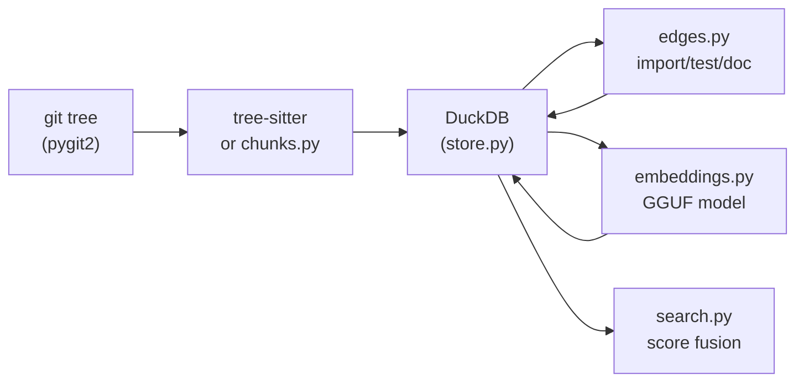

# Architecture

Technical reference for contributors and maintainers.
For usage, see [README.md](README.md).

---

## Overview

rbtr has four layers: a terminal UI that owns the display, an
engine that dispatches commands, an LLM pipeline that streams
model responses, and two storage backends — SQLite for sessions
and DuckDB for the code index.



The TUI dispatches work to the engine in daemon threads. The
engine delegates LLM queries to an anyio `BlockingPortal` on a
dedicated thread. Background indexing runs in its own daemon
thread. All results flow back to the TUI as typed `Event`
models on a `queue.Queue`.

The TUI never runs commands or does I/O beyond rendering. The
engine never imports Rich or touches the display. The portal
is long-lived across tasks to keep httpx connection pools
alive.

### Why two databases

SQLite and DuckDB are both embedded, single-file databases, but
they are built for opposite workloads.

**Sessions (SQLite)** are an OLTP workload: many small appends
(one INSERT per streaming part, per user input, per incident),
concurrent writes from multiple daemon threads, and point-query
reads by `session_id`. SQLite's WAL mode gives non-blocking
multi-reader/multi-writer concurrency, and the stdlib `sqlite3`
module adds zero dependencies. Losing session data is
unrecoverable, so reliability matters more than query speed.

**The code index (DuckDB)** is an OLAP workload: bulk PyArrow
inserts of thousands of chunks, BM25 full-text search over
tokenised content, cosine-similarity vector search over
embeddings, and analytical aggregations for search-score
fusion. DuckDB's columnar storage, vectorized execution, and
multi-threaded query processing make these operations fast.
Index data is derived and rebuildable — a schema change just
triggers a re-index.

DuckDB's concurrency model (single writer per process, MVCC
requiring explicit `CHECKPOINT` for cross-thread visibility)
is acceptable for the index because writes happen in one
background daemon thread with periodic checkpoints, and reads
from the UI thread are non-blocking. That same model would be
a regression for sessions, where multiple threads write
concurrently during streaming.

---

## Configuration and credentials

Two singleton instances, importable directly:

```python
from rbtr.config import config
from rbtr.creds import creds
```

Both use pydantic-settings with TOML files under
`~/.config/rbtr/`. Both support `update(**kwargs)` which
persists to disk and reloads the instance in place.

**`config.py`** reads `config.toml`. Contains preferences,
endpoint URLs, model selection, index settings, and TUI
settings. Environment variables with `RBTR_` prefix override
any TOML value.

**`creds.py`** reads `creds.toml` with 0600 permissions.
Contains OAuth tokens (Claude, ChatGPT, Google), API keys
(OpenAI, Fireworks, OpenRouter), endpoint keys, and the GitHub
token.

**`constants.py`** defines path constants: `RBTR_DIR`
(`~/.config/rbtr/`) and `WORKSPACE_DIR` (`.rbtr/` in the repo
root).

---

## TUI

The TUI lives in `tui/` and runs entirely on the main thread.

**`tui/ui.py`** owns the main event loop. It polls
`queue.Queue[Event]`, matches on the event type, and renders
via Rich `Live`. The terminal's native scroll buffer holds all
conversation history. The Live region is kept small — only the
current active panel and input chrome. Completed panels are
flushed to scrollback so they become part of the terminal's
own scroll history rather than an in-process buffer.

Each panel gets a background colour by variant: `response`
(transparent — LLM markdown text), `succeeded` (green —
command/shell output), `failed` (red — errors and failed tool
calls), `toolcall` (purple — successful tool results),
`input` (grey — user input echo), `queued` (slate — pending
commands). LLM text and tool results are always separate
panels — a multi-tool-call turn produces alternating
`response` and `toolcall` panels. Failed tool calls show a
`✗` icon and the `failed` background.

**`tui/footer.py`** renders the status bar. Pure functions, no
UI state. The footer shows the model name, token usage
(input/output/cache), context window percentage, message count,
cumulative cost, thinking effort level, and index progress.
Colour thresholds signal context pressure (green/yellow/red)
and message count (grey/yellow/red).

**`tui/input.py`** wraps prompt_toolkit for input handling.
Manages bracketed paste detection, paste markers (collapsed
display of large pastes with atomic cursor behaviour), tab
completion (slash commands, command arguments, bash
programmable completion, file paths, executables), multiline
editing via Alt+Enter, and input history backed by the session
database.

---

## Engine

The `Engine` class (`engine/core.py`) is a stateless dispatcher.
It holds references to:

- `EngineState` (`state.py`) — mutable session state shared
  across engine, LLM pipeline, and UI. Contains the repo
  handle, review target, connected providers, index store,
  model cache, usage counters, and discussion cache.
- `SessionStore` (`sessions/store.py`) — session persistence.
- `queue.Queue[Event]` — the event channel to the TUI.
- An anyio `BlockingPortal` on a dedicated daemon thread.

Input is classified and dispatched:

- Starts with `/` → `_handle_command()` routes to the matching
  `engine/*_cmd.py` handler via the `Command` enum.
- Starts with `!` → `handle_shell()` runs the command in a pty
  with output truncation.
- Anything else → `handle_llm()` in the LLM pipeline.

Each `*_cmd.py` module is a standalone handler that receives the
`Engine` instance and an argument string. Handlers emit events
through the engine. They never import or reference the TUI.

Before each task, the engine calls `_sync_store_context()` to
push current metadata (session ID, label, repo, model) to the
session store, so all subsequent writes inherit it.

**`LLMContext`** (`llm/context.py`) is the decoupling boundary
between engine and LLM pipeline. It is a dataclass holding the
state, store, event queue, cancellation flag, and portal.
The engine creates one via `_llm_context()` before each LLM or
compaction call. The LLM pipeline receives it as its only
dependency — it never imports the `Engine` class.

---

## LLM pipeline

The LLM pipeline lives in `llm/` and handles model interaction,
streaming, error recovery, and compaction.



**`handle_llm()`** (`llm/stream.py`) is the entry point.
`_prepare_turn` builds the PydanticAI model, loads history
from the session database, and applies load-time repairs
(corrupt args, dangling tool calls). `_run_agent` then enters
the streaming loop.

**Streaming** iterates `agent.iter()` graph nodes.
`ModelRequestNode` yields text and tool-call deltas, emitted
as `TextDelta` and `ToolCallStarted`/`ToolCallFinished` events.
Each response is persisted via `ResponseWriter` as it streams
(inserted incomplete, updated on finish). `CallToolsNode`
executes tools and checks whether context usage exceeds the
compaction threshold — if so, a mid-turn compaction runs once,
history is reloaded from the database, and the loop resumes.

**Error recovery** classifies failures and retries:

- **Context overflow** — compact history, retry.
- **History format error** — escalating repair. Level 1:
  consolidate tool returns (restructure grouping). Level 2:
  demote thinking parts to plain text, flatten tool exchanges
  to readable text. Retry after each level.
- **Effort unsupported** — disable the effort parameter, retry.
- **Other** — emit the error to the user.

**Tool-call limit.** After `max_requests_per_turn` model
requests (default 25), the loop breaks. A tool-free summary
request asks the model to report what it accomplished and what
remains.

**Key modules:**

- **`agent.py`** — PydanticAI `Agent` definition.
  `@agent.instructions` decorators wire the system prompt,
  review instructions, and index status. The agent is defined
  once at module level; the model is provided at call time.
- **`compact.py`** — a separate tool-less `Agent` for
  compaction. `compact_history()` splits the conversation via
  `split_history()`, serialises old turns, and sends them for
  summarisation. The compaction agent shares the system prompt
  but receives `compact.md` as its task instructions.
- **`history.py`** — repair functions for cross-provider
  compatibility: `consolidate_tool_returns`,
  `demote_thinking`, `flatten_tool_exchanges`,
  `repair_dangling_tool_calls`. All operate on in-memory
  message lists and return new lists — the database is never
  modified.
- **`errors.py`** — pure functions that inspect
  `ModelHTTPError` to classify failures as overflow, history
  format rejection, effort unsupported, or unrecoverable.

---

## Tools

18 tools registered via `@agent.tool` decorators in submodules
under `llm/tools/`. Each receives `RunContext[AgentDeps]` and
returns a string result.

Tools are conditionally visible to the LLM based on session
state. Each tool declares a `prepare` function that either
returns the tool definition (visible) or `None` (hidden). The
LLM never sees a tool it cannot call.

| Prepare function   | Condition                              |
| ------------------ | -------------------------------------- |
| `require_repo`     | A repository is connected (`/review`)  |
| `require_index`    | The code index has finished building   |
| `require_pr`       | A PR or branch is selected             |
| `require_pr_target`| The target is specifically a PR        |
| *(none)*           | Always visible                         |

### File tools (`require_repo`)

| Tool         | Purpose                                                 |
| ------------ | ------------------------------------------------------- |
| `read_file`  | Read file content by path, with pagination              |
| `grep`       | Substring search in one file, a directory, or repo-wide |
| `list_files` | List files in the repository or a subdirectory          |

### Git tools (`require_repo`)

| Tool            | Purpose                                        |
| --------------- | ---------------------------------------------- |
| `changed_files` | List file paths changed between base and head  |
| `diff`          | Unified text diff, optionally filtered by path |
| `commit_log`    | Commit log between base and head               |

### Index tools (`require_index`)

| Tool              | Purpose                                                          |
| ----------------- | ---------------------------------------------------------------- |
| `search`          | Find symbols by name, keywords, or concepts                      |
| `read_symbol`     | Read the full source code of a symbol                            |
| `list_symbols`    | List functions, classes, methods in a file                       |
| `find_references` | Find symbols referencing a given symbol via the dependency graph |
| `changed_symbols` | List symbols changed between base and head                       |

### Draft tools (`require_pr_target`)

| Tool                   | Purpose                                   |
| ---------------------- | ----------------------------------------- |
| `add_draft_comment`    | Add an inline comment to the review draft |
| `edit_draft_comment`   | Edit an existing draft comment            |
| `remove_draft_comment` | Remove a draft comment                    |
| `set_draft_summary`    | Set the top-level review summary          |
| `read_draft`           | Read the current draft                    |

### Discussion tools (`require_pr`)

| Tool                | Purpose                                      |
| ------------------- | -------------------------------------------- |
| `get_pr_discussion` | Read existing discussion on the current PR   |

### Edit tools (always visible)

| Tool   | Purpose                                                  |
| ------ | -------------------------------------------------------- |
| `edit` | Create or modify files matching `editable_include` globs |

File tools read from the git object store first and fall back
to the local filesystem for untracked files (`.rbtr/notes/`,
draft files). The filesystem fallback respects `.gitignore` and
the `include`/`extend_exclude` config. Tools that accept a
`ref` parameter return the state of the codebase at that
snapshot (`"head"`, `"base"`, or a raw commit SHA), not the
changes introduced by it.

All paginated tools accept `offset` and a per-call limit. When
output is truncated, a trailer tells the LLM how many results
remain and how to request the next page.

---

## Provider system

Every provider satisfies the `Provider` protocol:

```python
class Provider(Protocol):
    GENAI_ID: str
    LABEL: str
    def is_connected(self) -> bool: ...
    def list_models(self) -> list[str]: ...
    def build_model(self, model_name: str) -> Model: ...
    def model_settings(self, model_id: str, model: Model,
                       effort: ThinkingEffort) -> ModelSettings | None: ...
    def context_window(self, model_id: str) -> int | None: ...
```

The `PROVIDERS` dict in `providers/__init__.py` is the single
registration point — a mapping from `BuiltinProvider` enum
values to provider instances. All dispatch functions
(`build_model`, `model_settings`, `model_context_window`) call
`_resolve()`, which splits `<prefix>/<model-id>`, looks up the
prefix in `PROVIDERS`, and falls back to `endpoint.resolve()`
for custom endpoints. Nothing else in the codebase imports
provider modules directly.

**Builtin providers:**

| Prefix       | Module            | Auth        |
| ------------ | ----------------- | ----------- |
| `claude`     | `claude.py`       | OAuth/PKCE  |
| `chatgpt`    | `openai_codex.py` | OAuth/PKCE  |
| `google`     | `google.py`       | OAuth/PKCE  |
| `openai`     | `openai.py`       | API key     |
| `fireworks`  | `fireworks.py`    | API key     |
| `openrouter` | `openrouter.py`   | API key     |

**Custom endpoints** (`/connect endpoint <name> <url> [key]`)
are stored in `config.toml` under `[endpoints.<name>]` with
optional keys in `creds.toml` under `[endpoint_keys]`.
`endpoint.py` wraps each as an `EndpointProvider` that satisfies
the same protocol. Endpoint providers appear in model listings,
tab completion, and dispatch identically to builtin providers.

**API-key providers** share a generic connect handler in
`connect_cmd.py`. Each exposes a `CRED_FIELD` attribute naming
the credential field (e.g. `"fireworks_api_key"`). The connect
command stores the key via `creds.update()`, and `setup.py`
auto-detects stored keys on startup by calling
`prov.is_connected()` for each registered provider.

**OAuth providers** (Claude, ChatGPT, Google) each have their
own connect handler with PKCE and a localhost callback.
Tokens are stored in `creds.toml` under a provider-specific
section and refreshed automatically when they expire.

**`shared.py`** contains helpers used by multiple providers:
`openai_chat_model_settings()` maps `ThinkingEffort` to
OpenAI-compatible settings, and `genai_prices_context_window()`
looks up context windows from the `genai-prices` library.

### How to add a provider

1. **Create `providers/<name>.py`** with a class satisfying
   `Provider`. Use `fireworks.py` as a template for API-key
   providers, `google.py` for OAuth providers. Instantiate the
   class as a module-level `provider` variable.

2. **Add a credential field** to `Creds` in `creds.py` (e.g.
   `newprov_api_key: str = ""`).

3. **Add an enum variant** to `BuiltinProvider` in
   `providers/__init__.py`.

4. **Add an entry** to the `PROVIDERS` dict mapping the new
   enum variant to the provider instance.

5. **Add a connect handler** in `engine/connect_cmd.py`. For
   API-key providers, add `CRED_FIELD` and optionally
   `KEY_PREFIX` to the provider class — the generic
   `_connect_api_key` handler will work automatically. OAuth
   providers need a dedicated handler in the `match` block.

6. **Add auto-detect** in `engine/setup.py`. The existing loop
   over `PROVIDERS` already calls `prov.is_connected()` for
   each registered provider, so API-key providers work with no
   changes. OAuth providers may need additional setup logic.

Model listing, tab completion, dispatch, and pricing via
`genai-prices` all derive from the registry automatically.

---

## Prompt architecture

The LLM receives instructions assembled from four templates in
`prompts/`, rendered via minijinja:

| Template          | Agent      | Content                             |
| ----------------- | ---------- | ----------------------------------- |
| `system.md`       | Both       | Identity, authority, language style |
| `review.md`       | Main       | Review context, principles, format  |
| `compact.md`      | Compaction | What to preserve/drop in summaries  |
| `index_status.md` | Main       | Index availability, tool readiness  |

**Main agent** receives three `@agent.instructions` decorators:
`_system()` renders `system.md`, `_review_task(ctx)` renders
`review.md` with live state (date, repo, PR metadata), and
`_index_status(ctx)` renders `index_status.md` with the current
index state and the names of tools that require it. All three
run on every turn.

**Compaction agent** is a separate tool-less `Agent` instance
in `llm/compact.py`. It receives two
`@compact_agent.instructions` decorators: `_system()` (same
`render_system()` as the main agent) and `_compact_task()`
(renders `compact.md`). The shared system prompt ensures
consistent identity and language across both agents.

**`review.md`** is a Jinja template with variables populated
from `EngineState`: `date`, `owner`, `repo`, `target_kind`,
`base_branch`, `branch`, `pr_number`, `pr_title`, `pr_author`,
`pr_body`, `editable_globs`.

**`system.md`** has two template variables:
`project_instructions` and `append_system`.

### Customisation

Three layers, applied in order:

1. **System prompt override.** If `~/.config/rbtr/SYSTEM.md`
   exists, it replaces the built-in `system.md`. The same
   template variables (`project_instructions`, `append_system`)
   are available. Only the system prompt is replaced — review
   and compaction instructions are unaffected.

2. **Append system.** If `~/.config/rbtr/APPEND_SYSTEM.md`
   exists, its content is injected into the `append_system`
   template variable. Plain markdown, not a template. Applies
   to both agents.

3. **Project instructions.** Files listed in
   `config.project_instructions` (default `["AGENTS.md"]`) are
   read from the repo root, concatenated, and injected into the
   `project_instructions` template variable. Missing files are
   silently skipped.

Tool docstrings are the single source of truth for tool
behaviour. The prompt templates describe capabilities
conceptually without naming tools or parameters.

---

## Threading and communication

Three thread types coexist at runtime.

**Main thread.** The TUI. Owns the Rich `Live` context and the
prompt_toolkit input session. Polls `queue.Queue[Event]` in a
loop and renders each event. Never runs commands or performs
blocking I/O beyond display.

**Daemon threads.** The engine spawns one per task via
`threading.Thread(daemon=True)`. Commands (`/review`, `/model`),
shell execution (`!git log`), and LLM queries each run in their
own daemon thread. Background indexing is a separate daemon
thread launched by `/review`. Daemon threads communicate results
exclusively through the event queue — they never call TUI
methods.

**Async portal.** An anyio `BlockingPortal` created at engine
init via `start_blocking_portal(backend="asyncio")`. LLM
streaming runs as coroutines on the portal via
`portal.call()`. The portal persists across tasks so httpx
connection pools stay alive between turns.



### Cancellation

`Ctrl+C` sets a `threading.Event` on the engine and signals
an `anyio.Event` via `anyio.from_thread.run_sync()`. The LLM
pipeline checks cancellation at two levels:

- **Synchronous.** `LLMContext.out()` and `LLMContext.warn()`
  check the `threading.Event` before emitting and raise
  `TaskCancelled`.
- **Asynchronous.** `_run_with_cancel()` wraps the entire
  agent turn in an anyio task group with a cancel scope. A
  watcher task awaits an `anyio.Event` that the engine sets
  from the UI thread (zero-latency bridge via a shared
  `CancelSlot`). When fired, the watcher cancels the scope,
  tearing down streaming, compaction, and all async work.
  `TaskCancelled` is raised to the caller.

Shell commands are killed via `SIGTERM` to the process group.

The engine's `run_task()` catches `TaskCancelled` and emits
`TaskFinished(success=False, cancelled=True)`. The TUI
re-enables the input prompt.

### Events

All communication from engine and LLM threads to the TUI flows
through typed Pydantic models defined in `events.py`. The TUI
matches on the `Event` union type.

#### Lifecycle

| Event          | Description                                |
| -------------- | ------------------------------------------ |
| `TaskStarted`  | A new task has begun (carries `task_type`) |
| `TaskFinished` | A task has completed                       |

#### Output

| Event            | Description                                      |
| ---------------- | ------------------------------------------------ |
| `Output`         | A line of text with a semantic `OutputLevel`     |
| `TableOutput`    | A table (columns and rows as plain strings)      |
| `MarkdownOutput` | Markdown content to render                       |
| `LinkOutput`     | A link with URL and optional label               |
| `FlushPanel`     | Flush active lines to scrollback or discard them |

`Output.level` is an `OutputLevel` enum (`INFO`, `WARNING`,
`ERROR`, `SHELL_STDERR`). The TUI maps each level to a theme
key for rendering. `Output.detail` optionally carries
expandable diagnostic text (shown via Ctrl+O on errors).

#### LLM streaming

| Event              | Description                                            |
| ------------------ | ------------------------------------------------------ |
| `TextDelta`        | A streaming text chunk                                 |
| `ToolCallStarted`  | The LLM is calling a tool                              |
| `ToolCallFinished` | A tool call has completed (carries optional `error`)   |

#### Index

| Event           | Description                                   |
| --------------- | --------------------------------------------- |
| `IndexStarted`  | Background indexing has begun                 |
| `IndexProgress` | Progress update (phase, indexed count, total) |
| `IndexReady`    | Indexing complete, store is queryable         |
| `IndexCleared`  | Index has been cleared                        |

#### Compaction

| Event                | Description                               |
| -------------------- | ----------------------------------------- |
| `CompactionStarted`  | Compaction has begun (message counts)     |
| `CompactionFinished` | Compaction complete (summary token count) |

#### Fact extraction

| Event                    | Description                                           |
| ------------------------ | ----------------------------------------------------- |
| `FactExtractionStarted`  | Fact extraction has begun                             |
| `FactExtractionFinished` | Fact extraction complete (added/confirmed/superseded) |

#### Review

| Event          | Description                     |
| -------------- | ------------------------------- |
| `ReviewPosted` | A review was posted to GitHub   |

---

## Code index

The code index lives in `index/` and provides structural and
semantic search across the repository. It runs in a background
daemon thread — the review proceeds immediately while indexing
catches up. Once ready, the LLM gains access to the index tools
(`search`, `read_symbol`, `list_symbols`, `find_references`,
`changed_symbols`).



### Data flow

**File listing.** `index/git.py` lists files from the git tree
at a commit ref, filtered by `.gitignore`, the
`include`/`extend_exclude` config, and `max_file_size`.

**Extraction.** For each file, the orchestrator dispatches to
one of three strategies:

- **Tree-sitter** (`treesitter.py`) — if the language plugin
  provides a grammar and query. Extracts functions, classes,
  methods, and imports as structured `Chunk` objects with
  names, kinds, line ranges, and scope.
- **Custom chunker** — if the language plugin provides a
  `chunker` function (e.g. markdown heading-hierarchy
  splitting).
- **Plaintext** (`chunks.py`) — fallback. Splits the file into
  fixed-size overlapping line chunks.

**Storage.** `store.py` bulk-inserts chunks via PyArrow into
DuckDB. Each chunk is keyed by `(commit_sha, file_path,
start_line)`.

**Edge inference.** `edges.py` infers cross-file relationships
from chunk metadata and content:

- **Import edges** — from tree-sitter import extractors
  (structural) or text-search fallback.
- **Test edges** — `test_foo.py` → `foo.py` by naming
  convention and import analysis.
- **Doc edges** — markdown/RST sections that mention function
  or class names.

**Embeddings.** `embeddings.py` computes vectors using a local
GGUF model (bge-m3, quantized). Runs on Metal (Apple Silicon)
or CPU. No API calls. Chunks are embedded in configurable batch
sizes.

**Tokenisation.** `tokenise.py` provides code-aware
tokenisation for BM25 indexing: splits camelCase and
snake_case identifiers, emits both the compound form and its
parts. Applied at index time and query time.

### Storage schema

One DuckDB file per repo at `.rbtr/index/index.duckdb`. Three
tables:

- **`file_snapshots`** — maps `(commit_sha, file_path)` to
  `blob_sha`. Used for incremental updates: if a file's blob
  SHA hasn't changed, its chunks are reused.
- **`chunks`** — extracted symbols. Each row has the chunk's
  name, kind, file path, line range, content, tokenised
  content (for BM25), and an optional embedding vector.
- **`edges`** — cross-file relationships. Each row connects a
  source chunk to a target chunk with an edge kind (IMPORTS,
  TESTS, DOCUMENTS, CALLS, DEFINES).

### Incremental updates

`build_index()` indexes a single commit. `update_index()`
indexes a head commit given an existing index at a base commit
— it copies unchanged file snapshots and only re-extracts
changed files. Both deduplicate at the blob level: if two files
(or two commits) share the same blob SHA, chunks are extracted
once.

### Search

`IndexStore.search()` fuses three retrieval channels into a
single ranked result list:

- **Name matching** — case-insensitive substring and
  token-level matching against chunk names.
- **BM25 keyword search** — full-text search over tokenised
  chunk content.
- **Semantic similarity** — cosine distance between query and
  chunk embeddings. Skipped when embeddings are unavailable;
  its weight is redistributed to the other channels.

`classify_query()` routes each query as `IDENTIFIER`,
`CONCEPT`, or `PATTERN` and adjusts fusion weights accordingly.
Identifier queries favour name matching; concept queries favour
BM25 and semantic similarity.

After fusion, post-fusion multipliers adjust scores:

- **Kind boost** — classes and functions rank above imports.
- **File category penalty** — source files rank above tests.
- **Importance** — chunks with more inbound edges rank higher.
- **Proximity** — chunks in files touched by the current diff
  rank higher.

### Graceful degradation

- No grammar installed for a language → line-based plaintext
  chunking.
- No embedding model (missing GGUF, GPU init failure) →
  structural index works, semantic signal skipped.
- Slow indexing → review starts immediately, index tools
  appear when `IndexReady` is emitted.

---

## Language plugin system

Language plugins use [pluggy](https://pluggy.readthedocs.io/).
Each plugin implements the `rbtr_register_languages` hook and
returns a list of `LanguageRegistration` instances
(`plugins/hookspec.py`).

### Registration order

The plugin manager (`plugins/manager.py`) registers plugins in
precedence order:

1. `DefaultsPlugin` (`plugins/defaults.py`) — grammar-only and
   detection-only registrations for languages without full
   plugins (C#, CSS, HCL, markdown, etc.).
2. Language-specific plugins (`plugins/python.py`,
   `plugins/go.py`, etc.) — override defaults for the same
   language ID.
3. External plugins via the `rbtr.languages` setuptools entry
   point — highest priority.

### Progressive capability

Each field on `LanguageRegistration` unlocks more analysis:

| Field              | Unlocks                                |
| ------------------ | -------------------------------------- |
| `id` + `extensions`| File detection, line-based chunks      |
| `chunker`          | Custom chunking (no grammar needed)    |
| `grammar_module`   | Tree-sitter parsing                    |
| `query`            | Structural symbol extraction           |
| `import_extractor` | Structural import metadata for edges   |
| `scope_types`      | Method-in-class scoping                |

### How to add a language

**Minimal (detection only).** Add an entry in
`plugins/defaults.py`:

```python
LanguageRegistration(id="kotlin", extensions=frozenset({".kt", ".kts"}))
```

This gives file detection and line-based plaintext chunking.

**With tree-sitter grammar:**

1. Create `plugins/<language>.py` with a plugin class.
2. Decorate the registration method with `@hookimpl`.
3. Return a `LanguageRegistration` with `grammar_module`,
   `query`, and optionally `import_extractor` and
   `scope_types`.
4. Register the plugin in `plugins/manager.py`
   (`_register_builtins`).
5. Add the grammar package to `pyproject.toml` optional deps.

Use `plugins/bash.py` as a minimal grammar example (functions
only, no imports, no classes). Use `plugins/python.py` for a
full example with import extractor and scope types.

**External plugins** register via the `rbtr.languages` entry
point:

```toml
# hypothetical third-party plugin's pyproject.toml
[project.entry-points."rbtr.languages"]
kotlin = "rbtr_kotlin:KotlinPlugin"
```

`hookspec.py` exports two utilities for plugin authors:
`parse_path_relative()` for languages with filesystem-relative
imports (JS, TS) and `collect_scoped_path()` for languages with
`::` or `.`-separated scoped identifiers (Rust, Java).

---

## Session persistence

Conversation history lives in a single SQLite database at
`.rbtr/sessions.db`. All reads and writes go through
`SessionStore` (`sessions/store.py`), which serialises
PydanticAI message objects into a flat fragment table.

### Schema

One table, `fragments`, stores everything — messages, parts,
user input, and incidents. Sessions are a grouping column, not
a separate table.

Key columns:

| Column           | Purpose                                     |
| ---------------- | ------------------------------------------- |
| `id`             | UUID7 primary key                           |
| `session_id`     | Groups fragments into sessions              |
| `message_id`     | Self-referential FK — parts point to header |
| `fragment_index` | Ordering within a message (0 = header)      |
| `fragment_kind`  | Discriminator (`FragmentKind` enum)         |
| `status`         | Lifecycle state (`FragmentStatus` enum)     |
| `data_json`      | Serialised PydanticAI message or part       |
| `user_text`      | Extracted user prompt (for search/display)  |
| `tool_name`      | Extracted tool name (for search/display)    |
| `compacted_by`   | FK to summary message that replaced this    |

### Fragment kinds

`FragmentKind` has four groups:

**Message-level** — `REQUEST_MESSAGE`, `RESPONSE_MESSAGE`. One
row per message, `fragment_index = 0`. Contains the full
serialised `ModelRequest` or `ModelResponse` (minus parts).

**PydanticAI parts** — `USER_PROMPT`, `SYSTEM_PROMPT`,
`TOOL_RETURN`, `RETRY_PROMPT`, `TEXT`, `TOOL_CALL`, `THINKING`,
`FILE`, `BUILTIN_TOOL_CALL`, `BUILTIN_TOOL_RETURN`. One row per
part, `fragment_index >= 1`, linked to the message header via
`message_id`.

**User input** — `COMMAND`, `SHELL`. Standalone rows recording
slash commands and shell invocations.

**Incidents** — `LLM_ATTEMPT_FAILED`, `LLM_HISTORY_REPAIR`.
Standalone rows recording failures and repairs (see History
repair below).

### Fragment status

| Status        | Meaning                                  |
| ------------- | ---------------------------------------- |
| `IN_PROGRESS` | Streaming response being written         |
| `COMPLETE`    | Finished row, visible to `load_messages` |
| `FAILED`      | Failed turn, excluded from replay        |

`IN_PROGRESS` rows are invisible to `load_messages()` — they
become visible only when `ResponseWriter.finish()` sets the
status to `COMPLETE`. Failed rows are visible in
`search_history` (so the user can retry via up-arrow) but
excluded from the message list sent to the LLM.

### Streaming persistence

`ResponseWriter` provides incremental persistence during LLM
streaming. Created by `SessionStore.begin_response()`, it
inserts parts as they arrive (`add_part` on `PartStartEvent`,
`finish_part` on `PartEndEvent`) and finalises the message with
cost and token counts. If the process crashes mid-stream, the
`IN_PROGRESS` rows are simply invisible on next load — no
cleanup needed.

### Session compaction

`compact_session()` replaces a range of messages with a
summary. It inserts the summary message and its content
fragments, then sets `compacted_by` on each replaced message,
linking it to the summary.

Compacted messages are excluded from `load_messages()` via a
`WHERE compacted_by IS NULL` filter. The original messages
remain in the database — compaction is non-destructive.

### Session lifecycle

- **Creation.** A new `session_id` (UUID7) is generated on
  `/review` or at startup.
- **Continuation.** `/continue` loads the most recent session
  for the current repo and restores `EngineState` from it.
- **Retention.** `delete_old_sessions` enforces age-based
  cleanup via `/session purge <duration>`. Deletion cascades
  from message headers to parts via the `message_id` FK.

---

## History repair

Persisted history is immutable. When the LLM rejects a
conversation (provider-incompatible tool encoding, context
overflow, unsupported parameters), repairs are applied
transiently in memory. The original messages are never
modified. Each repair is recorded as an incident row.

### Repair stages

Repairs run in `_prepare_turn()` at three escalating levels:

**Level 0 — structural repair (every turn):**

- `repair_dangling_tool_calls` — injects synthetic
  `(cancelled)` tool returns for unmatched `ToolCallPart`s
  left by a cancelled turn. Merges synthetic returns into
  existing `ModelRequest`s to maintain provider-expected
  pairing.

**Level 1 — consolidate (after first rejection):**

- `consolidate_tool_returns` — restructures tool returns so
  each response's returns are in one request. Fixes
  cross-provider pairing mismatches without destroying content.

**Level 2 — simplify (after second rejection):**

- `demote_thinking` — converts `ThinkingPart` to `TextPart`
  wrapped in `<thinking>` tags (some providers reject
  thinking parts from other providers).
- `flatten_tool_exchanges` — converts `ToolCallPart` /
  `ToolReturnPart` pairs to plain text, removing structural
  pairing entirely. Last resort.

### Error classification and recovery

`handle_llm()` in `stream.py` classifies exceptions and selects
a recovery strategy:

| Failure kind         | Trigger               | Recovery                   |
| -------------------- | --------------------- | -------------------------- |
| `HISTORY_FORMAT`     | 400 + format error    | `CONSOLIDATE` / `SIMPLIFY` |
| `OVERFLOW`           | Context exceeded      | `COMPACT_THEN_RETRY`       |
| `EFFORT_UNSUPPORTED` | 400 + effort rejected | `EFFORT_OFF`               |
| `TOOL_ARGS`          | Malformed tool args   | `SIMPLIFY_HISTORY`         |
| `TYPE_ERROR`         | Adapter null values   | `SIMPLIFY_HISTORY`         |
| `CANCELLED`          | Ctrl+C                | `NONE`                     |
| `UNKNOWN`            | Unclassified          | `NONE`                     |

### Incident recording

Every retry cycle persists two incident rows:

1. **`LLM_ATTEMPT_FAILED`** — records `FailureKind`, strategy,
   diagnostic traceback, error text, model name, and HTTP
   status code.
2. **`LLM_HISTORY_REPAIR`** — records `RecoveryStrategy`, the
   specific transformation applied, and counts (parts demoted,
   tool calls flattened, etc.).

After the retry, the outcome is written back:

| `IncidentOutcome` | Meaning                               |
| ----------------- | ------------------------------------- |
| `RECOVERED`       | Retry succeeded                       |
| `FAILED`          | Retry also failed                     |
| `ABORTED`         | No recovery attempted (unrecoverable) |

Incidents are queryable via `/stats` and visible in session
history exports but never injected into the conversation sent
to the LLM.

---

## Cross-session memory

The `facts` table in `sessions.db` stores durable knowledge
that persists across conversations. Facts have a `scope` —
`"global"` for cross-project preferences, or `"owner/repo"`
for project-specific knowledge the agent learned during
reviews. Static project instructions live in `AGENTS.md`;
facts are agent-learned only.

### Storage

Facts are stored in the same SQLite database as sessions.
Store methods live on `SessionStore`: `insert_fact`,
`confirm_fact`, `supersede_fact`, `load_active_facts`,
`delete_fact`, `delete_old_facts`, `search_facts`. A
`facts_fts` FTS5 virtual table (content-external, synced via
triggers) enables keyword search for deduplication.

### Fact extraction

A dedicated `fact_extract_agent` (`llm/memory.py`) identifies
durable facts from conversation messages. It follows the
background agent pattern (see below): module-level `Agent()`,
`@instructions` decorators for the static task prompt
(`prompts/memory_extract.md`), model passed at each call
site. The conversation and existing facts are passed as the
user prompt.

Three triggers:

- **Compaction** — runs concurrently with the summary
  agent via `asyncio.gather`. The compaction summary and
  fact extraction are independent (different serialisations,
  different agents).
- **`/draft post`** — after posting a review, the richest
  source of project knowledge.
- **`/memory extract`** — explicit user command.

Orchestration is split into composable steps:

1. `run_fact_extraction()` — async, runs the agent, returns
   `FactExtractionRun` (raw results + cost + model refs)
   or `None`.
2. `apply_fact_extraction()` — async, processes facts,
   persists overhead, runs clarification if needed.
   Single orchestrator used by both `extract_facts_from_ctx`
   (daemon thread entry point) and `compact_history_async`.
3. `extract_facts_from_ctx()` — sync daemon-thread wrapper
   that emits `FactExtractionStarted`/`Finished` events
   around steps 1 and 2 via `portal.call`.

### Deduplication

LLM-driven. The extraction prompt includes all existing
active facts for the same scopes. The LLM tags each
extraction as `new`, `confirm` (re-observed, with
`existing_content`), or `supersede` (outdated, with
`existing_content` of the old fact). No client-side dedup
logic — the LLM sees the full context and makes the
decision. If it occasionally misses a near-duplicate,
`/memory purge` provides explicit cleanup.

Content-based matching throughout — no IDs exposed to LLMs.
The `remember` tool, fact injection, extraction prompt, and
clarification retry all reference facts by their text
content.

### Fact clarification

When the LLM's `existing_content` doesn't exactly match any
active fact (typo, paraphrase), the failed facts are
collected and a follow-up prompt is sent to the same agent
with `message_history` from the first call. One retry only;
still-unresolved facts are logged and skipped. Overhead from
clarification is persisted as a separate fragment.

### Lifecycle

Facts are created via fact extraction (at compaction, after
`/draft post`, or on demand) or the `remember` tool. They
accumulate `confirm_count` as they are re-observed. A fact
can be superseded (replaced by a newer one). Long-term
cleanup is explicit via `/memory purge <duration>`, which
deletes facts by `last_confirmed_at` — same pattern as
`/session purge`.

### Overhead tracking

Both compaction and fact extraction incur LLM costs outside
the main conversation. These are persisted as overhead
fragments (`overhead-compaction`, `overhead-fact-extraction`)
and tracked separately in `SessionUsage`. The `/stats`
command breaks down overhead by type.

Each overhead fragment carries a typed `data_json` payload
(`CompactionOverhead` or `FactExtractionOverhead`) with
domain-specific metadata (trigger, message counts, model
name, fact IDs). Persistence is domain-specific — extraction
overhead is saved in `memory.py`, compaction overhead in
`compact.py`.

---

## Background agent pattern

Compaction and fact extraction are independent background
agents that share structural conventions but no code. Future
background agents should follow the same pattern.

Each is a module-level PydanticAI `Agent()` with
`@instructions` decorators: `render_system()` for shared
identity, plus a task-specific `.md` template. The model is
passed at call time, not baked in — background agents may
use a different model than the main conversation.

### Cost tracking

Background agent calls incur LLM costs outside the main
conversation. These are persisted as overhead fragments
(`overhead-compaction`, `overhead-fact-extraction`) via
`store.save_overhead()` and recorded on `SessionUsage`.
Each overhead type has its own `FragmentKind`, data model,
and `record_*` method — deliberately not unified. The
`/stats` command breaks down overhead by type.

---

## Styling

All visual styling is centralised in `styles.py`.
`build_theme()` selects the palette for the configured mode and
passes it to Rich's `Theme`.

### Palette hierarchy

`PaletteConfig` is the base Pydantic model. It defines ANSI
text-style defaults (shared across modes) and declares
background fields as required (no defaults). `DarkPalette`
and `LightPalette` subclass it to provide mode-specific
background hex defaults. Because Pydantic uses the field's
type to deserialise, partial TOML overrides like
`[theme.light] bg_succeeded = "on #E0FFE0"` get the
correct light defaults for unset fields — no validators needed.

### Theme configuration

`[theme]` in config controls the colour mode:

- `mode` — `"dark"` (default) or `"light"`.
- `[theme.dark]` / `[theme.light]` — per-mode field overrides.
  Any Rich style string is valid.

### Theme structure

Code references semantic style keys — never inline hex colours
or ad-hoc style strings. Only the TUI imports `styles.py`.

Events carry semantic data, not style strings. `Output` events
use an `OutputLevel` enum (`INFO`, `WARNING`, `ERROR`,
`SHELL_STDERR`). The TUI maps each level to a theme key when
rendering. No engine or LLM module imports from `styles.py`.

### Style groups

| Group      | Keys                           | Purpose                   |
| ---------- | ------------------------------ | ------------------------- |
| Prompt     | `rbtr.prompt`, `.input`        | Input area                |
| Panels     | `rbtr.bg.*` (6 keys)           | Panel background by state |
| Text       | `rbtr.dim/muted/warning/error` | Semantic colours          |
| Chrome     | `rbtr.rule`, `.footer`         | Separators, status bar    |
| Completion | `rbtr.completion.*`            | Tab-completion menu       |
| Usage      | `rbtr.usage.*`                 | Context-window indicator  |
| Output     | `rbtr.out.*` (5 keys)          | TUI-internal level styles |
| Inline     | `rbtr.link`                    | Links                     |

---

## Review draft and GitHub integration

The draft system lets the LLM build a review incrementally,
sync it with GitHub's pending review, and post it. Three
modules collaborate:

- **`github/draft.py`** — local persistence and matching.
  Loads, saves, and diffs YAML draft files.
- **`github/client.py`** — GitHub API wrapper. Reads and
  writes pending reviews, converts between line formats.
- **`engine/publish.py`** — orchestration. Coordinates pull,
  merge, push, post, and draft cleanup.

### Draft persistence

Each PR's draft lives at `.rbtr/drafts/<pr>.yaml`. The file
is updated atomically (temp file + rename) on every mutation.
A `threading.Lock` serialises concurrent tool calls that
modify the same draft.

`ReviewDraft` contains a summary, a list of `InlineComment`
objects, and sync metadata (`github_review_id`,
`summary_hash`). Each `InlineComment` carries `path`, `line`,
`side`, `body`, optional `suggestion`, and sync fields
(`github_id`, `commit_id`, `comment_hash`).

### GitHub API constraints

Two hard API limitations shape the sync design:

**No individual pending-comment updates.** PATCH on a pending
review comment returns 404. DELETE works, but there is no way
to *modify* a single pending comment — the only option is to
delete the entire review and recreate it. Every push therefore
goes through a delete → create cycle. To track comments across
this cycle, each comment's `github_id` is recorded locally and
re-established after each push by re-fetching the new review.

**No modern line data on the per-review endpoint.** The write
path sends `line` + `side` (modern API) and GitHub accepts
them. However, the read endpoint
(`GET /repos/{o}/{r}/pulls/{n}/reviews/{id}/comments`) returns
`line: null`, `side: null`, and `subject_type: null` for all
review comments — pending and submitted. Only the deprecated
`position` field and the `diff_hunk` string are available. The
per-PR endpoint (`GET /pulls/{n}/comments`) returns modern
fields but excludes pending comments. The individual comment
endpoint (`GET /pulls/comments/{id}`) returns 404 for pending
comments.

> Verified 2026-02-27 with direct httpx calls using
> `Accept: application/vnd.github+json` and
> `X-GitHub-Api-Version: 2022-11-28`. If GitHub fixes this,
> `get_pending_review` already checks `data.get("line")`
> first — the hunk-walking fallback only fires when `line`
> is null.

### Position ↔ line conversion

Three functions in `client.py` handle the conversion:

**`_walk_hunk(diff_hunk)`** — the single source of truth.
Yields `(position, line, side)` for each diff line by
parsing the `@@ -old,n +new,m @@` header and classifying
each subsequent line by its prefix: `+` → RIGHT (new), `-`
→ LEFT (old), context → RIGHT (both counters advance).

**`_position_to_line(diff_hunk)`** — returns the last
`(line, side)` from the walk. The commented line is always
the last line in the hunk GitHub returns.

**`_line_to_position(diff_hunk, line, side)`** — the
inverse. Finds the first matching `(line, side)` and returns
its position. Used when pushing comments back.

### Content hashing

`_comment_hash(c)` computes a 16-char SHA-256 hex digest
over `path`, `line`, `body`, and `suggestion`. `side` and
`commit_id` are excluded — they are resolution metadata not
visible in the GitHub UI. `line` is included because the
position → line conversion is deterministic.

`_summary_hash(summary)` hashes the review body the same
way.

Hashes are only written during sync (via `stamp_synced()`),
never when the LLM or user edits a comment. Any edit makes
the live hash diverge from the stored one — this is how
dirty detection works without diffing content.

### Matching algorithm

`match_comments()` pairs remote comments against local in
two tiers:

**Tier 1 — `github_id`.** If a local comment has a
`github_id` from a previous sync and a remote comment has
the same ID, they match. Primary mechanism.

**Tier 2 — `(path, line, formatted_body)`.** For local
comments without a `github_id` (newly created, never
synced), match by exact content against unmatched remotes.
Pairs greedily, 1:1. If multiple remotes have identical
content, none are matched — ambiguity is not guessed at.

After both tiers: unmatched remotes are imported as new
local comments. Locals with a stale `github_id` (absent
from remote) were deleted on GitHub and are removed locally.

### Three-way merge

`_reconcile()` uses the stored `comment_hash` as a common
ancestor. Each side's current content is hashed and compared
to the stored hash to determine who changed what.

Conflicts resolve in favour of the local draft. The warning
includes a preview of the remote body. The same logic applies
to the review summary via `summary_hash`.

### Tombstones

When `remove_draft_comment` is called on a synced comment
(has `github_id`), the body and suggestion are cleared but
`github_id` and `comment_hash` are preserved. This creates a
tombstone — `is_tombstone()` checks for `github_id` set and
`body` empty.

During sync:

- Tombstones match their remote by `github_id` (tier 1).
  Three-way merge sees local as dirty → keeps the tombstone.
- Tombstones are excluded from the pushed comments. The new
  pending review is created without them.
- After a successful push, tombstones are dropped from the
  saved draft.

This prevents a deleted comment from being re-imported on
the next pull. Comments without a `github_id` (never synced)
are removed immediately — no tombstone needed.

### Stale comment translation

When a comment's `commit_id` differs from the current PR
head, `_translate_stale_comments()` uses
`translate_line(repo, path, old_sha, new_sha, line)` from
`git/objects.py` to compute the comment's new line number.
The function walks the diff hunks between the two commits to
map old lines to new ones. Comments targeting deleted lines
are separated out and skipped with a warning.

### Sync protocol

**Pull** (automatic on `/review <n>`):

1. Fetch the user's PENDING review via
   `client.get_pending_review()`. Remote comments arrive
   with `line: null` — recover `(line, side)` from
   `diff_hunk` via `_position_to_line()`.
2. Match remote comments to local via `match_comments()`
   (tier 1 by ID, tier 2 by content).
3. Reconcile each matched pair via `_reconcile()` — accept
   remote edits, detect conflicts.
4. Import unmatched remotes, remove remote deletions.
5. Stamp hashes via `stamp_synced()` and save.

**Push** (part of `/draft sync`):

1. Translate stale comments — if a comment's `commit_id`
   differs from the current PR head, translate its line
   number via `translate_line()`. Comments targeting deleted
   lines are skipped with a warning.
2. Validate against current diff via
   `_partition_comments()` — comments whose `(path, line)`
   is no longer in a diff hunk are kept locally but excluded
   from the push.
3. Delete existing PENDING review (404 = already gone,
   crash recovery).
4. Create new PENDING review with `line` + `side` +
   `commit_id` via `client.push_pending_review()`.
5. Re-fetch to learn new `github_id`s (they change on every
   recreate). Recover `(line, side)` from `diff_hunk` again.
6. Tier-2 match returned comments to local (content is
   exact since we just wrote them).
7. Store new `github_id`s on local comments.
8. Merge pushed and skipped-stale comments back into the
   draft. Set `github_review_id` on the draft.
9. Stamp `comment_hash` and `summary_hash` via
   `stamp_synced()`, save to disk.

### Post flow

`post_review_draft()` in `publish.py`:

1. Pull remote to detect unsynced comments. Refuse if the
   remote has comments not in the local draft.
2. Delete existing PENDING review.
3. Drop tombstones, translate stale comments, validate
   against diff.
4. Post via `client.post_review()` as a single API call.
5. Delete local draft file.
