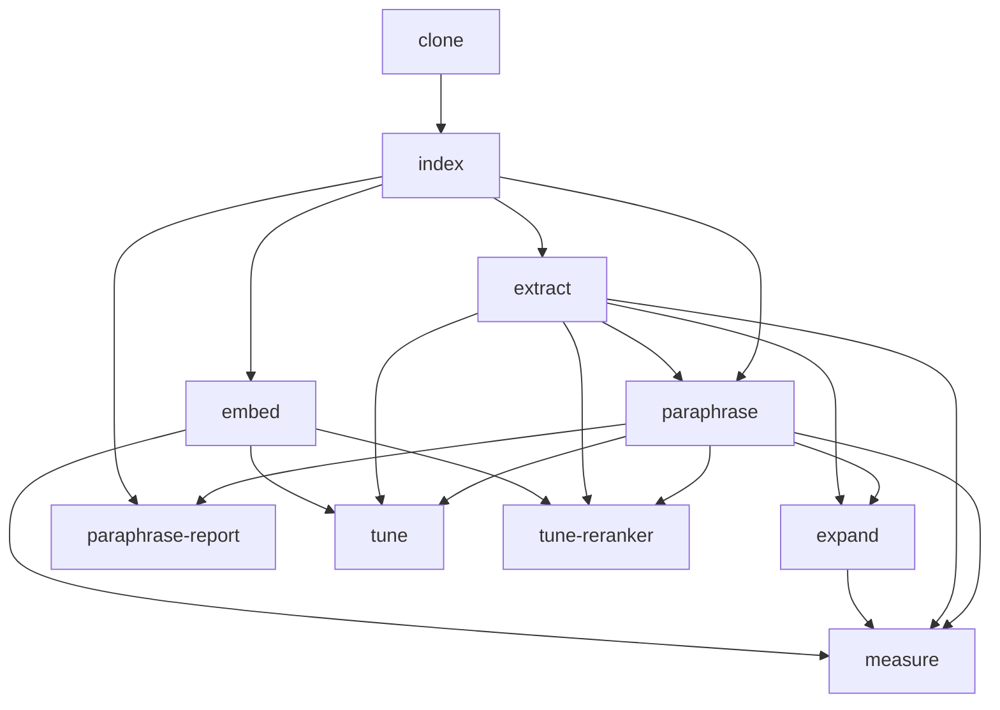

# rbtr-eval

Search-quality evaluation harness for [rbtr](../rbtr).

## What it does

Measures whether natural-language queries retrieve their
target symbol from the `rbtr` index. Two jobs:

1. **Benchmark search quality.** Index a set of repos,
   sample queries from documented symbols, and report
   Hit@k / MRR / NDCG@10.
2. **Tune the search fusion weights `(α, β, γ)`.**
   Bayesian-optimise over the unit simplex and report
   the best triple per query kind. `tune` only reports;
   the operator decides whether to adopt the weights.

## Usage

Pipeline is driven by [DVC](https://dvc.org). From this
package directory:

```bash
uv run dvc repro            # run every stage end-to-end
uv run dvc repro tune       # also (or only) run the tune stage
uv run dvc repro extract    # rebuild from extract onwards
uv run dvc repro --dry      # show the plan without running
```

From the workspace root: `just eval`.

### Pipeline DAG

Regenerate: `uv run dvc dag --mermaid --collapse-foreach-matrix`.



### Stages

| Stage               | What it does                                             | Output                                                       |
| ------------------- | -------------------------------------------------------- | ------------------------------------------------------------ |
| `clone@<slug>`      | `git clone --depth 1` each repo                          | `data/repos/<slug>/`                                         |
| `extract@<slug>`    | sample docstring-derived queries from one repo           | `data/per-repo/<slug>.parquet`, `data/headers/<slug>.parquet`|
| `paraphrase@<slug>` | LLM-generate concept queries per repo                    | `data/concept/<slug>.parquet`                                |
| `paraphrase-report` | summarise paraphrase quality                             |                                                              |
| `expand`            | LLM-generate keywords/variants for all queries           | `data/expansion/expansions.parquet`                          |
| `index`             | chunk repos into the DuckDB index (no embeddings)        | `data/index/`                                                |
| `embed`             | embed all chunks                                         | `data/index/`                                                |
| `measure`           | replay every query under each expansion arm; aggregate   | `data/metrics.json`                                          |
| `tune`              | Bayesian-optimise fusion weights                         |                                                              |
| `tune-reranker`     | grid-search reranker pool size and blend weight per kind |                                                              |

Indexing is split into `index` (chunking) and `embed`
(embedding) so that `extract` and `paraphrase` can run in
parallel with `embed` — they only read from the DuckDB
index. `measure` and `tune` each open one warm daemon for
the duration of the stage.

### Iterating on the harness

While developing, narrow `vars.repos` in `dvc.yaml` to one
entry (rbtr self) and lower `queries_per_cell`:

```yaml
vars:
  - queries_per_cell: 10
  - n_trials: 5
  - tune_queries_per_cell: 2
  - repos:
      - slug: rbtr__rbtr
        url: ../..
```

Restore the full list before the benchmark run. The
trimmed config runs in ~30 seconds; the full pipeline
(`queries_per_cell=25`, 5 repos) takes ~12 hours.

## Experiment log

### Eval methodology

**Docstring ablation (full vs stripped variants).** Indexed
each repo twice — with and without docstrings — to measure
their contribution to search quality. Hit@10 55% full vs
25% stripped — decisive. Removed because the variant
dimension consumed half the eval budget (2× indexing, 2×
search) and had no product use case beyond answering that
one question.

**LLM-paraphrased concept queries.** Added a `concept`
query provenance: an LLM describes what a function does
without using any of its identifier names. Tests vocabulary
mismatch — the failure mode where a user's words don't
match the code's names. Concept MRR 0.281 vs docstring
0.834 — revealed where search was weakest and motivated
the expansion and reranking work.

**Grid search → Bayesian optimisation for tuning.** The
original `tune` stage evaluated every query at every grid
point on the weight simplex (step 0.2 → 21 triples × 10k+
queries → 200k+ searches). Replaced by Bayesian
optimisation (Optuna TPE) which found better optima with
~10× fewer searches.

**Cell-based stratified sampling.** Replaced three separate
subsampling implementations (proportional cap, equal
provenance, cell-based) with a single strategy: sample up
to `queries_per_cell` rows from each `(slug, language,
provenance)` cell. Ensures every repo/language/provenance
combination is represented regardless of corpus size.

### Search quality — shipped

**Language-agnostic edge inference.** Import resolution was
Python-only — zero import edges for all other languages,
~136k false doc edges from config files. Rewrote with
language-declared module styles (dotted for Python/Java,
path-based for everything else). Doc edges replaced noisy
word-matching with explicit hyperlink extraction for
markdown and RST.

**Language plugins and prose chunking.** Added tree-sitter
chunkers for markdown, RST, JSON, TOML, YAML, CSS, HTML,
HCL. Previously non-code files got fixed-size line chunks.
Structural chunking (heading hierarchy for prose, key
hierarchy for config) gave BM25 and name search meaningful
units to match against.

**Multi-vector semantic scan.** When query expansion
produces variant phrasings, all query vectors are evaluated
in a single DuckDB scan using `CROSS JOIN` +
`MAX(cosine_similarity)`. Each chunk is scored against the
closest matching vector. Replaced sequential per-variant
table scans — 7–32× faster for 3 vectors.

**Client-side query expansion.** Query expansion (synonym
keywords and variant phrasings) is now client-supplied.
The `expand` DVC stage pre-generates expansion via an LLM
API; `measure --expansion-dir` joins the results onto
queries and passes them as `SearchRequest` fields.
Previously a local GGUF model generated expansion at
search time; this was replaced due to poor expansion
quality from the small model, ~1.5s p50 latency overhead,
and GPU memory cost.

**Expansion ablation.** `measure` runs each query under
four arms — `none`, `keywords`, `variants`, `both`.
Keywords feed BM25; variants feed semantic. Concept
queries benefit (+0.016 MRR from keywords). Code and
identifier queries are slightly hurt — expansion dilutes
the lexical signal these kinds rely on.

**Per-kind fusion weight tuning.** Tuned separate (α, β, γ)
weights per query kind (concept / identifier / code)
instead of a single global triple. Concept needs semantic
(α ≫ γ); identifier and code need name-match (γ ≫ α).
The tuner's code recommendation is unstable across runs
(γ=0.89 then γ=0.52) — the optimum surface is flat.
Gains concentrate in data-like languages (yaml, toml,
markdown); Python/TypeScript are flat.

**Punctuation-ratio concept gate.** Added a
punctuation-ratio check to the query classifier. Previously
any query with ≥ 3 words was classified as CONCEPT,
misrouting structured names (CSS selectors, dot-joined
paths). Misclassification 19.7% → ~4.2% with 0.6%
true-concept loss.

**Cross-encoder reranking.** Added a cross-encoder
(Qwen3-Reranker-0.6B) that re-scores the top fusion
candidates with full query-document attention. MRR 0.359 →
0.466 (+0.107), Hit@1 29.2% → 39.8% (+10.6pp). Latency
cost: p50 +2s.

**Per-kind reranker settings.** Different query types need
different reranker budgets. Concept queries ("how does X
work") improve steadily as the reranker sees more
candidates — scoring 50 instead of 20 cuts the not-found
rate by 8pp. Identifier queries ("find function foo")
don't benefit from a larger pool at all, so they run
cheaply at 20. How much to trust the reranker vs the
original fusion score barely matters — the number of
candidates is what counts.
