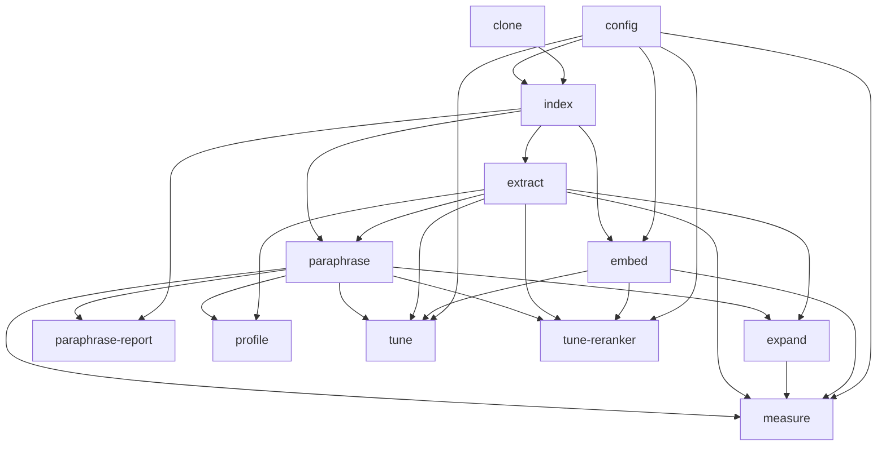

# rbtr-eval

Search-quality evaluation harness for [rbtr](../rbtr).

## What it does

Measures whether natural-language queries retrieve their
target symbol from the `rbtr` index. Two jobs:

1. **Benchmark search quality.** Index a set of repos,
   sample queries from documented symbols, and report
   Hit@k / MRR / NDCG@10.
2. **Tune the search fusion weights `(α, β, γ)`.**
   Bayesian-optimise over the unit simplex and report
   the best triple per query kind. `tune` only reports;
   the operator decides whether to adopt the weights.

## Usage

Pipeline is driven by [DVC](https://dvc.org). From this
package directory:

```bash
uv run dvc repro            # run every stage end-to-end
uv run dvc repro tune       # also (or only) run the tune stage
uv run dvc repro extract    # rebuild from extract onwards
uv run dvc repro --dry      # show the plan without running
```

From the workspace root: `just eval`.

### Pipeline DAG

Regenerate: `uv run dvc dag --mermaid --collapse-foreach-matrix`.


```mermaid
flowchart TD
	node1["clone"]
	node2["config"]
	node3["embed"]
	node4["expand"]
	node5["extract"]
	node6["index"]
	node7["measure"]
	node8["paraphrase"]
	node9["paraphrase-report"]
	node10["profile"]
	node11["tune"]
	node12["tune-reranker"]
	node1-->node6
	node2-->node3
	node2-->node6
	node2-->node7
	node2-->node11
	node2-->node12
	node3-->node7
	node3-->node11
	node3-->node12
	node4-->node7
	node5-->node4
	node5-->node7
	node5-->node8
	node5-->node10
	node5-->node11
	node5-->node12
	node6-->node3
	node6-->node5
	node6-->node8
	node6-->node9
	node8-->node4
	node8-->node7
	node8-->node9
	node8-->node10
	node8-->node11
	node8-->node12
```

### Stages

| Stage               | What it does                                                        | Output                                                        |
| ------------------- | ------------------------------------------------------------------- | ------------------------------------------------------------- |
| `config`            | freeze the index config the later stages share                      | `data/config/`                                                |
| `clone@<slug>`      | `git clone --depth 1` each repo                                     | `data/repos/<slug>/`                                          |
| `extract@<slug>`    | sample name/body/docstring queries from every measurable chunk kind | `data/per-repo/<slug>.parquet`, `data/headers/<slug>.parquet` |
| `paraphrase@<slug>` | LLM-generate concept queries per repo                               | `data/concept/<slug>.parquet`                                 |
| `paraphrase-report` | summarise paraphrase quality                                        | `data/PARAPHRASE.md`                                          |
| `profile`           | profile the sampled query set before it is measured                 | `data/DATASET.md`                                             |
| `expand`            | LLM-generate keywords/variants for all queries                      | `data/expansion/expansions.parquet`                           |
| `index`             | chunk repos into the DuckDB index (no embeddings)                   | `data/index/`, `data/INDEX.md`                                |
| `embed`             | embed all chunks                                                    | `data/index/`, `data/EMBEDDING.md`                            |
| `measure`           | replay every query under each expansion arm; aggregate              | `data/metrics.json`, `data/BENCHMARKS.md`                     |
| `tune`              | Bayesian-optimise fusion weights                                    | `data/TUNING.md`                                              |
| `tune-reranker`     | grid-search reranker pool size and blend weight per kind            | `data/RERANKER_TUNING.md`                                     |

Indexing is split into `index` (chunking) and `embed`
(embedding) so that `extract` and `paraphrase` can run in
parallel with `embed` — they only read from the DuckDB
index. `measure` and `tune` each open one warm daemon for
the duration of the stage.

### Iterating on the harness

While developing, narrow `vars.repos` in `dvc.yaml` to one
entry (rbtr self) and lower `queries_per_cell`:

```yaml
vars:
  - queries_per_cell: 10
  - n_trials: 5
  - tune_queries_per_cell: 2
  - repos:
      - slug: rbtr__rbtr
        url: ../..
```

Restore the full list before the benchmark run. The trimmed
config runs in ~30 seconds; the committed one
(`queries_per_cell=10`, 5 repos) took ~16 hours on its last
run — `data/BENCHMARKS.md` records the elapsed time of
whichever run produced it.

## Methodology

**Cell-based stratified sampling.** Queries are sampled up to
`queries_per_cell` from each `(slug, language, provenance)`
cell, so every repo/language/provenance combination is
represented regardless of corpus size.

**Query provenance.** Queries come from a symbol's name, its
body, its docstring, and — for `concept` — an LLM description
of what the symbol does that uses none of its identifier
names. Concept queries exist to measure vocabulary mismatch,
the case where a user's words and the code's names do not
overlap; they score far below docstring queries and are the
reason expansion and reranking were built.

**Expansion ablation.** `measure` replays every query under
four arms — `none`, `keywords`, `variants`, `both`. Keywords
feed BM25, variants feed the semantic channel, so the arms
separate which channel each form of expansion actually helps.

**The corpus is each clone's HEAD.** `dvc.yaml` indexes the
repos without naming a ref and then runs `gc --keep-head-only`
per repo, so each has exactly one indexed snapshot. The `index`
and `embed` stages refuse to write a report when that does not
hold — a second snapshot, from a worktree the daemon indexed
while the run was in flight, would add its counts to every
total.

**Chunks and chunk locations are both reported.**
[`data/INDEX.md`](data/INDEX.md) counts a chunk once and counts
it again for each file holding it, because a chunk is content
and identical content in several files is one row. The gap
between the two is how much of the corpus is repeated content.
Edges are counted per location, so a duplicated file's import
reaches the sibling beside each copy.

**Weight tuning is a recommendation, not a change.** `tune`
reports the best `(α, β, γ)` per query kind; adopting them is
a deliberate edit to the shipped defaults. The code kind's
optimum surface is flat enough that its recommendation moves
between runs, which is a reason to read the tuner's output
rather than apply it.

What the current run measured is in
[`data/BENCHMARKS.md`](data/BENCHMARKS.md), with the tuning
reports beside it in [`data/TUNING.md`](data/TUNING.md) and
[`data/RERANKER_TUNING.md`](data/RERANKER_TUNING.md).

## Rejected approaches

Measured, lost, and worth not repeating.

**A docstring ablation dimension.** Indexing each repo twice,
with and without docstrings, showed docstrings are decisive
for search quality — Hit@10 55% against 25%. The dimension
was then removed: it doubled both indexing and search for the
whole benchmark, and no product decision depended on
re-measuring a settled result. Worth restoring only if
docstring handling itself changes.

**Grid search over the weight simplex.** The original `tune`
stage scored every query at every grid point (step 0.2 → 21
triples × 10k+ queries → 200k+ searches). Optuna's TPE
sampler reaches better optima with roughly a tenth of the
searches, so the grid is only worth revisiting for an
exhaustive sweep of a very small space.

**A local model for query expansion.** Expansion once ran
from a small local GGUF model at search time. Its output was
poor, it added about 1.5 s at p50, and it held GPU memory
alongside the embedder. Expansion is now client-supplied —
the session LLM in pi, the `expand` stage here — which costs
nothing at search time and produces better terms. Revisit if
a local model ever matches API expansion quality within the
latency budget.
