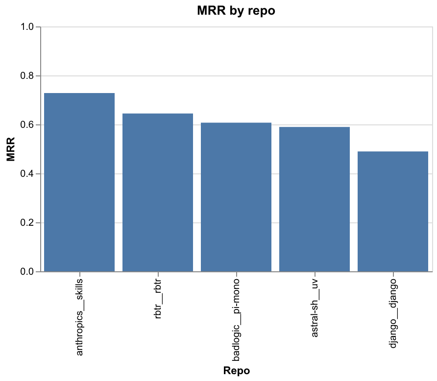
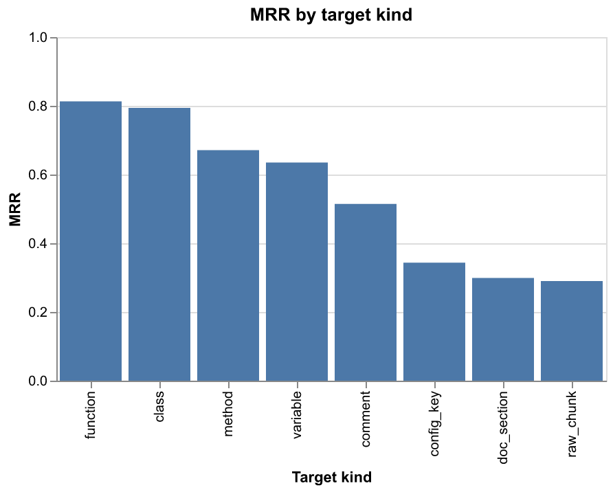
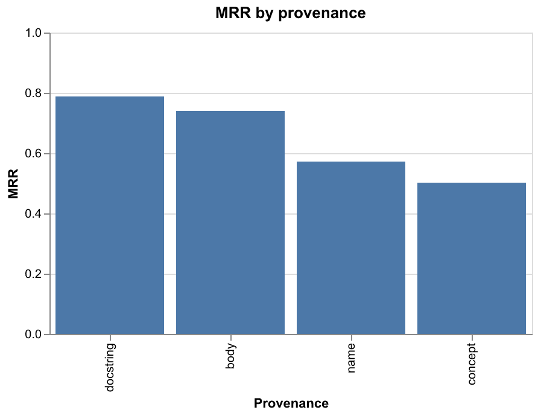

# rbtr search-quality benchmark

Hit@k / MRR / NDCG@10 for queries against the rbtr index. See
`packages/rbtr-eval/README.md` for methodology.

## Run

Reproduce: `cd packages/rbtr-eval && uv run dvc repro`.

| field         | value                                     |
| ------------- | ----------------------------------------- |
| seed          | 0                                         |
| sample target | 10 per (repo, language, kind, provenance) |
| total queries | 3621                                      |
| elapsed       | 55660 s                                   |

## Headline metrics

No-expansion baseline (arm `none`) per repo. The expansion
ablation is in the section below.

| repo                 | n    | Hit@1 | Hit@3 | Hit@10 | MRR   | NDCG@10 | median rank | not found |
| -------------------- | ---- | ----- | ----- | ------ | ----- | ------- | ----------- | --------- |
| **all repos**        | 3621 | 50.6% | 68.4% | 80.8%  | 0.608 | 0.657   | 1           | 19.2%     |
| `anthropics__skills` | 737  | 62.4% | 81.1% | 91.9%  | 0.728 | 0.775   | 1           | 8.1%      |
| `astral-sh__uv`      | 894  | 48.8% | 66.1% | 78.9%  | 0.589 | 0.638   | 1           | 21.1%     |
| `badlogic__pi-mono`  | 659  | 51.0% | 67.4% | 80.7%  | 0.607 | 0.656   | 1           | 19.3%     |
| `django__django`     | 769  | 40.4% | 55.1% | 67.1%  | 0.489 | 0.533   | 1           | 32.9%     |
| `rbtr__rbtr`         | 562  | 51.4% | 74.6% | 88.3%  | 0.644 | 0.703   | 1           | 11.7%     |

## Expansion ablation

MRR / Hit@k for each expansion arm (`none`, `keywords`,
`variants`, `both`) broken down by query kind, aggregated
across all repos. Compare arms within a kind to read the
effect of each channel.

| arm      | query kind   | n    | Hit@1 | Hit@3 | Hit@10 | MRR   | NDCG@10 |
| -------- | ------------ | ---- | ----- | ----- | ------ | ----- | ------- |
| both     | **all**      | 3621 | 48.3% | 66.3% | 79.0%  | 0.586 | 0.636   |
| keywords | **all**      | 3621 | 48.7% | 66.6% | 79.2%  | 0.59  | 0.639   |
| none     | **all**      | 3621 | 50.6% | 68.4% | 80.8%  | 0.608 | 0.657   |
| variants | **all**      | 3621 | 50.2% | 68.1% | 81.0%  | 0.606 | 0.655   |
| both     | `code`       | 541  | 74.5% | 90.2% | 93.7%  | 0.824 | 0.852   |
| keywords | `code`       | 541  | 74.9% | 90.0% | 93.9%  | 0.826 | 0.854   |
| none     | `code`       | 541  | 76.9% | 90.4% | 94.6%  | 0.84  | 0.866   |
| variants | `code`       | 541  | 76.5% | 90.6% | 94.5%  | 0.838 | 0.865   |
| both     | `concept`    | 1566 | 37.6% | 58.4% | 74.4%  | 0.497 | 0.557   |
| keywords | `concept`    | 1566 | 38.2% | 58.8% | 74.8%  | 0.502 | 0.561   |
| none     | `concept`    | 1566 | 39.3% | 59.4% | 74.6%  | 0.509 | 0.566   |
| variants | `concept`    | 1566 | 38.7% | 58.9% | 74.8%  | 0.504 | 0.563   |
| both     | `identifier` | 1514 | 50.0% | 66.1% | 78.4%  | 0.594 | 0.64    |
| keywords | `identifier` | 1514 | 50.3% | 66.2% | 78.5%  | 0.597 | 0.642   |
| none     | `identifier` | 1514 | 52.9% | 69.8% | 82.3%  | 0.628 | 0.675   |
| variants | `identifier` | 1514 | 52.8% | 69.7% | 82.6%  | 0.628 | 0.676   |

## Per-kind breakdown

Retrieval quality for each target chunk kind (`symbol_kind`),
aggregated across repos, languages and provenances.

| symbol_kind   | n   | Hit@1 | Hit@3 | Hit@10 | MRR   | NDCG@10 | not found |
| ------------- | --- | ----- | ----- | ------ | ----- | ------- | --------- |
| `function`    | 627 | 73.5% | 87.9% | 94.6%  | 0.813 | 0.846   | 5.4%      |
| `class`       | 630 | 70.6% | 86.8% | 93.0%  | 0.794 | 0.828   | 7.0%      |
| `method`      | 427 | 53.4% | 77.5% | 92.7%  | 0.671 | 0.734   | 7.3%      |
| `variable`    | 722 | 51.5% | 72.6% | 87.4%  | 0.635 | 0.693   | 12.6%     |
| `comment`     | 331 | 38.1% | 60.7% | 78.2%  | 0.515 | 0.579   | 21.8%     |
| `config_key`  | 335 | 26.3% | 40.6% | 50.1%  | 0.344 | 0.382   | 49.9%     |
| `doc_section` | 272 | 22.8% | 34.2% | 48.9%  | 0.299 | 0.344   | 51.1%     |
| `raw_chunk`   | 277 | 18.1% | 33.6% | 57.8%  | 0.29  | 0.358   | 42.2%     |

## Target × request shape

MRR for each target kind sliced by request shape (`query_kind`) —
which kinds search finds well, and via which kind of query.

| symbol_kind   | concept | identifier | code  |
| ------------- | ------- | ---------- | ----- |
| `class`       | 0.736   | 0.795      | 0.896 |
| `comment`     | 0.446   | 0.615      | 0.333 |
| `config_key`  | 0.267   | 0.38       | 0.614 |
| `doc_section` | 0.191   | 0.356      | 0.639 |
| `function`    | 0.745   | 0.814      | 0.941 |
| `method`      | 0.59    | 0.633      | 0.896 |
| `raw_chunk`   | 0.241   | 0.31       | 0.49  |
| `variable`    | 0.507   | 0.708      | 0.797 |

## Search latency

Shared index home size: **1.9 GiB**.

| repo                 | search P50 | search P95 |
| -------------------- | ---------- | ---------- |
| **all repos**        | 3093 ms    | 7619 ms    |
| `anthropics__skills` | 2959 ms    | 7237 ms    |
| `astral-sh__uv`      | 3264 ms    | 9369 ms    |
| `badlogic__pi-mono`  | 2734 ms    | 7182 ms    |
| `django__django`     | 3380 ms    | 6971 ms    |
| `rbtr__rbtr`         | 3001 ms    | 6908 ms    |

## Per-language breakdown

Aggregated across all repos for each language present in the sample.

| language     | n   | Hit@1 | Hit@3 | Hit@10 | MRR   | NDCG@10 | median rank | not found |
| ------------ | --- | ----- | ----- | ------ | ----- | ------- | ----------- | --------- |
| ``           | 110 | 21.8% | 44.5% | 67.3%  | 0.36  | 0.436   | 2           | 32.7%     |
| `bash`       | 234 | 71.8% | 85.5% | 95.7%  | 0.798 | 0.837   | 1           | 4.3%      |
| `css`        | 355 | 62.5% | 79.7% | 92.1%  | 0.725 | 0.772   | 1           | 7.9%      |
| `html`       | 59  | 23.7% | 35.6% | 47.5%  | 0.308 | 0.348   | 1           | 52.5%     |
| `javascript` | 431 | 62.6% | 80.0% | 87.5%  | 0.716 | 0.755   | 1           | 12.5%     |
| `json`       | 198 | 17.2% | 30.8% | 42.9%  | 0.253 | 0.295   | 2           | 57.1%     |
| `markdown`   | 282 | 24.1% | 36.5% | 56.0%  | 0.326 | 0.382   | 2           | 44.0%     |
| `python`     | 902 | 60.2% | 77.9% | 88.1%  | 0.701 | 0.745   | 1           | 11.9%     |
| `rst`        | 40  | 7.5%  | 20.0% | 37.5%  | 0.151 | 0.203   | 3           | 62.5%     |
| `rust`       | 247 | 46.2% | 70.0% | 83.8%  | 0.595 | 0.654   | 1           | 16.2%     |
| `sql`        | 78  | 52.6% | 76.9% | 94.9%  | 0.663 | 0.732   | 1           | 5.1%      |
| `toml`       | 73  | 39.7% | 47.9% | 58.9%  | 0.453 | 0.485   | 1           | 41.1%     |
| `typescript` | 521 | 52.2% | 74.1% | 88.5%  | 0.65  | 0.707   | 1           | 11.5%     |
| `yaml`       | 91  | 33.0% | 53.8% | 63.7%  | 0.441 | 0.489   | 1           | 36.3%     |

## Per-provenance breakdown

Aggregated across all repos and languages for each provenance.

| provenance  | n    | Hit@1 | Hit@3 | Hit@10 | MRR   | NDCG@10 | median rank | not found |
| ----------- | ---- | ----- | ----- | ------ | ----- | ------- | ----------- | --------- |
| `body`      | 913  | 64.7% | 82.1% | 89.2%  | 0.74  | 0.778   | 1           | 10.8%     |
| `concept`   | 1526 | 38.6% | 58.7% | 73.9%  | 0.502 | 0.559   | 1           | 26.1%     |
| `docstring` | 389  | 71.2% | 85.6% | 90.0%  | 0.788 | 0.816   | 1           | 10.0%     |
| `name`      | 793  | 47.3% | 62.8% | 79.9%  | 0.572 | 0.627   | 1           | 20.1%     |

## Truncation impact

MRR breakdown by whether the target chunk's embedding was truncated
to fit the context window.

| embedding | n     | MRR   |
| --------- | ----- | ----- |
| full      | 14300 | 74.8% |
| truncated | 184   | 52.4% |
