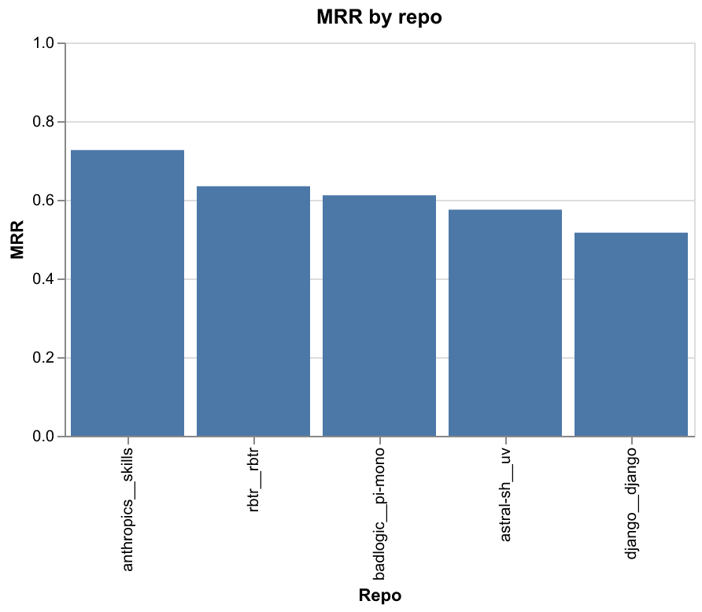
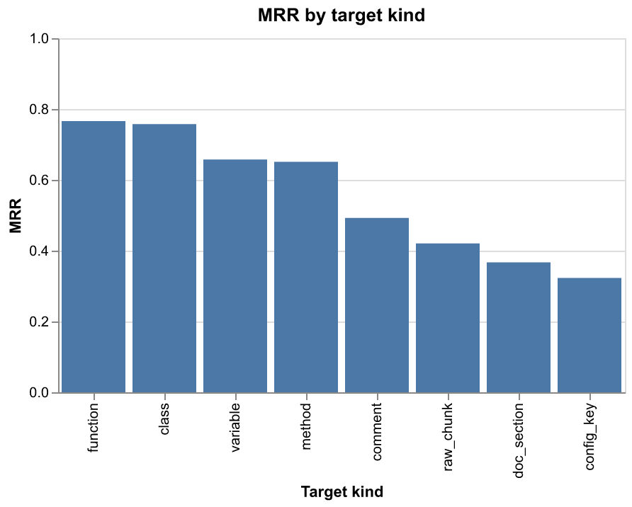
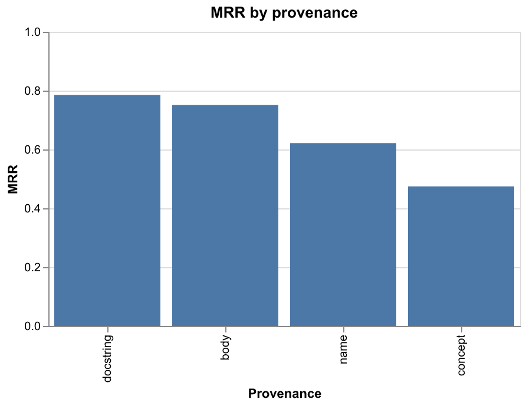

# rbtr search-quality benchmark

Hit@k / MRR / NDCG@10 for queries against the rbtr index. See
`packages/rbtr-eval/README.md` for methodology.

## Run

Reproduce: `cd packages/rbtr-eval && uv run dvc repro`.

| field         | value                                     |
| ------------- | ----------------------------------------- |
| seed          | 0                                         |
| sample target | 10 per (repo, language, kind, provenance) |
| total queries | 3623                                      |
| elapsed       | 63180 s                                   |

## Headline metrics

No-expansion baseline (arm `none`) per repo. The expansion
ablation is in the section below.

| repo                 | n    | Hit@1 | Hit@3 | Hit@10 | MRR   | NDCG@10 | median rank | not found |
| -------------------- | ---- | ----- | ----- | ------ | ----- | ------- | ----------- | --------- |
| **all repos**        | 3623 | 50.9% | 68.8% | 79.9%  | 0.61  | 0.656   | 1           | 20.1%     |
| `anthropics__skills` | 735  | 62.3% | 81.9% | 91.3%  | 0.731 | 0.776   | 1           | 8.7%      |
| `astral-sh__uv`      | 904  | 47.1% | 64.9% | 75.3%  | 0.572 | 0.616   | 1           | 24.7%     |
| `badlogic__pi-mono`  | 651  | 50.1% | 67.4% | 80.8%  | 0.601 | 0.651   | 1           | 19.2%     |
| `django__django`     | 746  | 43.8% | 58.7% | 69.0%  | 0.524 | 0.564   | 1           | 31.0%     |
| `rbtr__rbtr`         | 587  | 52.1% | 72.7% | 85.7%  | 0.64  | 0.693   | 1           | 14.3%     |

## Expansion ablation

MRR / Hit@k for each expansion arm (`none`, `keywords`,
`variants`, `both`) broken down by query kind, aggregated
across all repos. Compare arms within a kind to read the
effect of each channel.

| arm      | query kind   | n    | Hit@1 | Hit@3 | Hit@10 | MRR   | NDCG@10 |
| -------- | ------------ | ---- | ----- | ----- | ------ | ----- | ------- |
| both     | **all**      | 3623 | 49.1% | 66.8% | 78.9%  | 0.593 | 0.641   |
| keywords | **all**      | 3623 | 49.3% | 66.9% | 79.1%  | 0.595 | 0.643   |
| none     | **all**      | 3623 | 50.9% | 68.8% | 79.9%  | 0.61  | 0.656   |
| variants | **all**      | 3623 | 51.0% | 68.6% | 80.0%  | 0.611 | 0.657   |
| both     | `code`       | 582  | 72.3% | 86.8% | 90.5%  | 0.797 | 0.825   |
| keywords | `code`       | 582  | 72.5% | 86.9% | 90.7%  | 0.799 | 0.826   |
| none     | `code`       | 582  | 74.7% | 88.1% | 91.6%  | 0.816 | 0.841   |
| variants | `code`       | 582  | 74.7% | 88.0% | 91.8%  | 0.816 | 0.841   |
| both     | `concept`    | 1595 | 36.2% | 56.2% | 73.9%  | 0.483 | 0.544   |
| keywords | `concept`    | 1595 | 36.5% | 56.3% | 73.9%  | 0.485 | 0.547   |
| none     | `concept`    | 1595 | 36.5% | 56.7% | 72.4%  | 0.483 | 0.542   |
| variants | `concept`    | 1595 | 36.7% | 56.6% | 72.5%  | 0.484 | 0.543   |
| both     | `identifier` | 1446 | 53.9% | 70.5% | 79.8%  | 0.633 | 0.673   |
| keywords | `identifier` | 1446 | 54.1% | 70.4% | 80.0%  | 0.634 | 0.675   |
| none     | `identifier` | 1446 | 57.1% | 74.3% | 83.5%  | 0.667 | 0.709   |
| variants | `identifier` | 1446 | 57.1% | 74.1% | 83.5%  | 0.667 | 0.709   |

## Per-kind breakdown

Retrieval quality for each target chunk kind (`symbol_kind`),
aggregated across repos, languages and provenances.

| symbol_kind   | n   | Hit@1 | Hit@3 | Hit@10 | MRR   | NDCG@10 | not found |
| ------------- | --- | ----- | ----- | ------ | ----- | ------- | --------- |
| `function`    | 641 | 69.1% | 85.2% | 93.1%  | 0.778 | 0.816   | 6.9%      |
| `class`       | 640 | 67.3% | 83.8% | 92.5%  | 0.766 | 0.805   | 7.5%      |
| `method`      | 435 | 51.7% | 78.4% | 90.6%  | 0.657 | 0.718   | 9.4%      |
| `variable`    | 751 | 53.5% | 73.4% | 87.1%  | 0.651 | 0.705   | 12.9%     |
| `comment`     | 356 | 36.2% | 57.9% | 74.2%  | 0.492 | 0.552   | 25.8%     |
| `raw_chunk`   | 60  | 30.0% | 53.3% | 61.7%  | 0.421 | 0.469   | 38.3%     |
| `doc_section` | 403 | 29.0% | 39.0% | 48.1%  | 0.351 | 0.382   | 51.9%     |
| `config_key`  | 337 | 23.1% | 36.8% | 48.7%  | 0.314 | 0.356   | 51.3%     |

## Target × request shape

MRR for each target kind sliced by request shape (`query_kind`) —
which kinds search finds well, and via which kind of query.

| symbol_kind   | concept | identifier | code  |
| ------------- | ------- | ---------- | ----- |
| `class`       | 0.67    | 0.805      | 0.874 |
| `comment`     | 0.405   | 0.62       | 0.215 |
| `config_key`  | 0.211   | 0.391      | 0.477 |
| `doc_section` | 0.183   | 0.467      | 0.687 |
| `function`    | 0.684   | 0.802      | 0.917 |
| `method`      | 0.572   | 0.617      | 0.901 |
| `raw_chunk`   | 0.35    | 0.473      | 0.52  |
| `variable`    | 0.51    | 0.736      | 0.815 |

## Search latency

| repo                 | search P50 | search P95 |
| -------------------- | ---------- | ---------- |
| **all repos**        | 3657 ms    | 8090 ms    |
| `anthropics__skills` | 3621 ms    | 8117 ms    |
| `astral-sh__uv`      | 4086 ms    | 8877 ms    |
| `badlogic__pi-mono`  | 3251 ms    | 7975 ms    |
| `django__django`     | 3988 ms    | 7831 ms    |
| `rbtr__rbtr`         | 3494 ms    | 7427 ms    |

## Per-language breakdown

Aggregated across all repos for each language present in the sample.

| language     | n   | Hit@1 | Hit@3 | Hit@10 | MRR   | NDCG@10 | median rank | not found |
| ------------ | --- | ----- | ----- | ------ | ----- | ------- | ----------- | --------- |
| `bash`       | 389 | 60.7% | 78.4% | 87.4%  | 0.705 | 0.746   | 1           | 12.6%     |
| `css`        | 349 | 58.7% | 80.8% | 92.0%  | 0.708 | 0.76    | 1           | 8.0%      |
| `html`       | 39  | 28.2% | 33.3% | 43.6%  | 0.32  | 0.347   | 1           | 56.4%     |
| `javascript` | 431 | 62.9% | 78.9% | 88.6%  | 0.717 | 0.758   | 1           | 11.4%     |
| `json`       | 197 | 17.3% | 29.9% | 44.7%  | 0.257 | 0.303   | 2           | 55.3%     |
| `markdown`   | 199 | 25.1% | 35.2% | 47.2%  | 0.317 | 0.354   | 1           | 52.8%     |
| `plaintext`  | 60  | 30.0% | 53.3% | 61.7%  | 0.421 | 0.469   | 2           | 38.3%     |
| `python`     | 885 | 61.0% | 78.5% | 88.8%  | 0.708 | 0.752   | 1           | 11.2%     |
| `rst`        | 69  | 17.4% | 20.3% | 24.6%  | 0.196 | 0.208   | 1           | 75.4%     |
| `rust`       | 249 | 44.6% | 65.1% | 81.9%  | 0.57  | 0.631   | 1           | 18.1%     |
| `sql`        | 80  | 55.0% | 77.5% | 92.5%  | 0.685 | 0.743   | 1           | 7.5%      |
| `toml`       | 68  | 36.8% | 48.5% | 51.5%  | 0.426 | 0.448   | 1           | 48.5%     |
| `typescript` | 516 | 50.6% | 74.4% | 86.8%  | 0.639 | 0.696   | 1           | 13.2%     |
| `yaml`       | 92  | 27.2% | 45.7% | 57.6%  | 0.374 | 0.423   | 2           | 42.4%     |

## Per-provenance breakdown

Aggregated across all repos and languages for each provenance.

| provenance  | n    | Hit@1 | Hit@3 | Hit@10 | MRR   | NDCG@10 | median rank | not found |
| ----------- | ---- | ----- | ----- | ------ | ----- | ------- | ----------- | --------- |
| `body`      | 967  | 66.3% | 82.9% | 89.1%  | 0.752 | 0.787   | 1           | 10.9%     |
| `concept`   | 1558 | 35.4% | 55.7% | 71.4%  | 0.473 | 0.532   | 2           | 28.6%     |
| `docstring` | 389  | 71.0% | 85.9% | 89.7%  | 0.786 | 0.814   | 1           | 10.3%     |
| `name`      | 709  | 52.8% | 69.0% | 80.8%  | 0.622 | 0.667   | 1           | 19.2%     |

## Truncation impact

MRR breakdown by whether the target chunk's embedding was truncated
to fit the context window.

| embedding | n     | MRR   |
| --------- | ----- | ----- |
| full      | 14316 | 75.8% |
| truncated | 176   | 61.5% |
