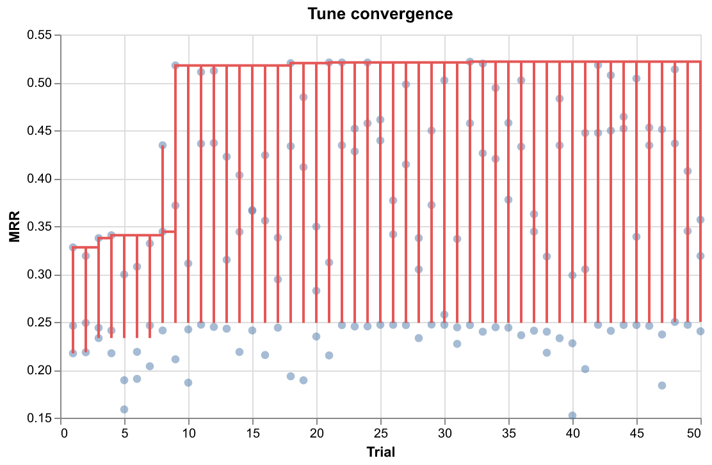
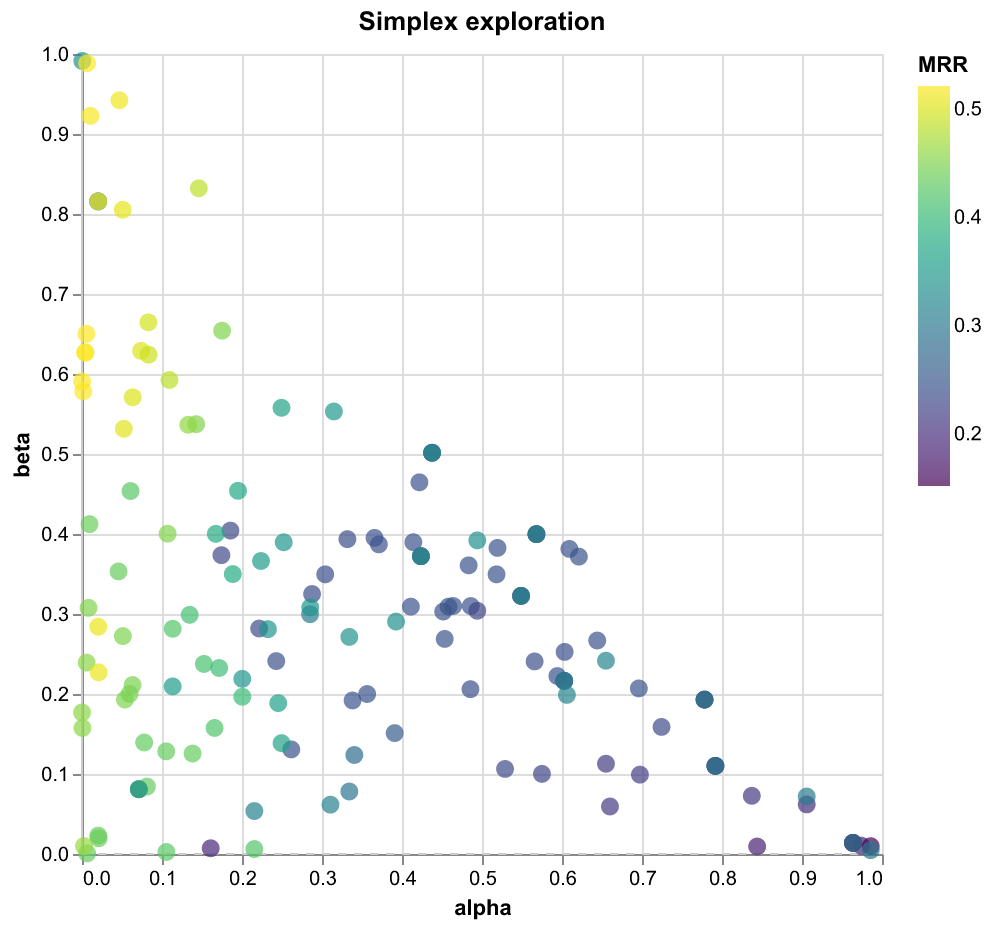

# rbtr search-weight tuning report

## Fusion weights

The search score fuses three channels:

- __alpha__ — semantic (embedding cosine similarity)
- __beta__ — lexical (BM25 keyword search)
- __gamma__ — name-match (identifier matching)

`score = alpha × semantic + beta × lexical + gamma × name`

| kind       | alpha    | beta     | gamma    |
| ---------- | -------- | -------- | -------- |
| concept    | 0.594185 | 0.222441 | 0.183375 |
| identifier | 0.00054  | 0.15752  | 0.841939 |
| code       | 0.00008  | 0.590756 | 0.409164 |

## Result

| metric | current             | recommended         | delta                        |
| ------ | ------------------- | ------------------- | ---------------------------- |
| MRR    | 0.24646297696589317 | 0.24996070764436693 | 0.003497730678473754 (+1.4%) |

## Impact by dimension

MRR comparison between current (baseline) and recommended
(best) weights, broken down by repo, language, and query
kind.

| slug               | language   | provenance | baseline_mrr | best_mrr | delta   | baseline_ndcg_at_10 | best_ndcg_at_10 | delta_ndcg_at_10 |
| ------------------ | ---------- | ---------- | ------------ | -------- | ------- | ------------------- | --------------- | ---------------- |
| __all__            | __all__    | __all__    | 0.39955      | 0.405758 | 0.0062  | 0.436423            | 0.443468        | 0.007            |
| __all__            | __all__    | body       | 0.492691     | 0.521587 | 0.0289  | 0.537661            | 0.563434        | 0.0258           |
| __all__            | __all__    | concept    | 0.1512       | 0.156723 | 0.0055  | 0.172227            | 0.178698        | 0.0065           |
| __all__            | __all__    | docstring  | 0.666206     | 0.617063 | -0.0491 | 0.720978            | 0.681093        | -0.0399          |
| __all__            | __all__    | name       | 0.452199     | 0.457694 | 0.0055  | 0.489935            | 0.496876        | 0.0069           |
| __all__            | css        | __all__    | 0.598611     | 0.647222 | 0.0486  | 0.615907            | 0.652182        | 0.0363           |
| __all__            | html       | __all__    | 0.359722     | 0.401481 | 0.0418  | 0.377182            | 0.424034        | 0.0469           |
| __all__            | javascript | __all__    | 0.562396     | 0.56191  | -0.0005 | 0.602047            | 0.59815         | -0.0039          |
| __all__            | json       | __all__    | 0.138757     | 0.157126 | 0.0184  | 0.155215            | 0.173391        | 0.0182           |
| __all__            | markdown   | __all__    | 0.17855      | 0.203516 | 0.025   | 0.21535             | 0.238205        | 0.0229           |
| __all__            | python     | __all__    | 0.615464     | 0.582651 | -0.0328 | 0.666239            | 0.641115        | -0.0251          |
| __all__            | rst        | __all__    | 0.078095     | 0.065873 | -0.0122 | 0.099402            | 0.090871        | -0.0085          |
| __all__            | rust       | __all__    | 0.568988     | 0.631349 | 0.0624  | 0.619816            | 0.672999        | 0.0532           |
| __all__            | sql        | __all__    | 0.505476     | 0.475724 | -0.0298 | 0.587751            | 0.562868        | -0.0249          |
| __all__            | toml       | __all__    | 0.183704     | 0.217593 | 0.0339  | 0.227458            | 0.253721        | 0.0263           |
| __all__            | typescript | __all__    | 0.729058     | 0.703695 | -0.0254 | 0.766343            | 0.749443        | -0.0169          |
| __all__            | yaml       | __all__    | 0.147321     | 0.159127 | 0.0118  | 0.177931            | 0.195062        | 0.0171           |
| anthropics__skills | __all__    | __all__    | 0.530125     | 0.556978 | 0.0269  | 0.573604            | 0.60167         | 0.0281           |
| astral-sh__uv      | __all__    | __all__    | 0.337599     | 0.35451  | 0.0169  | 0.36924             | 0.386916        | 0.0177           |
| badlogic__pi-mono  | __all__    | __all__    | 0.497127     | 0.518126 | 0.021   | 0.527213            | 0.544322        | 0.0171           |
| django__django     | __all__    | __all__    | 0.298117     | 0.302266 | 0.0041  | 0.33361             | 0.338455        | 0.0048           |
| rbtr__rbtr         | __all__    | __all__    | 0.471964     | 0.447257 | -0.0247 | 0.520482            | 0.501213        | -0.0193          |

## Convergence



## Simplex exploration



## Recommended config

```toml
[search_weights.concept]
alpha = 0.5941845928026548
beta = 0.22244079821911436
gamma = 0.18337460897823085

[search_weights.identifier]
alpha = 0.0005403347318220716
beta = 0.15752044253148387
gamma = 0.8419392227366941

[search_weights.code]
alpha = 8.015780612902201e-05
beta = 0.5907558504032105
gamma = 0.40916399179066043
```

## Run metadata

- Optuna trials: 50
- queries evaluated: 880
- elapsed: 5508 s

## Sample distribution

| slug               | language   | provenance | n_queries |
| ------------------ | ---------- | ---------- | --------- |
| anthropics__skills | markdown   | body       | 10        |
| anthropics__skills | markdown   | concept    | 10        |
| anthropics__skills | markdown   | name       | 10        |
| anthropics__skills | python     | body       | 10        |
| anthropics__skills | python     | concept    | 10        |
| anthropics__skills | python     | docstring  | 10        |
| anthropics__skills | python     | name       | 10        |
| astral-sh__uv      | json       | body       | 10        |
| astral-sh__uv      | json       | concept    | 10        |
| astral-sh__uv      | json       | name       | 10        |
| astral-sh__uv      | markdown   | body       | 10        |
| astral-sh__uv      | markdown   | concept    | 10        |
| astral-sh__uv      | markdown   | name       | 10        |
| astral-sh__uv      | python     | body       | 10        |
| astral-sh__uv      | python     | concept    | 10        |
| astral-sh__uv      | python     | docstring  | 10        |
| astral-sh__uv      | python     | name       | 10        |
| astral-sh__uv      | rust       | body       | 10        |
| astral-sh__uv      | rust       | concept    | 10        |
| astral-sh__uv      | rust       | docstring  | 10        |
| astral-sh__uv      | rust       | name       | 10        |
| astral-sh__uv      | toml       | body       | 10        |
| astral-sh__uv      | toml       | concept    | 10        |
| astral-sh__uv      | toml       | name       | 10        |
| astral-sh__uv      | yaml       | body       | 10        |
| astral-sh__uv      | yaml       | concept    | 10        |
| astral-sh__uv      | yaml       | name       | 10        |
| badlogic__pi-mono  | css        | body       | 10        |
| badlogic__pi-mono  | css        | concept    | 10        |
| badlogic__pi-mono  | css        | name       | 10        |
| badlogic__pi-mono  | javascript | body       | 10        |
| badlogic__pi-mono  | javascript | concept    | 10        |
| badlogic__pi-mono  | javascript | docstring  | 10        |
| badlogic__pi-mono  | javascript | name       | 10        |
| badlogic__pi-mono  | json       | body       | 10        |
| badlogic__pi-mono  | json       | concept    | 10        |
| badlogic__pi-mono  | json       | name       | 10        |
| badlogic__pi-mono  | markdown   | body       | 10        |
| badlogic__pi-mono  | markdown   | concept    | 10        |
| badlogic__pi-mono  | markdown   | name       | 10        |
| badlogic__pi-mono  | typescript | body       | 10        |
| badlogic__pi-mono  | typescript | concept    | 10        |
| badlogic__pi-mono  | typescript | docstring  | 10        |
| badlogic__pi-mono  | typescript | name       | 10        |
| django__django     | css        | body       | 10        |
| django__django     | css        | concept    | 10        |
| django__django     | css        | name       | 10        |
| django__django     | html       | body       | 10        |
| django__django     | html       | concept    | 10        |
| django__django     | html       | name       | 10        |
| django__django     | javascript | body       | 10        |
| django__django     | javascript | concept    | 10        |
| django__django     | javascript | docstring  | 10        |
| django__django     | javascript | name       | 10        |
| django__django     | json       | body       | 10        |
| django__django     | json       | concept    | 10        |
| django__django     | json       | name       | 10        |
| django__django     | markdown   | body       | 10        |
| django__django     | markdown   | concept    | 10        |
| django__django     | markdown   | name       | 10        |
| django__django     | python     | body       | 10        |
| django__django     | python     | concept    | 10        |
| django__django     | python     | docstring  | 10        |
| django__django     | python     | name       | 10        |
| django__django     | rst        | body       | 10        |
| django__django     | rst        | concept    | 10        |
| django__django     | rst        | name       | 10        |
| django__django     | yaml       | body       | 10        |
| django__django     | yaml       | concept    | 10        |
| django__django     | yaml       | name       | 10        |
| rbtr__rbtr         | json       | body       | 10        |
| rbtr__rbtr         | json       | concept    | 10        |
| rbtr__rbtr         | json       | name       | 10        |
| rbtr__rbtr         | markdown   | body       | 10        |
| rbtr__rbtr         | markdown   | concept    | 10        |
| rbtr__rbtr         | markdown   | name       | 10        |
| rbtr__rbtr         | python     | body       | 10        |
| rbtr__rbtr         | python     | concept    | 10        |
| rbtr__rbtr         | python     | docstring  | 10        |
| rbtr__rbtr         | python     | name       | 10        |
| rbtr__rbtr         | sql        | body       | 10        |
| rbtr__rbtr         | sql        | concept    | 10        |
| rbtr__rbtr         | sql        | docstring  | 10        |
| rbtr__rbtr         | sql        | name       | 10        |
| rbtr__rbtr         | typescript | body       | 10        |
| rbtr__rbtr         | typescript | concept    | 10        |
| rbtr__rbtr         | typescript | docstring  | 10        |
| rbtr__rbtr         | typescript | name       | 10        |
