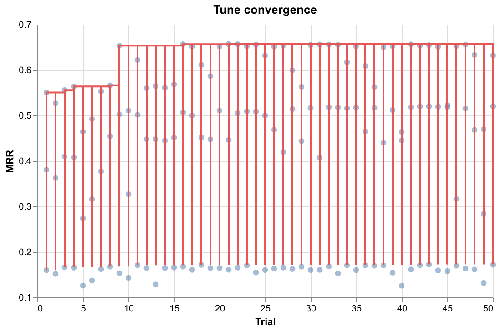
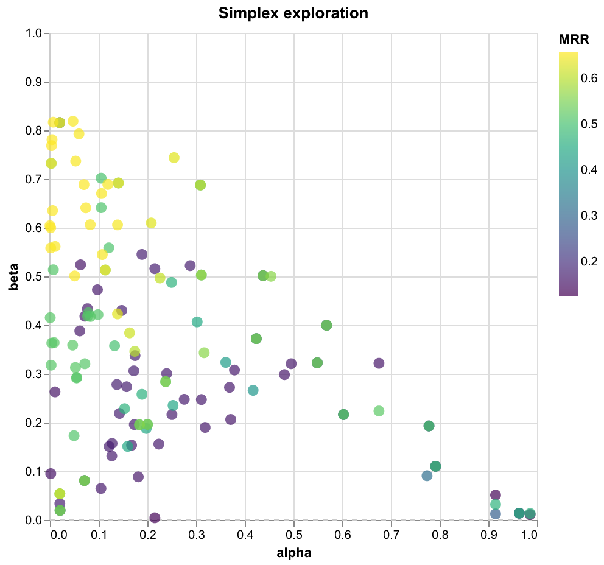

# rbtr search-weight tuning report

## Fusion weights

The search score fuses three channels:

- __alpha__ — semantic (embedding cosine similarity)
- __beta__ — lexical (BM25 keyword search)
- __gamma__ — name-match (identifier matching)

`score = alpha × semantic + beta × lexical + gamma × name`

| kind       | alpha    | beta     | gamma    |
| ---------- | -------- | -------- | -------- |
| concept    | 0.207632 | 0.112856 | 0.679512 |
| identifier | 0.015902 | 0.395471 | 0.588627 |
| code       | 0.021059 | 0.780735 | 0.198206 |

## Result

One row per query kind. Each kind is tuned as its own
optimisation, against its own query set, so the rows are
three separate results rather than parts of one.

`std error` is the standard error of the delta, taken over
the per-query differences between the two arms. The verdict
is `recommend` only where the delta exceeds twice that
error; otherwise this run cannot tell the tuned weights
from the current ones, and the recommended config below
comments that kind out.

What the MRR measures: each trial reorders a pool of 50
candidates fetched once per query under the current default
weights, and scores the target's position in the top 10.
The reranker takes no part. `pool ceiling` is the share of
queries whose target reached that pool at all — a target the
defaults did not retrieve scores zero under every weight
triple, so the MRR cannot rise above the ceiling, and a
weight set whose merit would be retrieving something new
earns nothing for it here. These figures answer "which of
these weightings orders this pool best", not "how well does
search work", and are not comparable with the MRR in
`BENCHMARKS.md`.

| kind       | metric | current             | recommended         | delta                         | std error | verdict  | n   | pool ceiling |
| ---------- | ------ | ------------------- | ------------------- | ----------------------------- | --------- | -------- | --- | ------------ |
| concept    | MRR    | 0.16138949406923264 | 0.16515025763391775 | 0.0037607635646851045 (+2.3%) | ± 0.0036  | withhold | 459 | 0.4575       |
| identifier | MRR    | 0.5153108465608466  | 0.5205864818540875  | 0.005275635293240932 (+1.0%)  | ± 0.0052  | withhold | 852 | 0.8415       |
| code       | MRR    | 0.6532253754475976  | 0.6562596868152423  | 0.0030343113676446487 (+0.5%) | ± 0.0069  | withhold | 297 | 0.9024       |

## Top-trial spread

The range each weight covers across a study's ten
best-scoring trials, and the MRR those trials span. Wide
weight ranges beside a narrow `mrr_range` mean the
objective cannot separate the weights it is choosing
between, and the single triple above is one point drawn
from a plateau.

| kind       | n_top | alpha_min | alpha_max | beta_min | beta_max | gamma_min | gamma_max | mrr_range |
| ---------- | ----- | --------- | --------- | -------- | -------- | --------- | --------- | --------- |
| concept    | 10    | 0.163042  | 0.351534  | 0.112856 | 0.268223 | 0.462419  | 0.679512  | 0.002307  |
| identifier | 10    | 0.000598  | 0.083052  | 0.312942 | 0.417622 | 0.499326  | 0.67984   | 0.004267  |
| code       | 10    | 0.00008   | 0.143822  | 0.533552 | 0.95633  | 0.001136  | 0.388008  | 0.0021    |

## Impact by dimension

MRR comparison between current (baseline) and recommended
(best) weights, broken down by repo, language, and query
kind.

| slug               | language   | provenance | baseline_mrr | best_mrr | delta   | baseline_ndcg_at_10 | best_ndcg_at_10 | delta_ndcg_at_10 |
| ------------------ | ---------- | ---------- | ------------ | -------- | ------- | ------------------- | --------------- | ---------------- |
| __all__            | __all__    | __all__    | 0.439758     | 0.444187 | 0.0044  | 0.477767            | 0.479813        | 0.002            |
| __all__            | __all__    | body       | 0.516716     | 0.529729 | 0.013   | 0.560538            | 0.569405        | 0.0089           |
| __all__            | __all__    | concept    | 0.134976     | 0.137437 | 0.0025  | 0.166596            | 0.167164        | 0.0006           |
| __all__            | __all__    | docstring  | 0.681239     | 0.665554 | -0.0157 | 0.716229            | 0.699649        | -0.0166          |
| __all__            | __all__    | name       | 0.513057     | 0.518832 | 0.0058  | 0.550984            | 0.55572         | 0.0047           |
| __all__            | bash       | __all__    | 0.585083     | 0.580146 | -0.0049 | 0.626942            | 0.622202        | -0.0047          |
| __all__            | css        | __all__    | 0.651603     | 0.647871 | -0.0037 | 0.68625             | 0.682599        | -0.0037          |
| __all__            | html       | __all__    | 0.205593     | 0.259152 | 0.0536  | 0.237454            | 0.28652         | 0.0491           |
| __all__            | javascript | __all__    | 0.537353     | 0.538654 | 0.0013  | 0.582154            | 0.577623        | -0.0045          |
| __all__            | json       | __all__    | 0.182759     | 0.17836  | -0.0044 | 0.212275            | 0.207116        | -0.0052          |
| __all__            | markdown   | __all__    | 0.189228     | 0.24242  | 0.0532  | 0.219129            | 0.269713        | 0.0506           |
| __all__            | plaintext  | __all__    | 0.20713      | 0.232798 | 0.0257  | 0.233424            | 0.260767        | 0.0273           |
| __all__            | python     | __all__    | 0.598994     | 0.597372 | -0.0016 | 0.639446            | 0.63012         | -0.0093          |
| __all__            | rst        | __all__    | 0.095309     | 0.096797 | 0.0015  | 0.110642            | 0.11188         | 0.0012           |
| __all__            | rust       | __all__    | 0.531746     | 0.538596 | 0.0069  | 0.590455            | 0.591485        | 0.001            |
| __all__            | sql        | __all__    | 0.623913     | 0.613768 | -0.0101 | 0.68507             | 0.676917        | -0.0082          |
| __all__            | toml       | __all__    | 0.112583     | 0.094097 | -0.0185 | 0.134785            | 0.111204        | -0.0236          |
| __all__            | typescript | __all__    | 0.590792     | 0.586279 | -0.0045 | 0.643211            | 0.638233        | -0.005           |
| __all__            | yaml       | __all__    | 0.123313     | 0.117978 | -0.0053 | 0.149886            | 0.142375        | -0.0075          |
| anthropics__skills | __all__    | __all__    | 0.603212     | 0.612321 | 0.0091  | 0.646574            | 0.650954        | 0.0044           |
| astral-sh__uv      | __all__    | __all__    | 0.406575     | 0.407614 | 0.001   | 0.437126            | 0.435318        | -0.0018          |
| badlogic__pi-mono  | __all__    | __all__    | 0.452506     | 0.444787 | -0.0077 | 0.495432            | 0.489715        | -0.0057          |
| django__django     | __all__    | __all__    | 0.331416     | 0.331853 | 0.0004  | 0.360572            | 0.3599          | -0.0007          |
| rbtr__rbtr         | __all__    | __all__    | 0.43212      | 0.456207 | 0.0241  | 0.48384             | 0.502441        | 0.0186           |

## Convergence



## Simplex exploration



## Recommended config

```toml
# [search_weights.concept]
# alpha = 0.20763178867021473
# beta = 0.11285586647022668
# gamma = 0.6795123448595586
#
# [search_weights.identifier]
# alpha = 0.01590233513331555
# beta = 0.39547087467341663
# gamma = 0.5886267901932679
#
# [search_weights.code]
# alpha = 0.021058722837725086
# beta = 0.7807353805967499
# gamma = 0.19820589656552517
```

## Run metadata

- Optuna trials: 50
- queries evaluated: 1608
- elapsed: 10297 s

## Sample distribution

| slug               | language   | provenance | n_queries |
| ------------------ | ---------- | ---------- | --------- |
| anthropics__skills | bash       | body       | 16        |
| anthropics__skills | bash       | concept    | 10        |
| anthropics__skills | bash       | docstring  | 6         |
| anthropics__skills | bash       | name       | 10        |
| anthropics__skills | css        | body       | 11        |
| anthropics__skills | css        | concept    | 11        |
| anthropics__skills | css        | docstring  | 10        |
| anthropics__skills | css        | name       | 11        |
| anthropics__skills | javascript | body       | 18        |
| anthropics__skills | javascript | concept    | 11        |
| anthropics__skills | javascript | docstring  | 10        |
| anthropics__skills | javascript | name       | 10        |
| anthropics__skills | json       | body       | 10        |
| anthropics__skills | json       | concept    | 10        |
| anthropics__skills | json       | name       | 10        |
| anthropics__skills | markdown   | body       | 10        |
| anthropics__skills | markdown   | concept    | 11        |
| anthropics__skills | markdown   | name       | 10        |
| anthropics__skills | plaintext  | body       | 10        |
| anthropics__skills | plaintext  | concept    | 10        |
| anthropics__skills | python     | body       | 22        |
| anthropics__skills | python     | concept    | 11        |
| anthropics__skills | python     | docstring  | 13        |
| anthropics__skills | python     | name       | 10        |
| anthropics__skills | typescript | body       | 20        |
| anthropics__skills | typescript | concept    | 10        |
| anthropics__skills | typescript | docstring  | 9         |
| anthropics__skills | typescript | name       | 10        |
| astral-sh__uv      | bash       | body       | 23        |
| astral-sh__uv      | bash       | concept    | 10        |
| astral-sh__uv      | bash       | docstring  | 10        |
| astral-sh__uv      | bash       | name       | 10        |
| astral-sh__uv      | css        | body       | 11        |
| astral-sh__uv      | css        | concept    | 10        |
| astral-sh__uv      | css        | docstring  | 10        |
| astral-sh__uv      | css        | name       | 12        |
| astral-sh__uv      | json       | body       | 10        |
| astral-sh__uv      | json       | concept    | 10        |
| astral-sh__uv      | json       | name       | 10        |
| astral-sh__uv      | markdown   | body       | 10        |
| astral-sh__uv      | markdown   | concept    | 10        |
| astral-sh__uv      | markdown   | name       | 10        |
| astral-sh__uv      | plaintext  | body       | 10        |
| astral-sh__uv      | plaintext  | concept    | 10        |
| astral-sh__uv      | python     | body       | 20        |
| astral-sh__uv      | python     | concept    | 10        |
| astral-sh__uv      | python     | docstring  | 14        |
| astral-sh__uv      | python     | name       | 10        |
| astral-sh__uv      | rst        | body       | 10        |
| astral-sh__uv      | rst        | concept    | 11        |
| astral-sh__uv      | rst        | name       | 5         |
| astral-sh__uv      | rust       | body       | 20        |
| astral-sh__uv      | rust       | concept    | 10        |
| astral-sh__uv      | rust       | docstring  | 17        |
| astral-sh__uv      | rust       | name       | 10        |
| astral-sh__uv      | toml       | body       | 16        |
| astral-sh__uv      | toml       | concept    | 12        |
| astral-sh__uv      | toml       | docstring  | 10        |
| astral-sh__uv      | toml       | name       | 10        |
| astral-sh__uv      | yaml       | body       | 11        |
| astral-sh__uv      | yaml       | concept    | 10        |
| astral-sh__uv      | yaml       | docstring  | 10        |
| astral-sh__uv      | yaml       | name       | 10        |
| badlogic__pi-mono  | bash       | body       | 24        |
| badlogic__pi-mono  | bash       | concept    | 11        |
| badlogic__pi-mono  | bash       | docstring  | 14        |
| badlogic__pi-mono  | bash       | name       | 10        |
| badlogic__pi-mono  | css        | body       | 13        |
| badlogic__pi-mono  | css        | concept    | 10        |
| badlogic__pi-mono  | css        | docstring  | 10        |
| badlogic__pi-mono  | css        | name       | 10        |
| badlogic__pi-mono  | javascript | body       | 21        |
| badlogic__pi-mono  | javascript | concept    | 10        |
| badlogic__pi-mono  | javascript | docstring  | 10        |
| badlogic__pi-mono  | javascript | name       | 10        |
| badlogic__pi-mono  | json       | body       | 10        |
| badlogic__pi-mono  | json       | concept    | 10        |
| badlogic__pi-mono  | json       | name       | 10        |
| badlogic__pi-mono  | markdown   | body       | 10        |
| badlogic__pi-mono  | markdown   | concept    | 17        |
| badlogic__pi-mono  | markdown   | name       | 10        |
| badlogic__pi-mono  | typescript | body       | 20        |
| badlogic__pi-mono  | typescript | concept    | 10        |
| badlogic__pi-mono  | typescript | docstring  | 13        |
| badlogic__pi-mono  | typescript | name       | 10        |
| django__django     | bash       | body       | 18        |
| django__django     | bash       | concept    | 11        |
| django__django     | bash       | name       | 10        |
| django__django     | css        | body       | 20        |
| django__django     | css        | concept    | 10        |
| django__django     | css        | docstring  | 10        |
| django__django     | css        | name       | 12        |
| django__django     | html       | body       | 12        |
| django__django     | html       | concept    | 10        |
| django__django     | html       | name       | 10        |
| django__django     | javascript | body       | 21        |
| django__django     | javascript | concept    | 12        |
| django__django     | javascript | docstring  | 11        |
| django__django     | javascript | name       | 10        |
| django__django     | json       | body       | 10        |
| django__django     | json       | concept    | 10        |
| django__django     | json       | name       | 10        |
| django__django     | markdown   | body       | 10        |
| django__django     | markdown   | concept    | 10        |
| django__django     | markdown   | name       | 10        |
| django__django     | plaintext  | body       | 10        |
| django__django     | plaintext  | concept    | 10        |
| django__django     | python     | body       | 22        |
| django__django     | python     | concept    | 10        |
| django__django     | python     | docstring  | 15        |
| django__django     | python     | name       | 10        |
| django__django     | rst        | body       | 10        |
| django__django     | rst        | concept    | 10        |
| django__django     | rst        | name       | 10        |
| django__django     | yaml       | body       | 10        |
| django__django     | yaml       | concept    | 10        |
| django__django     | yaml       | docstring  | 1         |
| django__django     | yaml       | name       | 10        |
| rbtr__rbtr         | bash       | body       | 15        |
| rbtr__rbtr         | bash       | concept    | 10        |
| rbtr__rbtr         | json       | body       | 10        |
| rbtr__rbtr         | json       | concept    | 10        |
| rbtr__rbtr         | json       | name       | 10        |
| rbtr__rbtr         | markdown   | body       | 10        |
| rbtr__rbtr         | markdown   | concept    | 10        |
| rbtr__rbtr         | markdown   | name       | 10        |
| rbtr__rbtr         | python     | body       | 21        |
| rbtr__rbtr         | python     | concept    | 11        |
| rbtr__rbtr         | python     | docstring  | 11        |
| rbtr__rbtr         | python     | name       | 10        |
| rbtr__rbtr         | sql        | body       | 16        |
| rbtr__rbtr         | sql        | concept    | 10        |
| rbtr__rbtr         | sql        | docstring  | 10        |
| rbtr__rbtr         | sql        | name       | 10        |
| rbtr__rbtr         | typescript | body       | 20        |
| rbtr__rbtr         | typescript | concept    | 13        |
| rbtr__rbtr         | typescript | docstring  | 11        |
| rbtr__rbtr         | typescript | name       | 10        |
