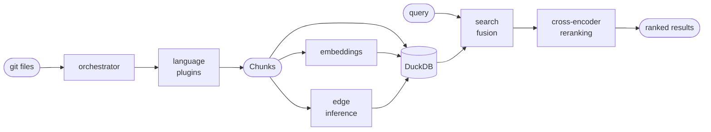
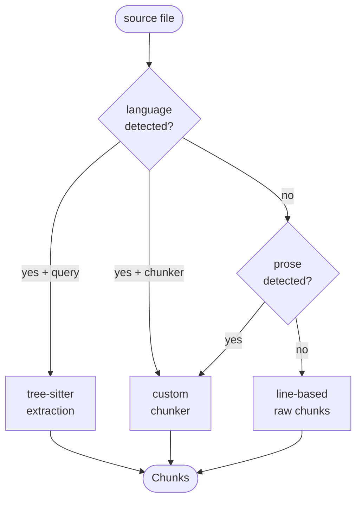
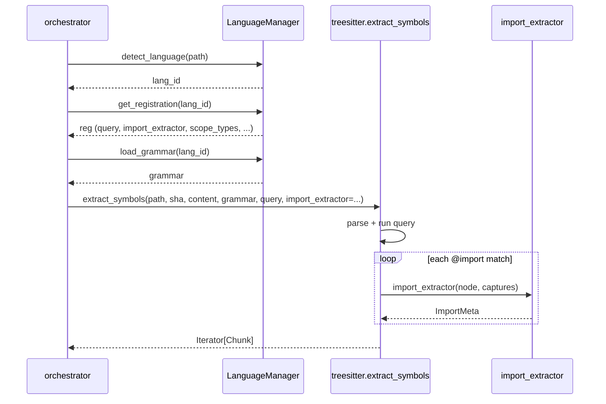
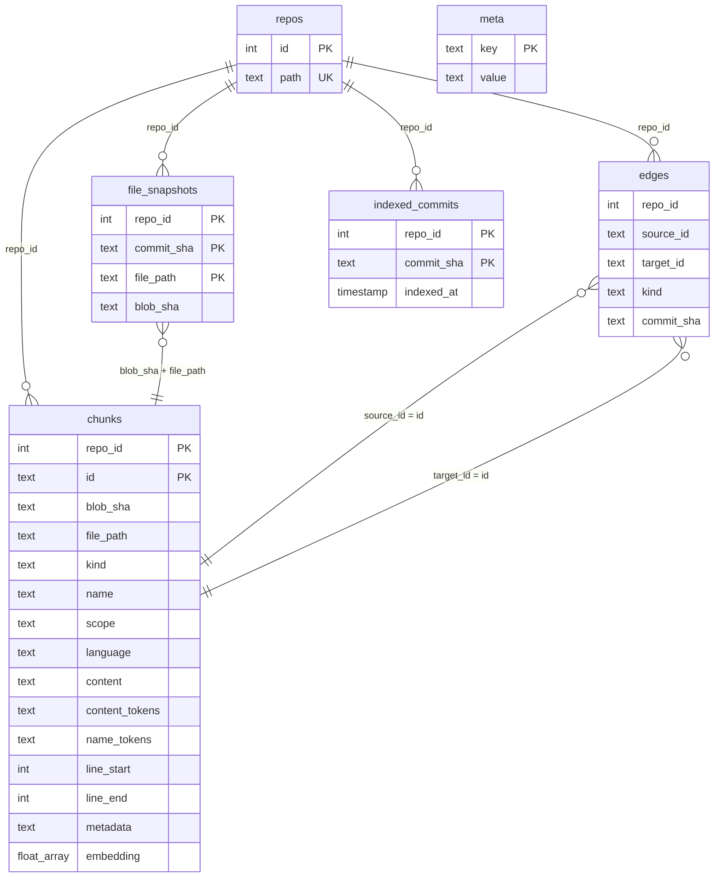
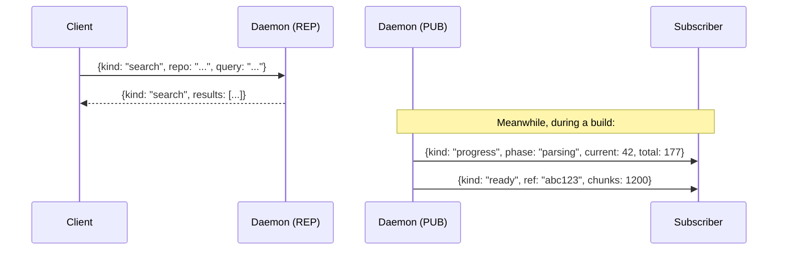

# Architecture

Technical reference for contributors. For usage, see
[README.md](README.md).

## Overview

rbtr decomposes source files into named chunks (functions,
classes, methods, imports), connects them with a dependency
graph, and makes them searchable through three fused
retrieval channels.

Design priorities:

1. **Language-agnostic.** Every file gets indexed. Languages
   with tree-sitter grammars get structural extraction;
   everything else gets line-based chunking.
2. **Local and offline.** Embeddings run on-device (GGUF on
   Metal/CPU). The index is a DuckDB file. No API calls.
3. **Incremental.** Builds are keyed by git blob SHA. Only
   changed files are re-extracted. Embeddings persist.

## Module dependencies

### Index pipeline

The indexing pipeline flows in one direction: files come
in, chunks come out, and the store makes them searchable.



The orchestrator drives the pipeline. It detects each
file's language, loads the appropriate plugin, and
routes extraction through one of three strategies (see
[Language decomposition](#language-decomposition)).
Chunks, embeddings, and edges are written to a single
DuckDB file via the store. Search reads from the same
store.

Modules only import from layers below them - no upward
dependencies. The orchestrator sits at the top; models
and config sit at the bottom.

### Language plugin routing

Plugins register capabilities via `LanguageRegistration`.
The orchestrator routes each file to the most specific
extraction path available:



Plugins provide whatever combination of fields their
language needs. A query-based plugin (most languages)
gets structural extraction automatically. A chunker-based
plugin (markdown, HTML, HCL) handles cases where
query captures can't express the structure. Languages
without a plugin get line-based chunking.

### Blob dedup and language invalidation

Chunks are keyed by `(repo_id, id)` where `id` is a
hash of `file_path:name:line_start`. Each chunk also
carries a `blob_sha` (git blob - the file's content
hash, path-independent) and a `language` tag.

The orchestrator checks `store.has_blob(blob_sha,
language=detected)` before extracting a file. If
chunks already exist for that blob with a matching
language, the file is skipped.

When a new language plugin is registered, files that
were previously indexed as plaintext (`language=""`)
produce a `has_blob` miss - the stored language
doesn't match. The orchestrator deletes old chunks
for the blob (they may have different IDs from the
new extraction) and re-extracts.

Files detected as prose (Markdown/RST) via content
heuristics have a special case: `has_blob` accepts
`language IN ('markdown', 'rst')` when the detected
language is empty, preventing needless re-extraction
on every build.

### Write path

All mutations go through `WriteSession`, obtained via
`IndexStore.session()`. The session is a context manager:

- `__enter__`: bootstraps the schema on first use,
  begins a transaction.
- `__exit__`: flushes buffered chunks, commits the
  transaction, and rebuilds the FTS index if chunks
  were modified. Rolls back on exception.

Sweep is explicit: `ws.sweep()` removes residue from
crashed builds.

`IndexStore` owns the connection, reads, and search.
`WriteSession` owns all data mutations. A store created
with `writable=False` (the default) rejects `session()`
calls.

The build pipeline opens one session per phase:
extract → edges → finalise → (separate) embed.

Embedding is deferred and lower-priority. After
indexing completes, the daemon submits an `EmbedJob`
to the work queue's low-priority deque. The index is
fully queryable (FTS + name search) before embeddings
exist; semantic search degrades gracefully when
embeddings are absent.

### Extraction call flow

The tree-sitter path - the most common case - follows
this call chain:



## Data model

The index is a single DuckDB file with six tables.



### Record identity

| Table             | Natural key                                                                      |
| ----------------- | -------------------------------------------------------------------------------- |
| `repos`           | `(id)`, `path` is unique                                                         |
| `file_snapshots`  | `(repo_id, commit_sha, file_path)`                                               |
| `chunks`          | `(repo_id, id)` where `id` = `blake2b(file_path:name:line_start, digest_size=8)` |
| `edges`           | no PK - bag of tuples scoped by `(repo_id, commit_sha)`                          |
| `indexed_commits` | `(repo_id, commit_sha)`                                                          |
| `meta`            | `(key)`                                                                          |

### Embedding column

`chunks.embedding` is a variable-length `FLOAT[]`. The dimension
is a property of the configured embedding model, not the schema,
so the column is not fixed-size: the table is created before any
model loads (indexing without embeddings is a supported fast
path), and `search_similar.sql` scores with
`LIST_COSINE_SIMILARITY`, which works on any length. Consistency
is maintained without a stored dimension:

- All stored vectors share one length because they come from one
  model. `_check_embedding_version` clears every embedding when
  `config.embedding_model` changes (see [Versioning](#versioning)),
  so they are re-embedded at the new model's width.
- The embedding staging frame (`EmbeddingStagingRow`) enforces
  uniform length per write batch via the `embedding_dim_is_uniform`
  rule.

### Commit resolution

Chunks are blob-addressed (shared across commits with the
same blob) but visible through the lens of a specific
commit's file tree:

```sql
FROM chunks c
JOIN file_snapshots fs
  ON c.repo_id = fs.repo_id
  AND c.blob_sha = fs.blob_sha
  AND c.file_path = fs.file_path
WHERE fs.commit_sha = ?
```

### Registered frames as query inputs

Both reads and writes pass polars frames into DuckDB by
**registering them as named views** (`register` →
`execute` → `unregister` in a `finally`), rather than
interpolating values into SQL or issuing one query per
row. The motive is speed: it collapses N round trips into
one set-based operation — one table scan instead of N, one
bulk upsert instead of per-row inserts — and DuckDB reads
the registered frame zero-copy, so one query handles any
number of rows. The multi-vector scan below quantifies the
win (7–32× for 3 vectors).

- **Reads** register a frame and join against it:
  `_repo_refs` (the `(repo_id, commit_sha)` snapshots a
  search spans — see [Cross-repo search](#cross-repo-search))
  and `_qvecs` (query vectors — see
  [Multi-vector semantic scan](#multi-vector-semantic-scan)).
- **Writes** register a staging frame the upsert reads from:
  `_stg` (chunks / snapshots / edges) and `_emb_stg`
  (embeddings), via `WriteSession._bulk_insert`.

Registration is cursor-scoped, and the store uses one
thread-local cursor per thread (see
[Concurrency model](#concurrency-model)), so concurrent
calls register identically-named views without colliding —
no locking needed. Registered frames carry a `dataframely`
schema like any other frame, so the view's column types
match the table it joins against. The caller-side
convention lives in the `rbtr-data` skill.

### Blob dedup

The build loop skips files whose blob SHA is already in
the store for the same language. See
[Blob dedup and language invalidation](#blob-dedup-and-language-invalidation)
for how this interacts with plugin registration.

### Completion tracking

`indexed_commits` records which `(repo, commit)` pairs are
fully indexed. The daemon watcher checks this to trigger
builds. GC uses it to identify orphans: any
`file_snapshots` or `edges` row without a matching
`indexed_commits` row is orphan.

### Versioning

`meta` is a key-value table that tracks compatibility.
Three keys:

- `schema_version` - the DDL version. A mismatch deletes
  the database on open (it's derived data; a full rebuild
  is the only safe migration).
- `embedding_model` - the GGUF model ID used to compute
  vectors.
- `embedding_version` - a format version for the embedding
  pipeline.

When the model or version changes, all embeddings are
cleared and recomputed on the next build.

## Daemon

The daemon keeps the index current without blocking the
CLI or editor. Single process, asyncio event loop:

```text
DaemonServer (asyncio.TaskGroup)
 ├─ _rpc_loop            — zmq REP poll + dispatch
 ├─ _job_worker          — await Event, to_thread(run_job)
 ├─ _watcher_loop        — sleep, to_thread(poll), wake
 ├─ _notification_relay  — zmq inproc PULL → PUB
 └─ _idle_loop           — sleep, check idle, unload
```

- **`DaemonServer`** — ZMQ REQ/REP for request/response
  and PUB for build-progress notifications. Owns one
  `Embedder` instance shared between build (indexing)
  and search (query embedding).
- **`_job_worker`** — DB-polling async task. Queries
  the database for un-indexed commits (builds) and
  un-embedded chunks (embeds). Priority is implicit
  in query order: builds before embeds. Runs each
  job via `asyncio.to_thread`.
- **`_watcher_loop`** — async task that polls registered
  repos' HEAD against `has_indexed`. Sets `_wake` when
  stale HEADs are found.
- **`_notification_relay`** — async task that receives
  progress from worker threads via zmq inproc PULL and
  forwards to the PUB socket.
- **`DaemonClient`** — typed client; pydantic models over
  ZMQ.

Requests and responses are pydantic models discriminated on
a `kind` field (`messages.py`). The daemon writes a status
file to `runtime_dir` on startup; `DaemonClient` reads it
to connect.

`StatusResponse` is the most complex response. Per-ref
state is grouped in `IndexedRef` (sha, symbolic names,
chunk count, embed completeness) — a single list rather
than parallel maps. `active_build` and `active_embed`
share the same `ActiveJob` type; the field name
distinguishes them. Both are filtered to the requested
repo so a status query never leaks activity from
unrelated repos. Text renderers (CLI, TUI, LLM) derive
output solely from the response model — never from
external state like config.

### Concurrency model

**Task inventory:**

| Task                  | Purpose                          |
| --------------------- | -------------------------------- |
| `_rpc_loop`           | Async zmq REP/PUB                |
| `_job_worker`         | DuckDB writes (builds + embeds)  |
| `_watcher_loop`       | Polls git repos, sets wake event |
| `_notification_relay` | inproc PULL → PUB forwarding     |
| `_idle_loop` (×N)     | Per-model idle unload            |

**Single-writer guarantee:** DuckDB enforces one writer at
a time. The `_job_worker` serialises all write tasks
through `asyncio.Semaphore(1)` + `asyncio.to_thread()`.
Reads use thread-local cursors (via `connection.cursor()`)
and run concurrently with writes.

**GPU model serialisation:** The daemon manages two GPU
models: `Embedder` (embedding) and `Reranker`
(cross-encoder reranking). Each wraps a `llama_cpp.Llama`
instance via `GpuModelSlot` — a generic slot that handles
lazy loading, idle unload, and `RLock`-based thread
safety. Metal is not thread-safe across concurrent Llama
instances, so all GPU inference is serialised through a
single `_gpu_lock` (`asyncio.Lock` on `DaemonServer`,
passed to each model at construction).

Code paths that acquire `_gpu_lock`:

- **Search** — embedder `embed_single()` + batch
  `embed()` for variants, then reranker `rerank()` on
  fused candidates. Held for the entire search.
- **Embed worker** — `_run_embed_async` → `embed` per
  batch.
- **Idle unload** — each model's `_idle_loop` →
  `_do_unload`.

Because the lock is asyncio-native, waiting is an
`await` — the event loop stays responsive during
contention. Without this, a `threading.Lock` would
block the event loop thread, freezing ZMQ dispatch,
notification relay, and the watcher loop.

```text
Event loop thread                    Worker thread (to_thread)
─────────────────                    ─────────────────────────
serve() loop
  rep.recv()
  await _dispatch(raw)  [async]
    async with _gpu_lock:            ← held for full search
      await to_thread(handle_search) ← embed + fuse + rerank

_run_embed_async():
  for batch:
    async with _gpu_lock:            ← serialised
      await to_thread(embed, batch)  ← off event loop
    write to store

_idle_loop() (per model):
  if idle >= timeout:
    async with _gpu_lock:            ← serialised
      re-check idle, close model
```

Each model has its own idle timeout and unloads
independently. The idle loop re-checks the idle timeout
inside the lock to avoid a TOCTOU race: inference may
have used the model between the outer check and lock
acquisition.

The embed worker processes batches individually rather
than running `embed_index` as one monolithic `to_thread`
call. This means search waits at most one batch duration
(not the entire embed job).

**Priority:** The worker queries the DB for un-indexed
commits first (builds), then un-embedded chunks (embeds).
When a build arrives while an embed is running, the embed
finishes first (interrupting mid-write is unsafe), then
the build runs next.

### Crash recovery

**Indexing:** `WriteSession.sweep` deletes data
for commits never `mark_indexed`. On next startup the
watcher detects the un-indexed HEAD and re-triggers the
build.

**Embedding:** On startup, the daemon scans indexed commits
for un-embedded chunks and sets the wake event so the
DB-polling worker picks up the work. This handles the case
where the daemon crashed after indexing completed but before
embedding finished. `embed_index` is incremental
(`get_unembedded_chunks` returns only `embedding IS NULL`
rows), so recovery is idempotent.

**Transactional writes:** `WriteSession` rolls back on
exception. No partial state persists.

### Daemon protocol

Two ZMQ sockets, both bound in `runtime_dir`:

- **REP** (`daemon.rpc`) — synchronous request/response.
- **PUB** (`daemon.pub`) — fan-out notifications.

Messages are JSON, discriminated on a `kind` field. Every
request has a `kind`; every response echoes it or returns
`kind: "error"`.



A concrete search exchange:

```json
→ {"kind": "search", "repo": "/path/to/repo", "query": "retry logic", "limit": 10}
← {"kind": "search", "results": [{"name": "retry_with_backoff", "kind": "function",
    "file_path": "src/client.py", "line_start": 12, "line_end": 30, "score": 0.87}]}
```

A progress notification (PUB):

```json
{"kind": "progress", "repo": "/path/to/repo", "phase": "parsing", "current": 42, "total": 177}
```

Error responses carry a `code` field:

- `index_not_built` — no index exists for this repo.
  Client should trigger `rbtr index`.
- `index_in_progress` — a build is running; retry after
  the `ready` notification.
- `repo_not_found` — the repo path isn't registered.
- `invalid_request` — malformed or missing fields; the message
  names each offending field and the value it received, so a
  caller can see how an argument was mis-shaped.
- `internal` — unexpected server error.

The two index errors differ by where they're decided: a read
for an unindexed ref raises a plain `IndexNotBuiltError`, and
`_dispatch` — the one place that knows a build is running —
turns it into `index_in_progress`, otherwise it stays
`index_not_built`.

**Schema generation.** `messages.py` is the source of
truth. `rbtr schema-dump` produces JSON Schema.
`just schema-check` regenerates `protocol.ts` (the
TypeScript types used by `pi-rbtr`) and fails CI if the
generated file is stale.

## Observability

rbtr's own code logs through `structlog.get_logger(__name__)`,
producing event dictionaries (a short snake_case `event` name plus
keyword fields). `rbtr.logging.configure_logging` is the single setup
point; see its docstring for the call contract.

### Pipeline and sinks

```text
rbtr code ─ structlog.get_logger ─┐
                                  ├─ shared processors ─ ProcessorFormatter ─ handler ─ sink
third-party ─ logging.getLogger ──┘   (foreign_pre_chain)
```

Application events and third-party `logging` records (llama.cpp,
huggingface_hub, duckdb, pyzmq, pygit2) converge on **one** stdlib
handler whose formatter is a `structlog.stdlib.ProcessorFormatter`.
Foreign records are lifted through a `foreign_pre_chain` that mirrors
the structlog processors, so every line carries the same fields
(level, logger, ISO timestamp, callsite) regardless of origin. A
single sink means level, format, and rotation are configured once.

### Renderers

- **CLI** → `StreamHandler` on stderr. `ConsoleRenderer` (coloured)
  on a TTY, JSON otherwise. stdout is reserved for command output
  (`cli.output.emit`), so logs never corrupt a `--json` result.
- **Daemon** → `RotatingFileHandler` on `daemon.log`, always JSON
  lines, sized by `log_max_bytes` / `log_backup_count`.

`log_format=auto` chooses console-on-TTY-else-JSON for the stream;
`console` and `json` force one. A rendered daemon line:

```json
{"event": "request_complete", "level": "info", "logger": "rbtr.daemon.server",
 "timestamp": "2026-06-15T10:00:44Z", "func_name": "_dispatch", "lineno": 846,
 "request_id": "a1b2c3d4", "kind": "search", "repo": "/p", "elapsed_ms": 12.4}
```

### Correlation

Keys are bound with `structlog.contextvars` so they merge into every
event emitted within their scope, and reset on exit:

- `_dispatch` binds `request_id` (+ `kind`, `repo`) per request.
- the job worker binds `job_id` (+ `repo`, `ref`, `job_kind`) per job.
- `_watcher_loop` binds a `watch_cycle` id per poll.

Bindings ride `asyncio.to_thread` — it copies the context — so a
search handler running in a worker thread, or a build/embed running
in `to_thread`, still tags its lines with the originating request or
job. This is what lets one request or background job be followed
across `server`, `handlers`, `search`, `store`, and the index
pipeline.

### Timing

Latency is logged as structured fields: `request_complete`
(`elapsed_ms`) per dispatch, `embedded_chunks` (`elapsed_ms`) per
embed run, `index_complete` (`elapsed_seconds`) per build, and
`reranked_candidates` (`elapsed_ms`) per rerank.

### Testing

Log behaviour is asserted on captured event dicts via
`structlog.testing` (the autouse `log_output` fixture); see the
`rbtr-testing` skill for the fixture and conventions.

## Language decomposition

Each file is routed to one of three extraction strategies
by the language plugin:

- **Tree-sitter** - grammar + query → functions, classes,
  methods, variables, imports as structured `Chunk` objects.
- **Custom chunker** - plugin-provided (e.g. markdown
  heading-hierarchy splitting).
- **Plaintext fallback** - fixed-size overlapping line
  chunks.

Scope detection: when a function node is nested inside a
class node (per the plugin's `scope_types`), the chunk gets
`scope = "ClassName"` and `kind = METHOD`.

Variable chunks cover module-level bindings only; class
attributes and function-locals stay within their enclosing
chunk.

## Dependency graph

`edges.py` infers cross-file relationships:

- **Import edges** - structural (tree-sitter import
  extractor) or text-search fallback.
- **Test edges** - `test_foo.py` → `foo.py` by naming
  convention and import analysis.
- **Doc edges** - markdown sections mentioning symbol names.

Import resolution maps a module string to a repo file:
relative paths directly, absolute/dotted paths by matching
the dotted path as a *suffix* of a candidate file path (so
`rbtr.index.store` → `…/rbtr/index/store.py`) — which lets a
single index span a monorepo. `module_style` and
`source_roots` tune the mapping per language; ambiguous
matches are dropped rather than guessed.

Powers `find-refs` and the importance signal in search
ranking. `find-refs` first resolves the user's symbol *name*
to chunk IDs via `match_by_name` (edges are keyed on chunk
IDs, not names), then a single `inbound_refs` query joins the
inbound edges to their *source* chunk so the response names
the referring symbol (`RefOut`) rather than exposing an opaque
hash.

## Storage models vs API DTOs

The read commands (`search`, `read-symbol`, `list-symbols`,
`find-refs`, `changed-symbols`) do not return the storage
models (`Chunk`, `ScoredChunk`, `Edge`). Those carry
persistence detail — identity hashes (`id`, `blob_sha`), the
embedding, the full ranking-signal breakdown, an
always-present `metadata` bag — that no caller needs and that
adds noise and tokens to an agent's context. Handlers instead
project to output DTOs in `rbtr.daemon.dto` (`SymbolOut`,
`SearchHitOut`, `RefOut`): a curated, low-noise public
contract. Empty `metadata` and null `repo_path` are omitted;
the nine search signals collapse to a single `score` unless
the request sets `explain`, which attaches a nested
`SearchSignals` (used by the eval tuners). The DTOs are
output-only — never fed to the write/staging path — which is
what lets them omit fields freely; the storage models, which
the same `model_dump` serialises into DuckDB staging frames,
cannot.

## Search fusion

Three channels fused into one ranked list:

- **Name matching** — case-insensitive substring matching.
- **BM25 keyword search** — DuckDB FTS over code-aware
  tokenised content.
- **Semantic similarity** — exact cosine between query and
  chunk embeddings. Local GGUF model, no API calls.

Each channel is normalised to [0, 1], then combined:

```text
score = alpha × semantic + beta × lexical + gamma × name
```

Post-fusion multipliers: kind boost, file category,
importance (inbound edge count), proximity (diff distance).

Weights are configured per query kind. Every search
classifies the query via `classify_query` and selects the
matching `(alpha, beta, gamma)` triple from
`config.search_weights`. The classifier is a cheap
heuristic (additive scoring on syntax characters and
language keywords), so it runs on every query regardless
of whether expansion is enabled. Per-query overrides
via `SearchRequest.weights` take precedence over the
config (used by the tuner). Run `rbtr config` for
current defaults.

### Cross-repo search

`SearchRequest.scope` (`workspace` | `all`) controls
breadth. `workspace` searches the single repo at `path`;
`all` searches every indexed repo in the shared store and
merges the hits into one ranked list.

Both modes run the *same* pipeline — `_retrieve` →
`fuse_scores` → reranker → `materialise_scored`. The only
difference is the list of refs fed in. Rather than branch
into parallel SQL or duplicate the channel methods,
`_retrieve` takes a `list[RepoRef]` (one
`(repo_id, commit_sha)` per repo) and each channel query
joins against a cursor-registered temporary view,
`_repo_refs(repo_id, commit_sha)`. For a workspace search
the view holds one row; for `scope=all` it holds one per
repo. This mirrors the `_qvecs` register/unregister pattern
used for multi-vector semantic scan — a single table scan
regardless of repo count, and no scalar `repo_id`/
`commit_sha` bind params in the search SQL.

`handle_search` builds the refs list: a one-element list
from `_resolve_read_ref` for `workspace`, or
`store.list_latest_refs()` for `all`. `list_latest_refs`
applies the same dirty-or-HEAD resolution as
`_resolve_read_ref` to every registered repo — preferring
an indexed dirty worktree tree SHA, else the newest indexed
commit — and skips repos with no indexed data.

Result attribution flows through a `repo_id` column carried
on the chunk-result frames (`ChunkResultRow` →
`FusedRow`). `materialise_scored` maps `repo_id` to a path
via the `repo_paths` dict the handler passes, populating
`ScoredChunk.repo_path` (and `IndexedRef.repo_path` for
status). It stays `None` for workspace searches, so
single-repo consumers are unaffected. `find_refs`,
`changed_symbols`, `read_symbol`, and `list_symbols` remain
single-repo: their edges and ref comparisons don't span
repos.

### Read-ref resolution and scoping

Read handlers pick their ref through `_resolve_read_ref`:
with no explicit ref, the indexed dirty-worktree tree SHA if
there is one, else `HEAD`. The ref has to be indexed to read
from, and the two cases differ on purpose:

- An explicit ref that isn't indexed is an error — you asked
  for that ref, so we don't quietly answer from another.
- An *implicit* ref that isn't indexed yet (a build still
  finalising) falls back to the latest indexed commit, so a
  read returns a slightly stale answer rather than nothing. It
  only errors when the repo has no indexed commits at all.

`file_paths` is normalised to repo-root-relative POSIX form,
so absolute, `./`-prefixed, and relative inputs all match the
stored (repo-relative) chunk paths.

### Query expansion

Query expansion is client-supplied: the caller passes
`keywords` and `variants` directly on `SearchRequest`,
which strips, de-duplicates, and caps them
(`config.max_expansion_keywords`). In pi sessions the
session LLM generates them inline as tool-call
parameters, guided by `promptGuidelines`. In eval the
`expand` DVC stage pre-generates them via an LLM API.

A heuristic classifier (`classify_query` in
`index/classify.py`) determines the query kind, from
which `search()` selects the per-kind fusion weights.
The caller may force the kind with the
`SearchRequest.query_kind` override; otherwise the
query text is classified.
Classification uses additive scoring: syntax characters
(braces, operators, function-call patterns) and language
keywords each contribute points. A query is classified
as `CODE` when its total reaches a threshold of 2.
Keywords are extracted at runtime from all registered
tree-sitter grammars, so new language plugins
automatically contribute.

| Kind           | Example                       | Expansion strategy       |
| -------------- | ----------------------------- | ------------------------ |
| **concept**    | `"how does idle unload work"` | keywords + NL variants   |
| **identifier** | `fuse_scores`                 | keywords only            |
| **code**       | `def fuse_scores(`            | expansion skipped        |

Keywords are synonym identifiers (e.g.
`getName` → `fetchName`, `retrieveName`) appended to
the BM25 query. Variants are natural-language
rephrasings embedded alongside the original query to
widen the semantic candidate pool. Identifier and code
queries skip variant generation — NL rephrasings would
add noise to queries already well-served by BM25 and
name matching.

### Cross-encoder reranking

When a reranker model is configured (on by default), a
cross-encoder re-scores the top fusion candidates before
results are returned. The reranker evaluates each
`(query, chunk)` pair with full cross-attention, improving
ranking precision — particularly promoting correct results
from lower fusion positions to position 1.

The pipeline after fusion becomes:

```text
fuse → rerank → materialise
```

`rerank()` takes the fused frame, scores each row with
the cross-encoder, normalises scores to [0, 1], and
blends them with the fusion score:

```text
score = w × fusion + (1 − w) × reranker
```

where `w` is the per-kind `blend_weight` from
`config.reranker_settings`. The result is re-sorted
and trimmed to `top_k`.

Pool size and blend weight are configured per query kind
via `reranker_settings` (a `dict[QueryKind,
RerankerSettings]`). Every search classifies the query
and selects the matching entry. `SearchRequest` can
override both via `reranker_pool` and
`reranker_blend_weight`. The actual pool is
`max(pool, request.limit)` so the reranker never
discards candidates the caller asked for.

The `Reranker` class follows the same `GpuModelSlot`
lifecycle as the embedder — lazy load, idle
unload, `_gpu_lock` serialisation. On model failure,
`rerank()` returns fusion-order results with `reranker`
scores at `0.0` (graceful fallback).

### Multi-vector semantic scan

When expansion produces variants, the original query
vector and all variant vectors are evaluated in a
single DuckDB scan. The vectors are loaded into a
cursor-scoped register (`SELECT $vectors`) and joined
via `CROSS JOIN` + `MAX(cosine_similarity)` so each
chunk is scored against the closest matching vector.
This avoids N separate table scans — benchmarked at
7–32× faster than sequential scans for 3 vectors.

### FTS index lifecycle

DuckDB's FTS extension persists its inverted index to disk.
The persisted index survives connection close + reopen and
is queryable immediately. It does **not** auto-update after
INSERT or DELETE.

**Write path** (build, GC): uses `store.session()`, which
yields a `WriteSession` — the exclusive write surface.
All mutations go through the session. On clean exit it
commits the transaction and, if chunks were modified,
rebuilds the FTS index (with `overwrite = 1`, atomic
drop + create). On exception it rolls back. This is the
only path that writes FTS DDL.

**Read path** (search): queries the existing persisted
index. Never rebuilds. If no FTS index exists (no build has
ever completed), raises `IndexNotBuiltError`.

DuckDB's MVCC ensures readers see a consistent snapshot
during a concurrent rebuild — they block briefly on the DDL
and then execute against the fresh index. A stale index
(built before the latest inserts) is acceptable during a
build; it still returns results for previously-indexed
chunks.

## Language plugins

[pluggy]-based. Each plugin is a Python file under
`rbtr/languages/` that returns `LanguageRegistration`
instances. A plugin provides whatever combination of fields
its language needs - there are no tiers or categories.

[pluggy]: https://pluggy.readthedocs.io/

For the plugin author's API (field reference, examples,
capture conventions), see
[Writing a language plugin](README.md#writing-a-language-plugin).

### Dispatch chain

The orchestrator routes each file through three paths in
order:

1. **Registered chunker** - if the detected language has a
   `chunker`, the orchestrator loads the grammar and calls
   `chunker(path, sha, content, grammar)`. Used by
   markdown, rst, toml, yaml, hcl, html.
2. **Tree-sitter extraction** - if the language has a
   `grammar` + `query`, the orchestrator runs
   `extract_symbols`. This is the default path for code
   languages (python, rust, go, ...) and simple config
   formats (json, css).
3. **Prose detection fallback** - if no language was
   detected (unknown extension), the orchestrator applies
   `detect_prose_format` to sniff the first 2 KB of
   content. RST is detected by underline headings
   (`Title\n=====`) or directives (`.. note::`). Markdown
   is detected by ATX headings (`# Title`). If a format
   is detected, the orchestrator looks up that format's
   registered chunker and uses it. Otherwise, line-based
   raw chunks (`RAW_CHUNK`, fixed-size overlapping
   windows).

### Blob dedup and language awareness

See [Blob dedup and language invalidation](#blob-dedup-and-language-invalidation)
for the full dedup and re-extraction flow.

External plugins register via the `rbtr.languages` entry
point. External registrations override built-in ones. See
the README for a step-by-step guide to writing a plugin.

## Garbage collection

`indexed_commits` is the authority. Data without a matching
row is orphan. Both operations live on `WriteSession`:

- `drop_commit` — removes all trace of a commit
  (indexed_commits row, snapshots, edges, orphaned chunks).
- `cleanup` — removes residue from crashed builds
  (snapshots/edges for uncommitted commits) and stale data
  (chunks not referenced by any snapshot, edges whose
  commit has no snapshots).

## Working-tree indexing

The index pipeline was originally git-only: every file
came from a committed tree, every blob had a stable SHA,
and the unit of work was a commit. Working-tree indexing
extends this to include staged and unstaged changes so
searches reflect the user's current edits.

### Identity: tree SHAs

The working tree's identity is a git tree SHA computed by
`worktree_tree_sha(repo_path)` in `rbtr.git`:

```python
repo.index.read()         # load on-disk index
repo.index.add_all()      # stage all changes in memory
tree_sha = str(repo.index.write_tree())  # write tree object
repo.index.read()         # reset (no side effects on disk)
```

This produces a real git tree object that includes all
committed files plus working-tree modifications (staged,
unstaged, untracked, deleted). Properties:

- **Deterministic.** Same file contents → same tree SHA.
- **Content-sensitive.** Any edit changes the SHA.
- **Clean tree = HEAD tree.** `worktree_tree_sha` returns
  `None` when the tree SHA equals HEAD's tree SHA.
- **Blobs are persisted.** `add_all()` writes blob objects
  to `.git/objects`, so `list_files` can walk the tree
  directly — the same code path as commit trees.

Tree SHAs never collide with commit SHAs (different git
object types), so they coexist safely in `indexed_commits`.

### Data model

The working tree is indexed under its tree SHA in the
same schema as commits — no sentinel, no special columns.

When a worktree build runs, the store receives:

- **`file_snapshots`** with `commit_sha = <tree_sha>`.
  One row per file in the working tree. Each row's
  `blob_sha` is the git blob hash written by `add_all()`
  (dirty files) or the committed blob SHA (clean files).
- **`chunks`** keyed by `(repo_id, id)` where
  `id = blake2b(file_path:blob_sha:name:line_start)`.
  The `blob_sha` in the ID means a dirty file produces
  different chunk IDs from the committed version of the
  same file, even if the symbol name and position are
  identical.
- **`edges`** with `commit_sha = <tree_sha>`.
- **`indexed_commits`** with `commit_sha = <tree_sha>`.

Queries scope results through `file_snapshots`:

```sql
FROM chunks c
JOIN file_snapshots fs
  ON c.repo_id = fs.repo_id
  AND c.blob_sha = fs.blob_sha
  AND c.file_path = fs.file_path
WHERE fs.commit_sha = $commit_sha
```

When `$commit_sha` is a tree SHA, the join resolves to
the working-tree snapshots. When it's a commit SHA, the
join resolves to committed blobs. The same chunk row can
be visible through both paths if the file hasn't changed.

### What is shared, what is duplicated

**Shared (not duplicated):**

- **Chunks for clean files.** A file that hasn't changed
  has the same `blob_sha` in both HEAD and worktree
  snapshots. The `file_snapshots` rows differ (different
  `commit_sha`) but point at the same chunks. No chunk
  rows are duplicated.
- **Embeddings.** Since clean files share chunk rows,
  their embeddings are shared too. A dirty file's new
  chunks start with `embedding IS NULL` and are embedded
  in a subsequent pass.

**Duplicated (per tree SHA):**

- **`file_snapshots`** — one full set per tree SHA.
  `replace_snapshots` deletes old snapshots for that SHA
  and inserts the current set.
- **`edges`** — one full set per tree SHA.
- **`indexed_commits`** — one row per tree SHA.

**Duplicated (per blob):**

- **Chunks for dirty files.** A modified file has a new
  `blob_sha`. Since chunk IDs include `blob_sha`, the
  dirty file's chunks have different IDs from the
  committed version. Both sets coexist — HEAD snapshots
  point at committed chunks, worktree snapshots point at
  dirty chunks.

### Build lifecycle

`build_index(repo_path, tree_sha, store, ...)` runs the
same four-phase pipeline as a commit build:

1. **Extract** — `list_files(repo_path, tree_sha)` walks
   the tree object directly (same as commit trees). Each
   file gets a `FileEntry` with `blob_sha` from the tree.
   The `has_blob` gate skips files whose blob SHA already
   has chunks in the store.
2. **Edges** — inferred from the worktree's chunk set.
3. **Finalise** — `mark_indexed(repo_id, tree_sha)`,
   cleanup orphans.
4. **Embed** — deferred, same as commits.

Because `has_blob` works on content identity (blob SHA),
a rebuild where nothing changed skips all files.

### Staleness detection

`has_indexed(repo_id, tree_sha)` is the staleness check —
the same mechanism as commits. When the user edits a file,
`worktree_tree_sha` returns a different SHA,
`has_indexed` misses, and a rebuild is triggered. When
the same content is polled again, `has_indexed` hits and
the rebuild is skipped.

### Lifecycle scenarios

The daemon's watcher drives the worktree lifecycle. On
each poll cycle:

- `poll()` checks HEAD against `indexed_commits`.
- `poll_worktree()` computes `worktree_tree_sha` and
  checks `has_indexed`. Read-only — never writes.

#### Dirty repo (first edit)

```text
State: HEAD=abc123 indexed. User edits foo.py.

poll_worktree → worktree_tree_sha = tree_A (≠ HEAD tree)
             → has_indexed(tree_A) = False
             → returns DirtyWorktree(tree_sha=tree_A)

_find_next_job → BuildJob(refs=(tree_A,))
build_index(tree_A):
  list_files(tree_A) → walks tree object
  foo.py: dirty blob_sha → has_blob miss → extract
  other files: same blob_sha as HEAD → skip
  replace_snapshots(tree_A), replace_edges(tree_A)
  mark_indexed(tree_A)

Next poll: worktree_tree_sha = tree_A (same edit)
         → has_indexed(tree_A) = True → skip
```

#### User edits again

```text
State: tree_A indexed. User edits foo.py again.

poll_worktree → worktree_tree_sha = tree_B (≠ tree_A)
             → has_indexed(tree_B) = False → rebuild

build_index(tree_B):
  foo.py: new blob_sha → extract
  replace_snapshots(tree_B)
  mark_indexed(tree_B)

_drop_stale_worktree_shas:
  filter_tree_shas finds tree_A → drop_commit(tree_A)
  → deletes tree_A's snapshots, edges, indexed_commits row
  → cleanup() sweeps orphaned chunks
```

#### New commit while still dirty

```text
State: HEAD=abc123, tree_A indexed. User commits → HEAD=def456.

poll → StaleHead(def456)
_find_next_job → BuildJob(refs=(def456,))  # commits first

build_index(def456) completes.
_drop_stale_worktree_shas → drops tree_A.

Next poll: worktree_tree_sha = tree_C (against new HEAD)
         → has_indexed(tree_C) = False → rebuild
```

#### Commit makes tree clean

```text
State: tree_A indexed. User commits all changes → HEAD=def456.

Commit build runs. _drop_stale_worktree_shas → drops tree_A.

Next poll: worktree_tree_sha = None (clean) → skip.
Store: only def456 indexed.
```

#### Clean tree, worktree lingering

```text
State: tree_A indexed. User runs `git checkout .`.

poll_worktree → worktree_tree_sha = None → skip.
tree_A row lingers in indexed_commits but is inert:
  _resolve_read_ref(None) computes worktree_tree_sha (None)
  → falls back to HEAD.

tree_A is cleaned up by:
  - The next build (commit or worktree) via _drop_stale_worktree_shas
  - GC (tree SHAs are not reachable from any ref)
```

#### Branch change

```text
State: HEAD=abc123 (main), tree_A indexed.
User switches to feature → HEAD=fed987.

poll → StaleHead(fed987) → commit build.
_drop_stale_worktree_shas → drops tree_A.

If tree still dirty on new branch:
  worktree_tree_sha = tree_D (different tree base) → rebuild.
If clean: nothing.
```

### Invariants

1. **`has_indexed(tree_sha)` is the staleness check.**
   Same mechanism as commits. No fingerprint, no
   in-memory state.
2. **The watcher is read-only.** All writes go through
   `WriteSession` on the job worker thread.
3. **Stale tree SHAs are cleaned eagerly.** After each
   build, `_drop_stale_worktree_shas` scans
   `indexed_commits` and drops any tree-type SHA that
   isn't the one just built.
4. **GC protects the current tree SHA.** `_resolve_drop_set`
   calls `worktree_tree_sha` and excludes it. Stale tree
   SHAs are included in the drop set (not reachable from
   any ref).
5. **Commit builds have priority over worktree builds.**
   `_find_next_job` checks `poll()` before
   `poll_worktree()`.
6. **Worktree builds preempt embedding.** The embed
   worker checks `poll()` and `poll_worktree()` between
   batches and yields if higher-priority work is needed.

## Design decisions

**DuckDB over SQLite.** BM25 FTS, array columns for
embeddings, bulk insert performance.

**pygit2 over git CLI.** Direct object-store access; no
subprocess per file.

**pluggy for plugins.** Hook-based discovery, precedence,
entry-point registration.

**pydantic-settings for CLI + config.** Config fields are
CLI flags. TOML, env, and CLI args merge in one framework.

**ZMQ for the daemon.** REQ/REP + PUB/SUB. Simpler than
HTTP; single process, single build worker.

**structlog through one stdlib sink.** Application code uses
structlog, but the renderer is a `ProcessorFormatter` on a single
stdlib handler so third-party `logging` output is captured and
formatted identically. A pure `WriteLoggerFactory` was rejected:
third-party libraries still log via stdlib, so capturing them would
need a second handler writing the same file. See [Observability](#observability).

**Exact cosine over approximate NN.** Exact recall
outweighs marginal latency. Revisit when query latency is
measured as a bottleneck.

**Client-supplied query expansion over static rules.**
Query expansion (synonym keywords and variant phrasings)
is supplied by the caller rather than a built-in model.
In pi sessions the LLM generates expansion inline; in
eval a dedicated stage pre-generates it via an LLM API.
This stays language-agnostic (no hand-curated synonym
tables) and avoids the latency and GPU memory cost of
a local expansion model.

**Cross-encoder reranking after fusion.** Fusion is
fast but shallow — it combines independent channel
scores without seeing query and document together. A
cross-encoder evaluates each `(query, chunk)` pair
with full cross-attention, catching relevance that
channel scores miss. Evaluated at +10.6pp Hit@1 and
+0.107 MRR over fusion alone on 5029 queries.

**Suffix-match import resolution.** Absolute/dotted
imports resolve by matching the module path as a suffix
of candidate file paths, not by per-repo module-root
configuration. This supports monorepos transparently;
genuinely ambiguous matches are dropped rather than
guessed.

## Testing

For conventions (TDD workflow, fixture design, parametrise
patterns), see the `rbtr-testing` skill. This section
covers the test infrastructure.

**Isolation.** The root `conftest.py` has an autouse
`isolate_config` fixture that redirects `data_dir`,
`config_dir`, and `log_dir` to `tmp_path` and stubs the
embedding model. Tests never touch real data or load the
400 MB GGUF. `cache_dir` is deliberately not redirected
— it holds the shared model cache and is safe to reuse.

**Fixture composition.** Three layers: root conftest
(isolation) → domain conftest per subdirectory (data
fixtures — `index/conftest.py` has git repos, ranking
dataset, named chunks; `daemon/conftest.py` has seeded
stores and running servers) → case files (scenarios via
pytest-cases, e.g. `case_edges.py`, `case_fuse.py`).

**Real infrastructure, not mocks.** Index tests create
real `pygit2` repositories with deliberate data shapes.
Daemon tests spin up real `DaemonServer` instances on
IPC sockets in threads (`running_server`,
`running_server_with_index`). Mocking the server would
hide integration bugs at the ZMQ/DuckDB boundary.

**Test location.** In-package: `src/rbtr/tests/`. The
pi-rbtr tests live at `packages/pi-rbtr/tests/` with
a `fake-daemon.ts` test double and case files
(`*.cases.ts`) separating data from assertions.
